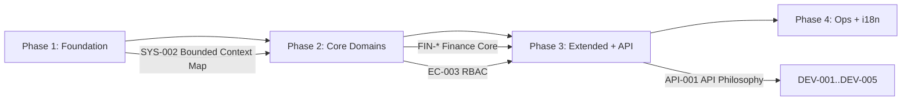

# ACCSYSTEM Documentation Engine — Master Execution Roadmap

> **Version:** 1.0.0
> **Authority:** Chief Architect
> **Governance:** This file is the GLOBAL execution controller.
> No task may be executed unless it complies with the phase rules defined here.

---

## 1. Execution Principles

1. **Sequential Phase Execution** — Phases MUST be executed in order (1 → 2 → 3 → 4).
2. **No Phase Skipping** — A phase cannot begin until the previous phase's exit criteria are met.
3. **Domain-by-Domain** — Within each phase, documentation is generated one domain at a time.
4. **Human Review Gates** — Every task output enters `pending_review.list.md`.
    - **Cross-Phase:** A phase cannot begin until ALL tasks in the previous phase are approved.
    - **Intra-Phase:** Tasks within the same phase MAY proceed if the predecessor is in the `pending_review` state, even if it has `NEEDS_VERIFICATION` (assumptions).
5. **Incremental Growth** — The entire roadmap is designed for execution over months, not days.
6. **Idempotent Re-entry** — The engine can be stopped and resumed at any point by reading state files.

---

## 2. Phase Definitions

### Phase 1: Architectural Foundation
**Duration Estimate:** 2–4 weeks
**Focus:** Tier 1 (System-Level) + Tier 2 (Architecture)

#### Scope
- ERP Philosophy, Vision, and Core Business Assumptions
- Bounded Context Map
- Financial Data Immutability Doctrine
- Cross-Domain Integration Patterns
- All Architecture documents (DDD, Event Bus, Action Layer, Multi-Tenancy, etc.)

#### Entry Criteria
- [ ] ENGINE.md has been reviewed and approved by Chief Architect
- [ ] GLOSSARY.md contains at minimum 50 canonical terms
- [ ] All Phase 1 task files exist in `/tasks/phase-1/`
- [ ] `current_phase.md` is set to `phase-1`

#### Exit Criteria
- [ ] ALL tasks with prefix `SYS-*` are in `completed_tasks.list.md`
- [ ] ALL tasks with prefix `ARCH-*` are in `completed_tasks.list.md`
- [ ] ALL Phase 1 tasks have status `approved` in `review-log.csv`
- [ ] Zero unresolved `[ASSUMPTION]` markers in Phase 1 outputs
- [ ] Chief Architect has signed off on Phase 1 completion

#### Task Sequence
```
SYS-001 → SYS-002 → SYS-003 → SYS-004 → SYS-005
                                                  ↓
ARCH-001 → ARCH-002 → ARCH-003 → ARCH-004 → ARCH-005 → ARCH-006
```
> SYS-002 (Bounded Context Map) MUST complete before any ARCH-* task begins.

#### Page Count: **11 pages** (5 SYS + 6 ARCH)

---

### Phase 2: Core Financial & Operational Domains
**Duration Estimate:** 6–10 weeks
**Focus:** Finance, EnterpriseCore, Commercial, SupplyChain

#### Scope
- Complete Finance domain documentation (GL, COA, Audit, FX, Tax, Treasury, Budgets)
- EnterpriseCore documentation (RBAC, Tenancy, Automation, Monitoring)
- Commercial domain (CRM, Sales Lifecycle, Revenue, Pricing)
- SupplyChain domain (Inventory, Procurement, Payables, Vendors)

#### Entry Criteria
- [ ] Phase 1 exit criteria fully met
- [ ] `current_phase.md` updated to `phase-2`
- [ ] All Phase 2 task files exist in `/tasks/phase-2/`

#### Exit Criteria
- [ ] ALL tasks with prefixes `FIN-*`, `EC-*`, `COM-*`, `SC-*` completed and approved
- [ ] Zero unresolved `[ASSUMPTION]` markers
- [ ] Cross-domain integration points documented between Finance ↔ Commercial ↔ SupplyChain

#### Domain Execution Order
```
Finance (FIN-001..FIN-008)
    ↓
EnterpriseCore (EC-001..EC-006)
    ↓
Commercial (COM-001..COM-006)
    ↓
SupplyChain (SC-001..SC-005)
```
> **Finance MUST complete first** — it is the irreversible core that all other domains reference.

#### Page Count: **25 pages** (8 FIN + 6 EC + 6 COM + 5 SC)

---

### Phase 3: Extended Modules & API / Developer Documentation
**Duration Estimate:** 10–16 weeks
**Focus:** All remaining domains + Tier 3 (API) + Tier 4 (Developer)

#### Scope
- HumanCapital (10 tasks), Assets (3), Manufacturing (4), Projects (4)
- Intelligence (3), Platform (4), Shared (3)
- API documentation (5 tasks)
- Developer documentation (5 tasks)

#### Entry Criteria
- [ ] Phase 2 exit criteria fully met
- [ ] `current_phase.md` updated to `phase-3`
- [ ] All Phase 3 task files exist in `/tasks/phase-3/`

#### Exit Criteria
- [ ] ALL Phase 3 task prefixes completed and approved
- [ ] API documentation validated against actual API endpoints
- [ ] Developer guides tested by at least one external contributor

#### Domain Execution Order
```
HumanCapital → Assets → Manufacturing → Projects
    ↓
Intelligence → Platform → Shared
    ↓
API (API-001..API-005)
    ↓
Developer (DEV-001..DEV-005)
```

#### Page Count: **41 pages** (10 HC + 3 AST + 4 MFG + 4 PRJ + 3 INT + 4 PLT + 3 SHR + 5 API + 5 DEV)

---

### Phase 4: Operations, Governance & Localization
**Duration Estimate:** 4–6 weeks
**Focus:** Tier 5 (Operations) + Arabic translations

#### Scope
- Deployment, backup, audit trails, production governance
- Post-closure financial discrepancy handling
- Arabic translation of Tier 1 and Tier 5 documents

#### Entry Criteria
- [ ] Phase 3 exit criteria fully met
- [ ] `current_phase.md` updated to `phase-4`
- [ ] Arabic translation reviewers identified

#### Exit Criteria
- [ ] ALL `OPS-*` and `L10N-*` tasks completed and approved
- [ ] Arabic translations reviewed by native-speaking domain expert
- [ ] Full documentation portal build succeeds (no broken links)
- [ ] Chief Architect final sign-off on complete documentation set

#### Page Count: **7 pages** (5 OPS + 2 L10N) + translation pages

---

## 3. Cross-Phase Dependencies



---

## 4. Estimated Total Output

| Phase | Pages | Cumulative |
|-------|-------|------------|
| Phase 1 | 11 | 11 |
| Phase 2 | 25 | 36 |
| Phase 3 | 41 | 77 |
| Phase 4 | 7+ | 84+ |

> **Note:** These 84 pages represent the **foundational pass** (one page per task).
> The Documentation Strategy targets ~2000 pages over the full project lifecycle.
> Subsequent expansion tasks will be added to each domain roadmap as the codebase grows.
> The engine architecture supports unlimited incremental growth without restructuring.

---

## 5. Escalation Protocol

If during execution the AI encounters any of the following, it MUST halt and escalate:

1. **Missing source code** — A task references files that do not exist
2. **Ambiguous business logic** — Code behavior cannot be explained without business context
3. **Cross-domain dependency** — Task requires knowledge from an unapproved domain
4. **Template mismatch** — The content does not fit any existing template
5. **Word count overflow** — Content exceeds 650 words and cannot be split

Escalation format:
```
ESCALATION REPORT
Task ID: [task_id]
Type: [missing_source | ambiguous_logic | cross_domain | template_mismatch | word_overflow]
Details: [description]
Suggested Action: [recommendation]
```
