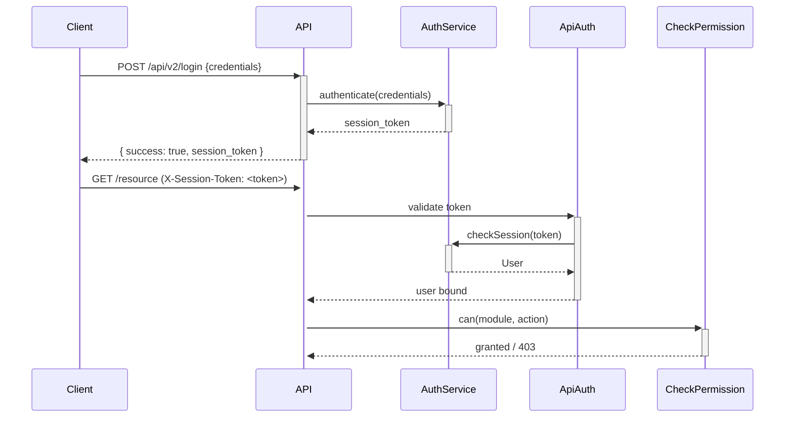

# Authentication and Authorization Contracts

## Authentication Mechanism

accore uses session-based authentication rather than token-based authentication (such as JWT or OAuth). Upon successful login, the server establishes a server-side session and returns a `session_token` string that the client must include in all subsequent API requests.

### Login

```
POST /api/v2/login
```

Submits credentials. The `throttle:api-auth` rate limiter is applied to this endpoint. On success, a session is created and the `session_token` is returned in the response.

### Session Token Transmission

The session token is transmitted on every protected request using the `X-Session-Token` HTTP header:

```
X-Session-Token: <session_token>
```

The `ApiAuth` middleware reads the token from this header (or from the server-side session if a session cookie is present). If the token is absent or the session is expired, the middleware returns a `401 Unauthorized` response.

### Session Validation

The `ApiAuth` middleware delegates token validation to the `AuthService.checkSession()` method in the EnterpriseCore / IdentityAccess domain. If the session is valid, the authenticated user is bound to the request context via `auth()->setUser()`. All downstream code accesses the authenticated user through Laravel's standard auth helpers.

### Logout

```
POST /api/v2/logout
```

Terminates the active session. The `session_token` is invalidated server-side.

### Session Check

```
GET /api/v2/check
```

Returns the current session's user context, used by the frontend to verify that an active session exists.

## Authorization Mechanism

Authorization is enforced through a module-and-action permission model managed by the `PermissionService` in EnterpriseCore / IdentityAccess. Every protected resource has two dimensions of access control:

| Dimension | Description | Example |
|-----------|-------------|---------|
| Module | The resource domain being accessed | `assets`, `purchases`, `general_ledger` |
| Action | The operation being performed | `view`, `create`, `edit`, `delete` |

### Middleware-Level Authorization

Routes apply the `can:` middleware alias, specifying the module and action:

```php
Route::get('/assets', ...)->middleware('can:assets,view');
Route::post('/assets', ...)->middleware('can:assets,create');
```

The `CheckPermission` middleware invokes `PermissionService::can(module, action)`. If the permission is not granted, the middleware returns a `403 Access denied` response with a message indicating the specific module and action that was blocked.

### Action-Level Authorization

Individual Action classes may also call `PermissionService::requirePermission(module, action)` directly within their `execute()` method. This provides a second enforcement layer for actions invoked outside the HTTP request cycle.

## Authentication Flow



## Security Notes

- Login is rate-limited via `throttle:api-auth`; brute-force attacks on the login endpoint are mitigated.
- Write operations (`POST`, `PUT`, `DELETE`) apply a `throttle:api-write` or `throttle:api-delete` rate limiter in addition to authentication and authorization checks.
- The session is stored server-side; the client holds only the opaque `session_token` and cannot modify session contents.
