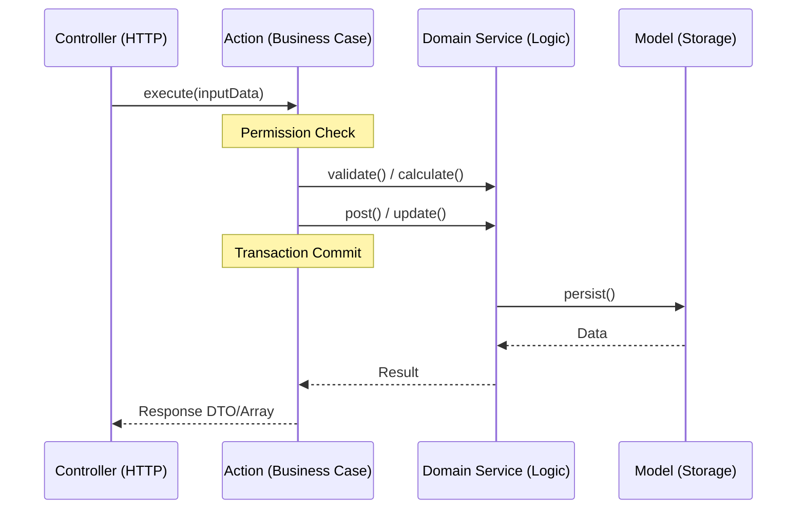

# ADR-003: Action & Service Layer

## Context
In a standard Laravel architecture, business logic often drifts into Controllers (leading to "Fat Controllers") or is scattered across Eloquent Models. This entanglement makes business processes difficult to reuse, test, and audit—critical requirements for an enterprise ERP. ACCSYSTEM requires a strict separation between HTTP request handling and business execution to ensure that financial and operational rules are consistently applied regardless of the entry point (API, CLI, or internal event).

## Decision
We have implemented a dual-layer logic architecture comprising **Actions** and **Services**:

1.  **Actions (Single-Action Classes)**: The primary entry points for business workflows. Each Action encapsulates exactly one user-intent or business use-case (e.g., `PostInvoiceAction`, `CloseFiscalPeriodAction`).
2.  **Services (Domain Services)**: Reusable classes that provide domain-specific capabilities across multiple Actions (e.g., `LedgerService`, `InventoryCostingService`).

Controllers in ACCSYSTEM are prohibited from containing business logic; they only handle request validation, authorization checks, and delegation to the appropriate Action.

## Rationale
*   **Predictability**: By using Single-Action classes, developers can find and understand a business process by its filename alone.
*   **Reusability**: Shared logic (such as calculating a ledger balance) resides in Services, which can be injected into any Action that requires them.
*   **Transactional Integrity**: Actions serve as the "Transaction Boundary." They are responsible for wrapping complex operations in a single database transaction, ensuring the system never enters a partially updated state.
*   **Testability**: Both Actions and Services can be unit-tested without an HTTP context, allowing for faster and more reliable CI pipelines.
*   **Standardization**: This pattern enforces a consistent "Enterprise Language" across the codebase, matching the tactical patterns defined in `ARCH-002`.

## Internal Responsibilities

### The Action Layer
*   Must implement a single `execute()` method.
*   Responsible for orchestrating multiple Services and Models.
*   Enforces business-level authorization (via `PermissionService`).
*   Manages `DB::transaction()` lifecycle.
*   Throws specific business exceptions for logic failures.

### The Service Layer
*   Contains low-level, reusable business logic.
*   Does not handle HTTP concerns or user permissions.
*   Frequently stateless, though may maintain internal caching where appropriate.
*   Consumed by Actions, or other Services within the same Bounded Context.

## Alternatives Considered
*   **Standard Controllers**: Rejected. Leads to logic duplication and makes it impossible to trigger the same process via CLI or Jobs without duplicating code.
*   **God Services**: Rejected. Large services that handle everything in a domain (e.g., `FinanceService`) eventually become hard to navigate and maintain. Decoupling into discrete Actions provides better isolation.

## Consequences
### Positive
*   Highly modular and navigable codebase.
*   Strict enforcement of SRP (Single Responsibility Principle).
*   Centralized audit and logging points within the Action execution flow.
*   Clear boundaries for transaction management.

### Negative / Trade-offs
*   **Boilerplate**: Requires creating more classes than a traditional controller-based approach.
*   **Indirection**: New developers may initially find the jump from Controller to Action to Service more complex than a standard MVC flow.

## Implementation Pattern
The following diagram illustrates the flow of a typical business request in ACCSYSTEM:

## Status
`accepted`

## Related Decisions
*   **ARCH-002**: Domain-Driven Design in Laravel (Structural context for Actions/Services).
*   **SYS-004**: Financial Data Immutability (Logic enforced within specific Actions/Services).
*   **SYS-005**: Cross-Domain Integration Patterns (Actions frequently trigger events).
