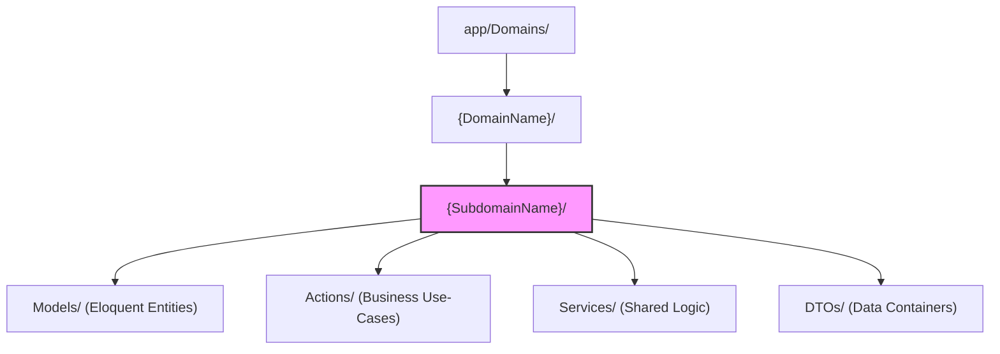

# ADR-002: Domain-Driven Design in Laravel

## Context
Standard Laravel applications often follow a flat `Models-Controllers-Services` structure, which works well for smaller projects but creates significant maintenance challenges for complex systems such as an enterprise ERP. In a monolithic standard structure, the "Finance," "SupplyChain," and "HumanCapital" models all exist in a single directory, leading to hidden dependencies and making it difficult to enforce the Bounded Context Map established in `SYS-002`.

## Decision
We have decided to organize the accore backend using **Domain-Driven Design (DDD)** principles, specifically using the **Bounded Context** as the primary organizational unit. The codebase is partitioned into distinct Domains within the `app/Domains/` directory, moving away from Laravel's default directory-per-component-type structure.

Each Domain is further divided into Subdomains, providing a nested, modular architecture where every piece of business logic has a single, unambiguous home.

## Rationale
This architecture was selected to achieve several critical ERP outcomes:
*   **Encapsulation of Business Logic**: By grouping related Models, Actions, and Services inside a single directory, we clearly define what constitutes a Bounded Context.
*   **Reduced Cognitive Load**: Developers working on "Finance" do not need to navigate through irrelevant "HumanCapital" or "Commercial" models, as their scope is physically constrained to their active domain.
*   **Strategic Modularity**: This structure maps 1:1 to our documentation and team structure, allowing us to evolve different parts of the ERP at different speeds.
*   **Standardized Tactical Patterns**: Every subdomain follows a predictable internal layout:
    *   `Models/`: Eloquent models scoped to the subdomain.
    *   `Actions/`: Single-responsibility classes implementing business use-cases.
    *   `Services/`: Reusable, cross-action business logic.
    *   `DTOs/`: Data Transfer Objects for passing structured data between layers.

## Alternatives Considered
*   **Standard Laravel Structure**: Rejected. Mixed concerns in flat directories lead to "Fat Models" and "God Classes" as the system grows.
*   **Modular Laravel (HMM / DX Modular)**: Evaluated but we chose a custom DDD structure that prioritizes Bounded Contexts as folders rather than creating separate composer-based packages for every module, striking a balance between isolation and development velocity.

## Consequences
### Positive
*   Explicit mapping of business concepts to code.
*   Clean, predictable folder structure for all modules.
*   Easier implementation of domain-level access controls and monitoring.
*   Improved discoverability for new developers.

### Negative / Trade-offs
*   **Namespace Verbosity**: Requires longer namespaces (e.g., `App\Domains\Finance\GeneralLedger\Models\GeneralLedger`).
*   **Pathing Complexity**: Does not follow the default Laravel `artisan make` conventions, requiring more manual file creation or custom scaffolding tools.
*   **Inter-Domain Communication**: Requires disciplined use of Integration Events (documented in `SYS-005`) to prevent circular dependencies.

## Internal Directory Pattern
The following diagram illustrates the canonical structure for an accore Domain:

## Status
`accepted`

## Related Decisions
*   **SYS-002**: Bounded Context Map (Matches the folder structure).
*   **ARCH-001**: Frontend-Backend Separation (Implicitly defines the Backend scope).
*   **ARCH-003**: Action & Service Layer Pattern (Defines the responsibilities of the internal folders).
