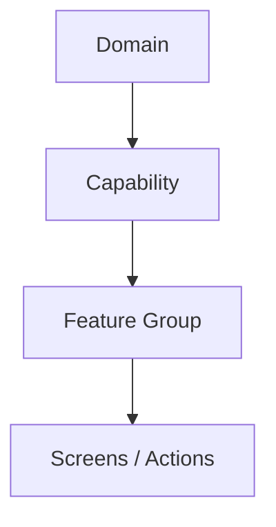

# UX Philosophy & Vision

## 1. Vision Statement
The accore ERP transcends the complexity of traditional enterprise software (like SAP) by providing a **Domain-Driven, Capability-Oriented** experience. Our objective is to minimize cognitive load while maintaining the rigid structural integrity required for enterprise-grade operations.

## 2. The Core Philosophy: "The 4-Layer Hierarchy"
To ensure consistency and predictability across thousands of screens, every element in the platform follows a strict 4-layer taxonomy:

1.  **Domain (The Why):** High-level business area (e.g., Financial Management).
2.  **Capability (The What):** A specific business power (e.g., Treasury & Cash).
3.  **Feature Group (The How):** Logical grouping of related tasks (e.g., Bank Reconciliation).
4.  **Screens/Actions (The Do):** The actual UI where the user interacts (e.g., New Reconciliation Statement).

## 3. Design Principles

### 3.1 Zero-Deep-Nesting
Users should never be more than **3 clicks away** from any functional screen. The hierarchy is wide but shallow to ensure rapid discovery.

### 3.2 Contextual Intelligence
The navigation system is "aware" of the active Domain. It adapts dynamically to show only relevant Capabilities, reducing visual noise and decision fatigue.

### 3.3 Portal-Ready Architecture
The structure inherently supports external personas (Vendors, Customers) via the same Domain-driven logic. Switching from an internal "Sourcing" view to an external "Vendor Portal" view is a matter of permission, not architectural change.

### 3.4 API-First Navigation
The navigation hierarchy directly mirrors the API endpoint structure (e.g., `/api/v1/finance/treasury/...`), ensuring that developers and users share a unified mental model of the system's data flow.

## 4. User Psychology and focus
The design is inspired by high-productivity environments like **Visual Studio Code (VS Code)**. It is built to keep the user in a "state of flow" for hours, avoiding the disjointedness found in legacy ERPs.

- **Familiar Metaphor:** Folders = Modules, Files = Screens.
- **Workflow State:** The UI reflects mental states: "What I am doing now" (Open Tabs), "What the system is" (Full Menu), and "What I need fast" (Favorites).
- **Explanation Over Transition:** Folders are "explanation spaces" (Cards) rather than just list containers.
