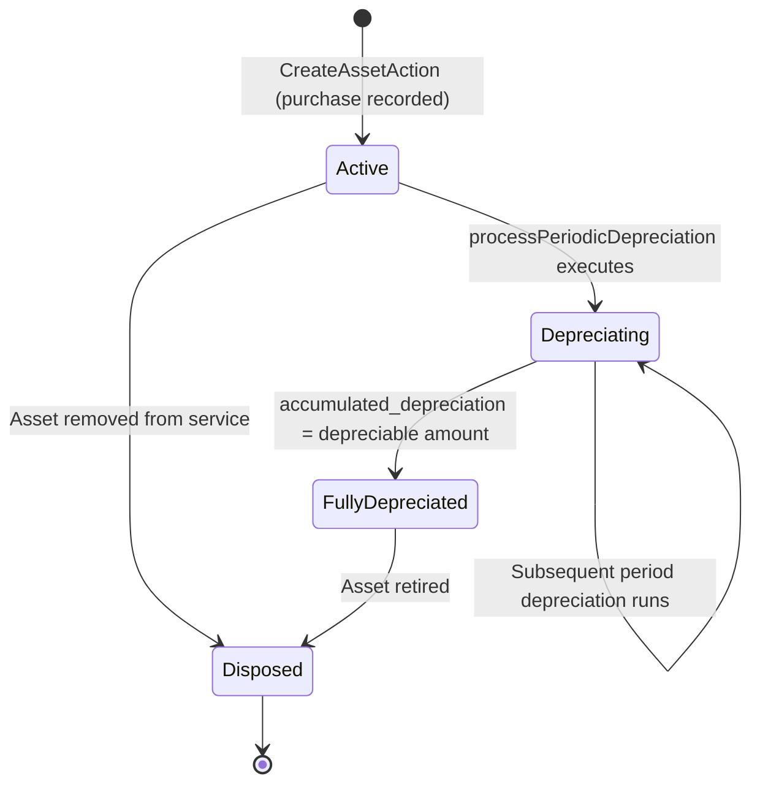

# Acquisition, Depreciation and Disposal

## Overview

The fixed asset lifecycle encompasses the financial and operational events that govern a capital asset from its initial registration in the system through periodic depreciation charges to its eventual disposal or full depreciation. This lifecycle is documented as a standalone page because it spans multiple fiscal periods, involves irreversible financial postings to the General Ledger, and determines the accurate book value of the organization's capital base at any point in time.

## State Diagram

## State Definitions

| State | Business Meaning | Entry Condition | Exit Condition |
|-------|-----------------|-----------------|----------------|
| Active | The asset is in service and eligible for depreciation processing. Purchase has been recorded with full valuation data. | CreateAssetAction completes with status = `active` and is_active = true. | First periodic depreciation run processes the asset, or asset is disposed. |
| Depreciating | The asset is actively being depreciated period by period. Accumulated depreciation is incrementally increasing and book value is decreasing. | processPeriodicDepreciation generates an AssetDepreciation entry for the asset. | Accumulated depreciation equals the depreciable amount, or asset is disposed. |
| FullyDepreciated | The asset has reached zero net book value (purchase_value minus salvage_value). No further depreciation charges are generated. | Accumulated depreciation equals or exceeds purchase_value minus salvage_value. | Asset is physically retired and disposal is recorded. |
| Disposed | The asset has been removed from service. Its book value is cleared. Any gain or loss on disposal is posted to the General Ledger. | DeleteAssetAction or disposal process transitions is_active to false. | Terminal state. |

## Transition Rules

1. **Active → Depreciating:** Triggered by the periodic depreciation batch process (processPeriodicDepreciation). The DepreciationService calculates the period charge using the asset's specified depreciation_method. An AssetDepreciation record is created for the fiscal period, and a journal entry is posted to the General Ledger via the Finance domain's LedgerService.

2. **Depreciating → Depreciating:** Repeats each fiscal period while accumulated depreciation remains below the depreciable amount. The depreciation_rate and useful_life_years govern the charge magnitude.

3. **Depreciating → FullyDepreciated:** Occurs when the cumulative AssetDepreciation entries bring accumulated_depreciation to the asset's fully depreciated threshold. No subsequent depreciation runs generate charges for this asset.

4. **Active / Depreciating / FullyDepreciated → Disposed:** Triggered when the asset is physically retired or sold. A disposal journal entry is posted to record the derecognition of the asset's gross value and accumulated depreciation, and any resulting gain or loss.

## Irreversibility & Immutability

Posted AssetDepreciation entries are immutable; once a depreciation charge is posted to the General Ledger, it cannot be reversed within the Assets domain. Corrections require a compensating journal entry in the Finance domain. The Disposed state is terminal — a disposed asset cannot be reactivated. Historical depreciation records are permanently retained for audit and financial reporting purposes.

## Integration Impact

Each depreciation posting generates a paired journal entry in the Finance domain's General Ledger: a debit to the depreciation expense account and a credit to the accumulated depreciation contra-asset account. The ChartOfAccountsMappingService resolves the correct GL account codes for each asset category. The Finance domain's fiscal period must be open for the posting period; attempting to post depreciation into a closed fiscal period will fail.

## Assumptions & Open Questions

<!-- [ASSUMPTION] -->
The disposal process (recording gain or loss on sale and derecognizing the asset from the balance sheet) is inferred from the DepreciationService's GL integration pattern. No explicit Dispose or Retire action was identified in the source code; the DeleteAssetAction may serve this purpose. Business confirmation of the disposal workflow and GL posting logic is required.
