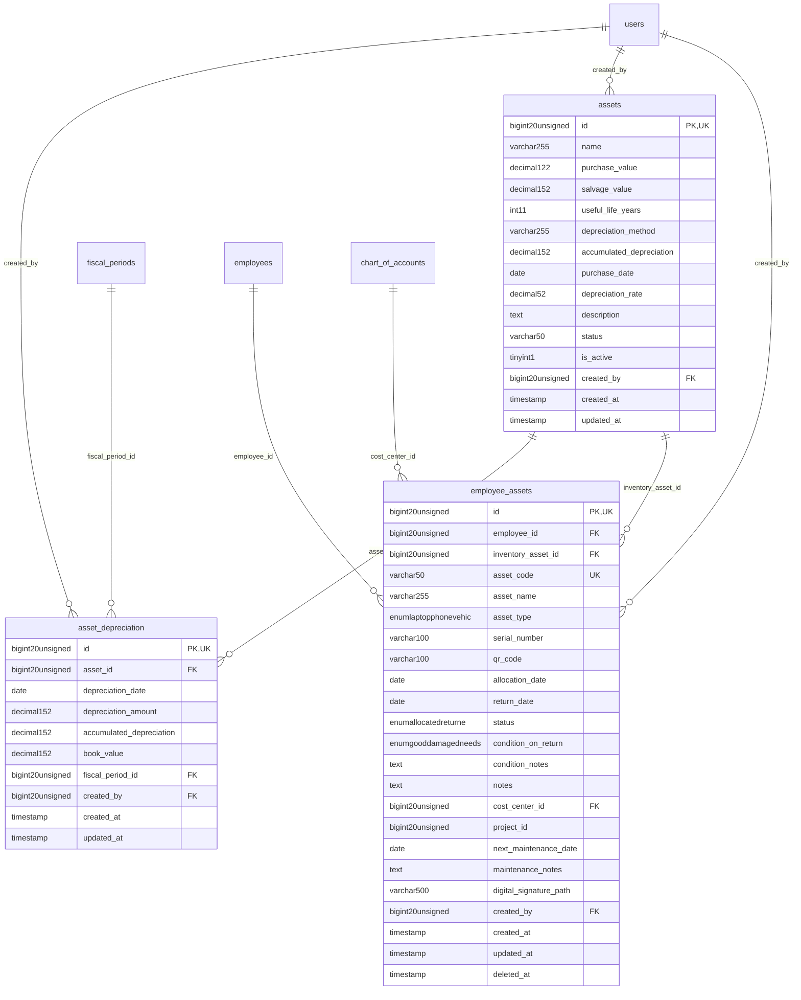

# Assets - AssetLifecycle

> **Bounded Context Schema & ERD**
> 3 Tables | Generated dynamically by accoregine

---

## Tables List

- `asset_depreciation`
- `assets`
- `employee_assets`

---

## Entity Relationship Diagram

---

## Data Dictionary

### Table: `asset_depreciation`

| Column | Type | Nullable | Default | Indexes | Foreign Keys |
|---|---|---|---|---|---|
| `id` | `bigint(20) unsigned` | No |  | **PK** |  |
| `asset_id` | `bigint(20) unsigned` | No |  | IDX | -> `assets.id` |
| `depreciation_date` | `date` | No |  | IDX |  |
| `depreciation_amount` | `decimal(15,2)` | No |  |  |  |
| `accumulated_depreciation` | `decimal(15,2)` | No |  |  |  |
| `book_value` | `decimal(15,2)` | No |  |  |  |
| `fiscal_period_id` | `bigint(20) unsigned` | Yes | `NULL` | IDX | -> `fiscal_periods.id` |
| `created_by` | `bigint(20) unsigned` | Yes | `NULL` | IDX | -> `users.id` |
| `created_at` | `timestamp` | Yes | `NULL` |  |  |
| `updated_at` | `timestamp` | Yes | `NULL` |  |  |

### Table: `assets`

| Column | Type | Nullable | Default | Indexes | Foreign Keys |
|---|---|---|---|---|---|
| `id` | `bigint(20) unsigned` | No |  | **PK** |  |
| `name` | `varchar(255)` | No |  |  |  |
| `purchase_value` | `decimal(12,2)` | No |  |  |  |
| `salvage_value` | `decimal(15,2)` | No | `0.00` |  |  |
| `useful_life_years` | `int(11)` | No | `5` |  |  |
| `depreciation_method` | `varchar(255)` | No | `'straight_line'` |  |  |
| `accumulated_depreciation` | `decimal(15,2)` | No | `0.00` |  |  |
| `purchase_date` | `date` | No |  |  |  |
| `depreciation_rate` | `decimal(5,2)` | No | `0.00` |  |  |
| `description` | `text` | Yes | `NULL` |  |  |
| `status` | `varchar(50)` | No | `'active'` |  |  |
| `is_active` | `tinyint(1)` | No | `1` |  |  |
| `created_by` | `bigint(20) unsigned` | Yes | `NULL` | IDX | -> `users.id` |
| `created_at` | `timestamp` | Yes | `NULL` |  |  |
| `updated_at` | `timestamp` | Yes | `NULL` |  |  |

### Table: `employee_assets`

| Column | Type | Nullable | Default | Indexes | Foreign Keys |
|---|---|---|---|---|---|
| `id` | `bigint(20) unsigned` | No |  | **PK** |  |
| `employee_id` | `bigint(20) unsigned` | No |  | IDX | -> `employees.id` |
| `inventory_asset_id` | `bigint(20) unsigned` | Yes | `NULL` | IDX | -> `assets.id` |
| `asset_code` | `varchar(50)` | No |  | *UK* |  |
| `asset_name` | `varchar(255)` | No |  |  |  |
| `asset_type` | `enum('laptop','phone','vehicle','key','equipment','other')` | No | `'other'` |  |  |
| `serial_number` | `varchar(100)` | Yes | `NULL` |  |  |
| `qr_code` | `varchar(100)` | Yes | `NULL` |  |  |
| `allocation_date` | `date` | No |  |  |  |
| `return_date` | `date` | Yes | `NULL` |  |  |
| `status` | `enum('allocated','returned','maintenance','lost','damaged')` | No | `'allocated'` |  |  |
| `condition_on_return` | `enum('good','damaged','needs_repair')` | Yes | `NULL` |  |  |
| `condition_notes` | `text` | Yes | `NULL` |  |  |
| `notes` | `text` | Yes | `NULL` |  |  |
| `cost_center_id` | `bigint(20) unsigned` | Yes | `NULL` | IDX | -> `chart_of_accounts.id` |
| `project_id` | `bigint(20) unsigned` | Yes | `NULL` |  |  |
| `next_maintenance_date` | `date` | Yes | `NULL` |  |  |
| `maintenance_notes` | `text` | Yes | `NULL` |  |  |
| `digital_signature_path` | `varchar(500)` | Yes | `NULL` |  |  |
| `created_by` | `bigint(20) unsigned` | Yes | `NULL` | IDX | -> `users.id` |
| `created_at` | `timestamp` | Yes | `NULL` |  |  |
| `updated_at` | `timestamp` | Yes | `NULL` |  |  |
| `deleted_at` | `timestamp` | Yes | `NULL` |  |  |

