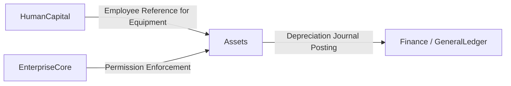

# Assets — Domain Overview

## Business Purpose

The Assets domain governs the management of fixed assets and employee equipment within accore. Its primary business purpose is to track the full economic life of capital assets — from acquisition through periodic depreciation to disposal — and to maintain accountability for equipment issued to individual employees. Finance controllers, asset managers, and HR administrators are the primary stakeholders. The domain ensures that asset carrying values are accurate and current in the General Ledger, that depreciation charges are applied consistently across fiscal periods, and that company-owned equipment is traceable to the responsible employee at all times.

## Bounded Context Boundaries

The Assets domain owns all data pertaining to fixed asset records, depreciation schedules, and employee equipment assignments. This includes the Asset master record, periodic AssetDepreciation entries, and EmployeeAsset allocation records.

Excluded from this domain are General Ledger accounts and journal entries, which are owned by the Finance domain. Employee records, to which equipment is assigned, are owned by the HumanCapital domain. Cost center and project assignment metadata on EmployeeAsset records is referenced from Finance but not owned by Assets.

## Subdomains

| Subdomain | Description |
|-----------|-------------|
| AssetLifecycle | Manages the registration, valuation, depreciation, and disposal of fixed assets, and tracks the allocation of company equipment to employees. |

## Key Domain Entities

The **Asset** entity represents a capital item owned by the organization, carrying its purchase value, salvage value, useful life, depreciation method, accumulated depreciation, and current status. It is the root aggregate of the domain.

The **AssetDepreciation** entity records a single periodic depreciation charge applied to an Asset, capturing the depreciation amount, accumulated total, resulting book value, and the fiscal period to which the charge belongs.

The **EmployeeAsset** entity tracks the assignment of a company asset to a specific employee, recording allocation date, expected return date, physical condition, QR code reference, and maintenance schedule. It links the Asset to the HumanCapital domain's Employee entity.

## Integration Points

The DepreciationService posts calculated depreciation charges as journal entries through the Finance domain's LedgerService, debiting the depreciation expense account and crediting the accumulated depreciation account. EnterpriseCore's PermissionService is enforced at the Action layer for all asset create, update, and delete operations.

## Governance Rules

1. An Asset must have a purchase_value, purchase_date, useful_life_years, and a defined depreciation_method before depreciation processing can occur.
2. Depreciation charges are posted per fiscal period; an Asset with accumulated_depreciation equal to its depreciable amount (purchase_value minus salvage_value) is considered fully depreciated and no further charges are generated.
3. An EmployeeAsset record may not be hard-deleted; soft deletion preserves the allocation history.
4. The depreciation_method must be one of the system-supported methods: straight-line, declining balance, or units of production.

## Documentation Scope

| Document | Task ID | Status |
|----------|---------|--------|
| Assets Domain Overview | AST-001 | draft |
| Acquisition, Depreciation and Disposal | AST-002 | draft |
| Investment Tracking | AST-003 | escalated |
