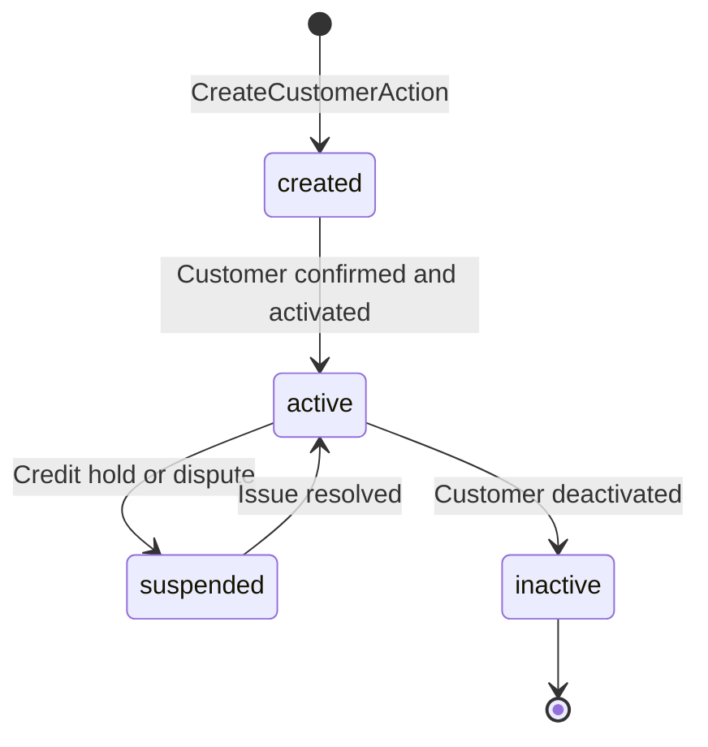

# Customer Journey & Credit Limits

## Business Context & Objective

The CRM subdomain provides the customer master record and the foundational data for all customer-facing transactions. It is the single source of truth for customer identity, contact information, tax registration, credit limits, and running account balances. Credit managers and sales teams depend on CRM to enforce credit policies (preventing over-limit sales), manage customer segmentation, and track customer financial health. The customer journey spans creation (onboarding), profile maintenance (updates), ledger inquiry (transaction history), and closure (deactivation). Without comprehensive credit management, the enterprise risks uncollectible receivables, disputes, and compliance violations.

## Domain Entities

| Entity | Business Definition | Role |
|--------|-------------------|------|
| **ArCustomer** | Master customer record containing identity, contact details, tax ID, credit limit, and current balance. | Single source of truth for "who is this customer?" Updated during onboarding and maintenance; queried for credit validation. |

## State Machine / Lifecycle

ArCustomer follows a simple lifecycle from creation to closure:

<!-- [ASSUMPTION] --> ArCustomer does not have an explicit "status" field; instead, global scope filter hides the CASH-001 customer. Other status transitions (suspended, inactive) must be implemented via a future "status" column or soft delete.

## Business Rules & Constraints

1. **Unique Identification** — Each customer must have a unique customer_code and unique combination of name and phone number.
2. **Customer Code Generation** — Customer codes are auto-generated via NumberRangeService (NrObject/NrGroup configuration). Manual codes are allowed if explicitly provided.
3. **Credit Limit Governance** — Credit limit is set at customer creation and updated by finance managers. Sales orders cannot exceed customer credit limit unless explicitly overridden.
4. **Tax Registration** — tax_number (VATIN or Saudi Unified Number) is captured at creation. Duplicate tax numbers may be allowed for multi-entity customers.
5. **Current Balance Reconciliation** — ArCustomer.current_balance represents the net receivable (invoiced - paid). This field must be reconciled daily against ArTransaction totals.
6. **Cash Customer Handling** — A special customer code (CASH-001) is used for all cash sales (point-of-sale, walk-in). This customer is hidden via global scope and excluded from normal customer lists.
7. **Customer Deduplication** — CreateCustomerAction validates that name and phone are not already in use; updates prevent changing to duplicate identifiers.
8. **Audit Trail** — All customer updates must record old_values for comparison and rollback capability.

## Integration Events

| Event | Direction | Connected Domain | Trigger |
|-------|-----------|-----------------|---------|
| Customer.Created | Outbound | MonitoringCompliance, Finance | CreateCustomerAction completes; audited |
| Customer.Updated | Outbound | MonitoringCompliance | UpdateCustomerAction completes; credit limit changes trigger GL event |
| Customer.Deactivated | Outbound | Finance | Customer status changes to inactive; prevents new sales |
| Ledger.Queried | Internal | RevenueReceivables | CustomerLedgerAction retrieves AR transactions |

## Key Operations

**CreateCustomerAction** — Creates a new customer with name, phone, email, address, tax_number, and initial credit_limit. If customer_code is not provided, generates one via NumberRangeService using nr_object_id and nr_group_id. Validates uniqueness of name/phone and tax_number. Atomically within transaction.

**UpdateCustomerAction** — Updates an existing customer's contact details, credit limit, or other attributes. Captures old_values for audit trail. Validates that updated name/phone do not duplicate another customer.

**DeleteCustomerAction** — Marks a customer as inactive or deleted. Deactivated customers cannot be the target of new sales orders, but historical transactions remain visible.

**ListCustomersAction** — Retrieves paginated list of customers with filtering by status, credit limit range, region, or sales representative assignment.

**CustomerLedgerAction** — Displays customer AR sub-ledger (ArTransaction records) with pagination, search, and type filtering. Shows invoice/payment/credit memo transactions linked to the customer. Current_balance is displayed as the sum of unpaid transactions.

## Known Constraints

1. ArCustomer.current_balance is a denormalized cache; it is not automatically updated by invoice/payment operations. Daily reconciliation is required.
2. No multi-entity customer support; a customer can belong to only one company code (explicit or implicit).
3. Customer code uniqueness is enforced only at the database level; race conditions during CreateCustomerAction may cause duplicate code generation.
4. <!-- [ASSUMPTION] --> Duplicate tax_numbers are allowed (e.g., subsidiary companies with same VAT ID). System does not validate tax_number uniqueness globally.
5. Credit limit changes are not retroactively applied to outstanding orders; new credit limit applies only to future orders.
6. No customer segmentation or classification field visible in ArCustomer model; marketing campaigns (MarketingDistribution) must implement segmentation externally.

## Assumptions & Open Questions

<!-- [ASSUMPTION] -->
**Status Field Absence**: ArCustomer model does not contain a status/is_active field. The global scope hides CASH-001, but how are other customers deactivated? Clarification needed: Is there an implicit soft-delete mechanism or a separate status column planned?

<!-- [ASSUMPTION] -->
**Current Balance Auto-Update**: current_balance is shown as a decimal field but is not updated in the CreateCustomerAction or UpdateCustomerAction code. Clarification needed: Who updates current_balance? Is it a nightly reconciliation batch, or is it updated in real-time by RevenueReceivables when ArTransaction is created?

<!-- [ASSUMPTION] -->
**Credit Limit Enforcement**: Credit managers set credit_limit, but the enforcement ("prevent sales exceeding limit") is not visible in CRM Actions. Clarification needed: Is credit validation delegated to SalesLifecycle (Invoice creation) or handled at the API gateway level?

<!-- [ASSUMPTION] -->
**Multi-Tenancy and Customer Codes**: NumberRangeService is called with nr_object_id and nr_group_id but no explicit tenant_id. Clarification needed: How does customer code generation ensure uniqueness across multiple company codes or tenants?
