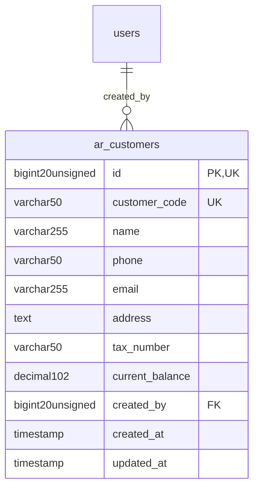

# Commercial - CRM

> **Bounded Context Schema & ERD**
> 1 Tables | Generated dynamically by accore engine

---

## Tables List

- `ar_customers`

---

## Entity Relationship Diagram

---

## Data Dictionary

### Table: `ar_customers`

| Column | Type | Nullable | Default | Indexes | Foreign Keys |
|---|---|---|---|---|---|
| `id` | `bigint(20) unsigned` | No |  | **PK** |  |
| `customer_code` | `varchar(50)` | Yes | `NULL` | *UK* |  |
| `name` | `varchar(255)` | No |  |  |  |
| `phone` | `varchar(50)` | Yes | `NULL` |  |  |
| `email` | `varchar(255)` | Yes | `NULL` |  |  |
| `address` | `text` | Yes | `NULL` |  |  |
| `tax_number` | `varchar(50)` | Yes | `NULL` |  |  |
| `current_balance` | `decimal(10,2)` | No | `0.00` |  |  |
| `created_by` | `bigint(20) unsigned` | Yes | `NULL` | IDX | -> `users.id` |
| `created_at` | `timestamp` | Yes | `NULL` |  |  |
| `updated_at` | `timestamp` | Yes | `NULL` |  |  |

