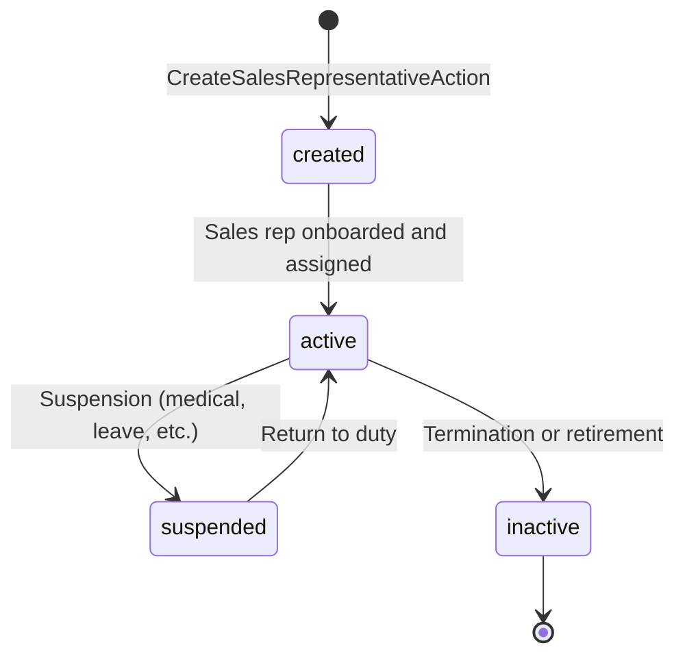

# Sales Representatives & Commission Management

## Business Context & Objective

The MarketingDistribution subdomain manages sales representatives and their commission structures, enabling transparent attribution of revenue to individual salespeople and team leaders. Sales operations, finance, and HR teams depend on this subdomain to track which representative sold to which customer, calculate commissions accurately, and manage sales performance metrics. While the task title mentions "Pricing Tiers & Campaigns," the actual implementation focuses on sales representative lifecycle and transaction-level commission tracking. This subdomain bridges customer engagement (CRM) and financial accountability (AR), ensuring that every revenue transaction is properly attributed for compensation and analytics purposes.

## Domain Entities

| Entity | Business Definition | Role |
|--------|-------------------|------|
| **SalesRepresentative** | A person responsible for acquiring and servicing customers. Contains contact information, address, and commission baseline. | Primary entity managing commission attribution. Linked to invoices and customers. |
| **SalesRepresentativeTransaction** | A transaction-level commission record linking a sales rep to a specific customer transaction. | Tracks commission earned per transaction; enables detailed compensation ledgers and performance analytics. |

## State Machine / Lifecycle

SalesRepresentative follows a simple creation-to-deactivation lifecycle:

<!-- [ASSUMPTION] --> SalesRepresentative does not have an explicit "status" field; instead, it is assumed that deletion (or soft-delete) marks representatives as inactive.

## Business Rules & Constraints

1. **Unique Representative Names** — Each sales representative must have a unique name within the organization.
2. **Representative Assignment** — An invoice can be assigned to a sales representative; the assignment drives commission calculation.
3. **Commission Attribution** — One transaction generates zero or one commission record per representative (no shared commissions across multiple reps per transaction).
4. **Transaction Immutability** — Once a SalesRepresentativeTransaction is created, commission amount and representative cannot be changed; reversal requires deletion and re-creation.
5. **Contact Information** — Phone and email are optional; address is optional for external contractors or field representatives.
6. **Audit Trail** — All representative changes must record the user creating the change (created_by).
7. **No Deletion Without Review** — Deleting a sales representative should be prevented if active transactions exist; archival (soft delete) is preferred.

## Integration Events

| Event | Direction | Connected Domain | Trigger |
|-------|-----------|-----------------|---------|
| SalesRepresentative.Created | Outbound | MonitoringCompliance | CreateSalesRepresentativeAction completes |
| SalesRepresentativeTransaction.Created | Outbound | Finance | Commission transaction created; may trigger GL posting |
| SalesRepresentative.Deactivated | Outbound | HumanCapital | Rep termination; used for HR record matching |

## Key Operations

**CreateSalesRepresentativeAction** — Creates a new sales representative with name (unique), phone, email, address, and created_by. Validates name uniqueness. Returns the created SalesRepresentative entity.

**UpdateSalesRepresentativeAction** — Updates representative contact details (phone, email, address). Name updates may be restricted or require approval.

**DeleteSalesRepresentativeAction** — Marks a representative as inactive or deleted. Soft-delete is recommended to preserve historical commission records.

**CreateSalesRepresentativeTransactionAction** — Creates a commission record linking a representative to a customer transaction (invoice, payment, return). Stores representative ID, customer ID, transaction ID, commission amount, and date.

**GetSalesRepresentativeLedgerAction** — Retrieves all commission transactions for a representative with pagination and filtering by date or transaction type. Used to generate commission statements.

**ListSalesRepresentativesAction** — Retrieves all sales representatives with optional filtering by status or region.

## Known Constraints

1. <!-- [ASSUMPTION] --> SalesRepresentativeTransaction references are implicit (no explicit customer_transaction_id); commission linkage is inferred from date and context.
2. No multi-tier commission hierarchy (commission rules are simple per-transaction; no percentage-based or tiered commission structures visible).
3. No commission dispute or adjustment workflow; commission is fixed once created.
4. No geographic territory assignment or customer assignment rules; any representative can be assigned to any customer.
5. No performance tracking or quota management (those are HR responsibilities, not commercial).

## Assumptions & Open Questions

<!-- [ASSUMPTION] -->
**Pricing Tiers and Campaigns Mismatch**: The task title "Pricing Tiers & Campaigns" does not match the actual implementation of SalesRepresentative management. Clarification needed: Are pricing tiers and promotional campaigns stored elsewhere, or are they planned for future implementation? The current MarketingDistribution subdomain focuses entirely on commission tracking, not pricing strategy.

<!-- [ASSUMPTION] -->
**Commission Calculation Logic**: SalesRepresentativeTransaction stores a commission amount, but the calculation logic (percentage of invoice, fixed fee, tiered commission) is not visible. Clarification needed: Is commission calculated at invoice creation time or in a separate batch process?

<!-- [ASSUMPTION] -->
**Transaction Linkage**: SalesRepresentativeTransaction does not have explicit reference to Invoice or customer transaction record. Clarification needed: How is a commission record linked to the originating transaction? Is it via customer ID + date proximity?

<!-- [ASSUMPTION] -->
**Multi-Representative Commissions**: Invoices assigned to a single SalesRepresentative, but complex scenarios (team sales, shared commissions) are not supported. Clarification needed: For team-based sales, how are commissions split?
