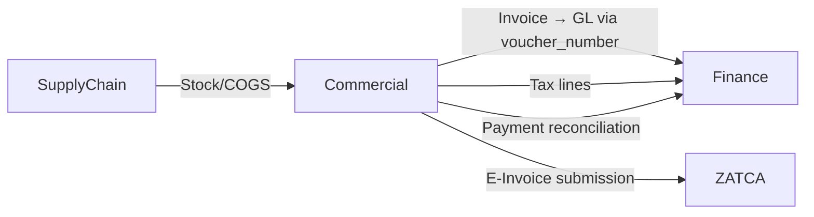

# Commercial — Domain Overview

## Business Purpose

The Commercial domain manages the end-to-end customer lifecycle, from lead capture through invoice generation, payment collection, and dispute resolution. It is the primary interface between the enterprise and its customers, handling CRM relationships, sales order processing, invoicing, and accounts receivable management. Finance teams, sales operations, and customer service teams depend on Commercial to track customer creditworthiness, manage payment terms, enforce revenue recognition rules, and reconcile customer balances. The Commercial domain bridges Sales (customer engagement) and Finance (revenue accounting), ensuring that every customer transaction is captured accurately, invoiced promptly, and collected on schedule.

## Bounded Context Boundaries

Commercial owns and manages:
- Customer master data (customer codes, contact details, tax identifiers, credit limits)
- Sales orders and invoice generation
- Sales returns and credit notes
- Accounts receivable sub-ledger (customer transaction history)
- Sales representative assignments and commission tracking
- Marketing campaign and promotional data
- ZATCA e-invoice compliance and submission

Commercial explicitly excludes:
- General ledger accounts and journal entries (Finance domain)
- Inventory and stock valuation (SupplyChain domain)
- Purchase orders and procurement (SupplyChain domain)
- Tax calculation and compliance reporting (Finance domain)
- Customer communication and interaction history (Platform domain)

## Subdomains

| Subdomain | Description |
|-----------|-------------|
| **CRM** | Customer master data, contact information, credit limits, and customer-level attributes. Single source of truth for "who is this customer?" |
| **SalesLifecycle** | Sales orders, invoices, invoice line items, sales returns, credit notes, and sales representative assignments. Manages the quote-to-cash process. |
| **RevenueReceivables** | Accounts receivable sub-ledger transactions, customer payment records, payment matching, and collection tracking. |
| **MarketingDistribution** | Promotional campaigns, pricing strategies, and customer segmentation for targeted marketing initiatives. |

## Key Domain Entities

**CRM Models:**
- **ArCustomer** — Customer master record with code, name, contact details, tax number, credit limit, and current balance. Uses a global scope to hide the CASH-001 customer (cash sale placeholder).

**SalesLifecycle Models:**
- **Invoice** — Sales invoice document referencing GL via voucher_number (SAP FI pattern). Contains invoice metadata; financial amounts derive from GL, not stored here.
- **InvoiceItem** — Line items of an invoice with product/service, quantity, unit price, and subtotal.
- **SalesReturn** — Credit note document for returned goods or service adjustments.
- **SalesReturnItem** — Line items of a sales return.
- **SalesRepresentative** — Sales staff assigned to customers for commission tracking and sales attribution.
- **SalesRepresentativeTransaction** — Transaction-level commission records.

**RevenueReceivables Models:**
- **ArTransaction** — Accounts receivable sub-ledger entry. Operational metadata only; financial amounts stored in GL. Linked to GL via voucher_number.

## Integration Points

<!-- [ASSUMPTION] --> The Commercial domain emits events to Finance upon invoice creation (Invoice.Created) and payment receipt (Payment.Received). These events trigger GL posting via the Finance Action Layer.

## Governance Rules

1. **Invoice Numbering** — Invoices are assigned sequential numbers by SystemOverview (NrObject/NrInterval).
2. **Voucher Linkage** — Every invoice must reference a GL voucher_number; invoices without GL entries are considered draft.
3. **Customer Balance Consistency** — ArCustomer.current_balance must equal the sum of unpaid ArTransaction amounts for that customer (reconciliation requirement).
4. **ZATCA Compliance** — All invoices must comply with Saudi ZATCA e-invoice requirements; non-compliant invoices cannot be finalized.
5. **Payment Matching** — Cash receipts must match invoices via ArTransaction.reference_id; unmatched receipts are flagged for manual review.
6. **Sales Returns Authorization** — Sales returns require original invoice reference and supervisor approval before credit is issued.
7. **Currency Lock** — Invoice currency is locked at creation; multi-currency invoices are not supported (conversion handled at GL level).
8. **Credit Limit Enforcement** — New credit sales cannot exceed customer credit limit unless explicitly overridden by a manager.

## Documentation Scope

The following documentation pages are planned for the Commercial domain:

| Document | Task ID | Status |
|----------|---------|--------|
| Commercial Domain Overview | COM-001 | In Progress |
| Customer Journey & Credit Policies | COM-002 | Pending |
| Pricing, Promotions & Campaigns | COM-003 | Pending |
| Accounts Receivable & Collections | COM-004 | Pending |
| Sales Contracts & Terms | COM-005 | Pending |
| Quote-to-Cash Process | COM-006 | Pending |

---

## Assumptions & Open Questions

<!-- [ASSUMPTION] -->
**Voucher Linkage Timing**: Commercial invoices reference GL voucher_number, but it is unclear whether the voucher must be created synchronously during invoice creation or can be deferred. Clarification needed: Is invoice creation blocked until GL posting succeeds, or is it asynchronous with reconciliation later?

<!-- [ASSUMPTION] -->
**ZATCA Integration Scope**: The domain mentions ZATCA e-invoice submission, but the submission mechanics (API call, timing, retry logic) are not visible. Clarification needed: Is ZATCA submission automatic upon invoice finalization or manual/batch?

<!-- [ASSUMPTION] -->
**MarketingDistribution Implementation**: The MarketingDistribution subdomain exists but contains no models, only Actions. Clarification needed: Is pricing and promotional data stored in a separate system or embedded in Invoice/InvoiceItem?
