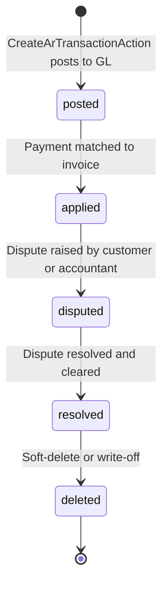

# Accounts Receivable & Collections

## Business Context & Objective

The RevenueReceivables subdomain manages customer payment receipts, returns, and the accounts receivable sub-ledger. It is the operational hub for cash collection, matching payments to invoices, and managing customer disputes. Treasury, collections, and accounting teams depend on this subdomain to track customer payment status, identify delinquent accounts, manage write-offs, and reconcile cash receipts with the general ledger. Every payment from a customer, every credit memo, and every adjustment flows through RevenueReceivables, linking back to both CRM (customer identity) and Finance (general ledger posting). Without effective AR management, the enterprise cannot enforce collection discipline, identify bad debts, or reconcile cash position.

## Domain Entities

| Entity | Business Definition | Role |
|--------|-------------------|------|
| **ArTransaction** | An accounts receivable sub-ledger entry recording a customer payment, return, or adjustment. | Operational record linking customer, transaction type, GL voucher, and dates. Financial amounts live in GL; ArTransaction is metadata only. |

## State Machine / Lifecycle

ArTransaction follows a simple creation-to-deletion lifecycle:

<!-- [ASSUMPTION] --> ArTransaction uses soft-delete semantics (is_deleted flag); deletion is not permanent, enabling audit trail reconstruction.

## Business Rules & Constraints

1. **GL Linkage** — Every ArTransaction must be created with a GL voucher_number. Transactions without GL entries are incomplete.
2. **Dual-Entry Posting** — ArTransaction creation posts two GL entries (e.g., DEBIT Cash, CREDIT AR) via LedgerService. Posting must succeed atomically or fail entirely.
3. **Customer Balance Reconciliation** — ArCustomer.current_balance must equal the sum of all non-deleted ArTransaction amounts for that customer (reconciliation requirement).
4. **Transaction Types** — ArTransaction.type supports 'payment' (receipt), 'receipt' (synonym), and 'return' (credit memo). Other types may be added for adjustments.
5. **Reference Tracking** — ArTransaction stores reference_type and reference_id to link to originating documents (invoice, sales return, manual adjustment).
6. **Immutable Amounts** — Once posted, transaction amount cannot be changed; reversal requires a new offsetting transaction.
7. **Deletion Audit** — Soft-deleted transactions retain is_deleted=true and deleted_at timestamp. Hard deletion is not permitted.
8. **Account Code Mapping** — Standard GL account mappings (cash, accounts_receivable, sales_revenue, sales_discount) are retrieved via ChartOfAccountsMappingService.

## Integration Events

| Event | Direction | Connected Domain | Trigger |
|-------|-----------|-----------------|---------|
| Payment.Posted | Outbound | Finance | CreateArTransactionAction posts GL entries |
| Customer.BalanceUpdated | Outbound | CRM | updateCustomerBalance() recalculates current_balance |
| AR.Reconciled | Outbound | MonitoringCompliance | Daily reconciliation between AR subledger and GL |
| Payment.Matched | Internal | RevenueReceivables | Payment linked to invoice |

## Key Operations

**CreateArTransactionAction** — Creates an AR transaction (payment or return) atomically within a database transaction. Constructs GL entries based on transaction type, posts to GL via LedgerService, creates ArTransaction record, links GL voucher to transaction, and updates customer balance. Returns the created ArTransaction.

**DeleteArTransactionAction** — Soft-deletes an ArTransaction by setting is_deleted=true and deleted_at=now(). Reverses GL entries (creates offsetting debit/credit). Updates customer balance to reflect deletion.

**ListArTransactionsAction** — Retrieves paginated list of AR transactions for a customer with filtering by type, date range, and deletion status.

**updateCustomerBalance (Private)** — Recalculates ArCustomer.current_balance by summing GL debits minus GL credits for all non-deleted transactions in the AR account. This ensures ArCustomer.current_balance stays synchronized with GL reality.

## Known Constraints

1. <!-- [ASSUMPTION] --> "Dunning" (collection notices, late payment reminders) is mentioned in the task title but not implemented in the source code. Collections management may be delegated to the Platform or HumanCapital domain.
2. Payment matching (applying a payment to a specific invoice) is not visible in the current action layer; matching may be implemented in a Services layer or a separate API endpoint.
3. Multi-currency transactions are not supported at the AR level; currency conversion is handled at GL entry level.
4. No dispute resolution workflow; disputed transactions are flagged but have no formal escalation or approval path.
5. Customer balance updates are synchronous (updateCustomerBalance called immediately after GL posting); high-volume payment processing may cause performance bottlenecks.
6. No automatic write-off of aged AR; write-off decisions require manual operator action.

## Assumptions & Open Questions

<!-- [ASSUMPTION] -->
**Dunning Process**: The task is titled "AR & Dunning," but no dunning workflow or collection notice system is visible in the RevenueReceivables code. Clarification needed: Is dunning (late payment reminders, escalation letters) implemented in a separate module, or is it planned for future phases?

<!-- [ASSUMPTION] -->
**Payment Matching Logic**: CreateArTransactionAction accepts reference_type and reference_id, suggesting that a payment can be matched to an originating invoice. However, the matching logic itself (finding which invoice a payment applies to, handling partial payments, overpayments) is not visible. Clarification needed: Is matching automatic based on customer ID + date, or is it manual?

<!-- [ASSUMPTION] -->
**GL Account Mappings**: CreateArTransactionAction retrieves standard accounts from ChartOfAccountsMappingService. Clarification needed: If a company has multiple AR accounts or custom account structures, how are those overrides handled? Is there a company-level or period-level configuration?

<!-- [ASSUMPTION] -->
**Customer Balance Synchronization**: updateCustomerBalance() runs synchronously after each transaction. Under high concurrency, this could cause locking or performance issues. Clarification needed: Should balance updates be asynchronous, or is synchronous required for real-time balance accuracy?
