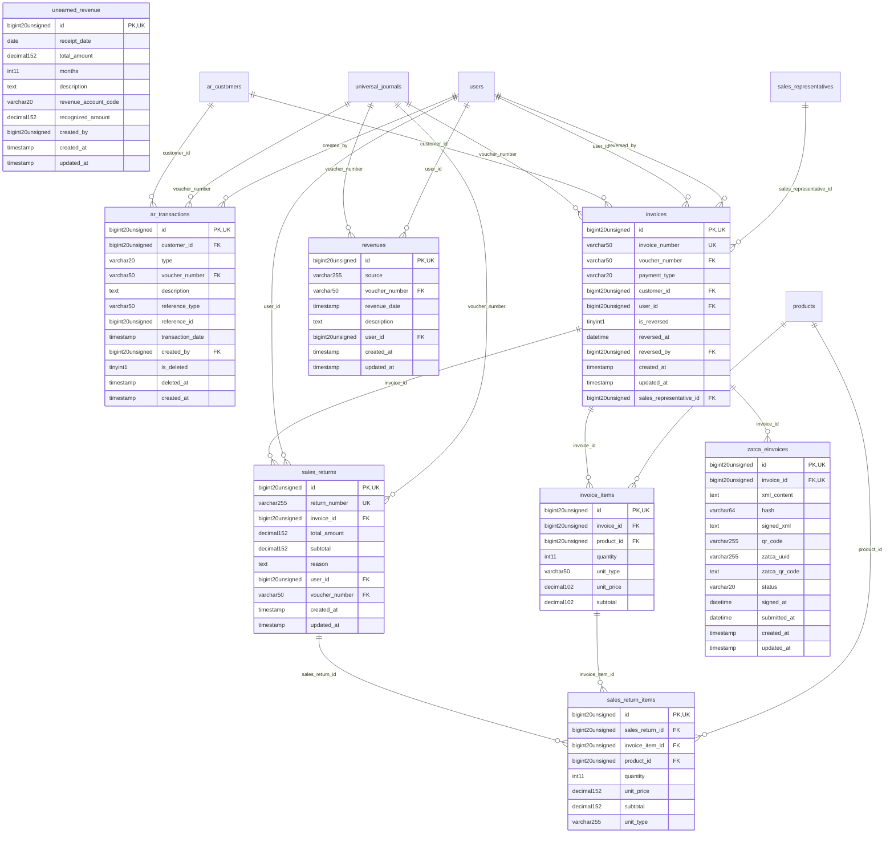

# Commercial - RevenueReceivables

> **Bounded Context Schema & ERD**
> 8 Tables | Generated dynamically by ACCSYSTEM engine

---

## Tables List

- `ar_transactions`
- `invoice_items`
- `invoices`
- `revenues`
- `sales_return_items`
- `sales_returns`
- `unearned_revenue`
- `zatca_einvoices`

---

## Entity Relationship Diagram

---

## Data Dictionary

### Table: `ar_transactions`

| Column | Type | Nullable | Default | Indexes | Foreign Keys |
|---|---|---|---|---|---|
| `id` | `bigint(20) unsigned` | No |  | **PK** |  |
| `customer_id` | `bigint(20) unsigned` | No |  | IDX | -> `ar_customers.id` |
| `type` | `varchar(20)` | No |  |  |  |
| `voucher_number` | `varchar(50)` | Yes | `NULL` | IDX | -> `universal_journals.voucher_number` |
| `description` | `text` | Yes | `NULL` |  |  |
| `reference_type` | `varchar(50)` | Yes | `NULL` |  |  |
| `reference_id` | `bigint(20) unsigned` | Yes | `NULL` |  |  |
| `transaction_date` | `timestamp` | No | `current_timestamp()` |  |  |
| `created_by` | `bigint(20) unsigned` | Yes | `NULL` | IDX | -> `users.id` |
| `is_deleted` | `tinyint(1)` | No | `0` |  |  |
| `deleted_at` | `timestamp` | Yes | `NULL` |  |  |
| `created_at` | `timestamp` | No | `current_timestamp()` |  |  |

### Table: `invoice_items`

| Column | Type | Nullable | Default | Indexes | Foreign Keys |
|---|---|---|---|---|---|
| `id` | `bigint(20) unsigned` | No |  | **PK** |  |
| `invoice_id` | `bigint(20) unsigned` | No |  | IDX | -> `invoices.id` |
| `product_id` | `bigint(20) unsigned` | No |  | IDX | -> `products.id` |
| `quantity` | `int(11)` | No |  |  |  |
| `unit_type` | `varchar(50)` | No | `'main'` |  |  |
| `unit_price` | `decimal(10,2)` | No |  |  |  |
| `subtotal` | `decimal(10,2)` | No |  |  |  |

### Table: `invoices`

| Column | Type | Nullable | Default | Indexes | Foreign Keys |
|---|---|---|---|---|---|
| `id` | `bigint(20) unsigned` | No |  | **PK** |  |
| `invoice_number` | `varchar(50)` | No |  | *UK* |  |
| `voucher_number` | `varchar(50)` | Yes | `NULL` | IDX | -> `universal_journals.voucher_number` |
| `payment_type` | `varchar(20)` | No | `'cash'` |  |  |
| `customer_id` | `bigint(20) unsigned` | Yes | `NULL` | IDX | -> `ar_customers.id` |
| `user_id` | `bigint(20) unsigned` | Yes | `NULL` | IDX | -> `users.id` |
| `is_reversed` | `tinyint(1)` | No | `0` |  |  |
| `reversed_at` | `datetime` | Yes | `NULL` |  |  |
| `reversed_by` | `bigint(20) unsigned` | Yes | `NULL` | IDX | -> `users.id` |
| `created_at` | `timestamp` | Yes | `NULL` |  |  |
| `updated_at` | `timestamp` | Yes | `NULL` |  |  |
| `sales_representative_id` | `bigint(20) unsigned` | Yes | `NULL` | IDX | -> `sales_representatives.id` |

### Table: `revenues`

| Column | Type | Nullable | Default | Indexes | Foreign Keys |
|---|---|---|---|---|---|
| `id` | `bigint(20) unsigned` | No |  | **PK** |  |
| `source` | `varchar(255)` | No |  |  |  |
| `voucher_number` | `varchar(50)` | Yes | `NULL` | IDX | -> `universal_journals.voucher_number` |
| `revenue_date` | `timestamp` | No | `current_timestamp()` |  |  |
| `description` | `text` | Yes | `NULL` |  |  |
| `user_id` | `bigint(20) unsigned` | Yes | `NULL` | IDX | -> `users.id` |
| `created_at` | `timestamp` | Yes | `NULL` |  |  |
| `updated_at` | `timestamp` | Yes | `NULL` |  |  |

### Table: `sales_return_items`

| Column | Type | Nullable | Default | Indexes | Foreign Keys |
|---|---|---|---|---|---|
| `id` | `bigint(20) unsigned` | No |  | **PK** |  |
| `sales_return_id` | `bigint(20) unsigned` | No |  | IDX | -> `sales_returns.id` |
| `invoice_item_id` | `bigint(20) unsigned` | No |  | IDX | -> `invoice_items.id` |
| `product_id` | `bigint(20) unsigned` | No |  | IDX | -> `products.id` |
| `quantity` | `int(11)` | No |  |  |  |
| `unit_price` | `decimal(15,2)` | No |  |  |  |
| `subtotal` | `decimal(15,2)` | No |  |  |  |
| `unit_type` | `varchar(255)` | No | `'sub'` |  |  |

### Table: `sales_returns`

| Column | Type | Nullable | Default | Indexes | Foreign Keys |
|---|---|---|---|---|---|
| `id` | `bigint(20) unsigned` | No |  | **PK** |  |
| `return_number` | `varchar(255)` | No |  | *UK* |  |
| `invoice_id` | `bigint(20) unsigned` | No |  | IDX | -> `invoices.id` |
| `total_amount` | `decimal(15,2)` | No |  |  |  |
| `subtotal` | `decimal(15,2)` | No |  |  |  |
| `reason` | `text` | Yes | `NULL` |  |  |
| `user_id` | `bigint(20) unsigned` | No |  | IDX | -> `users.id` |
| `voucher_number` | `varchar(50)` | Yes | `NULL` | IDX | -> `universal_journals.voucher_number` |
| `created_at` | `timestamp` | Yes | `NULL` | IDX |  |
| `updated_at` | `timestamp` | Yes | `NULL` |  |  |

### Table: `unearned_revenue`

| Column | Type | Nullable | Default | Indexes | Foreign Keys |
|---|---|---|---|---|---|
| `id` | `bigint(20) unsigned` | No |  | **PK** |  |
| `receipt_date` | `date` | No |  |  |  |
| `total_amount` | `decimal(15,2)` | No |  |  |  |
| `months` | `int(11)` | No |  |  |  |
| `description` | `text` | Yes | `NULL` |  |  |
| `revenue_account_code` | `varchar(20)` | Yes | `NULL` |  |  |
| `recognized_amount` | `decimal(15,2)` | No | `0.00` |  |  |
| `created_by` | `bigint(20) unsigned` | Yes | `NULL` |  |  |
| `created_at` | `timestamp` | Yes | `NULL` |  |  |
| `updated_at` | `timestamp` | Yes | `NULL` |  |  |

### Table: `zatca_einvoices`

| Column | Type | Nullable | Default | Indexes | Foreign Keys |
|---|---|---|---|---|---|
| `id` | `bigint(20) unsigned` | No |  | **PK** |  |
| `invoice_id` | `bigint(20) unsigned` | No |  | *UK* | -> `invoices.id` |
| `xml_content` | `text` | No |  |  |  |
| `hash` | `varchar(64)` | No |  | IDX |  |
| `signed_xml` | `text` | Yes | `NULL` |  |  |
| `qr_code` | `varchar(255)` | Yes | `NULL` |  |  |
| `zatca_uuid` | `varchar(255)` | Yes | `NULL` |  |  |
| `zatca_qr_code` | `text` | Yes | `NULL` |  |  |
| `status` | `varchar(20)` | No | `'generated'` | IDX |  |
| `signed_at` | `datetime` | Yes | `NULL` |  |  |
| `submitted_at` | `datetime` | Yes | `NULL` |  |  |
| `created_at` | `timestamp` | Yes | `NULL` |  |  |
| `updated_at` | `timestamp` | Yes | `NULL` |  |  |

