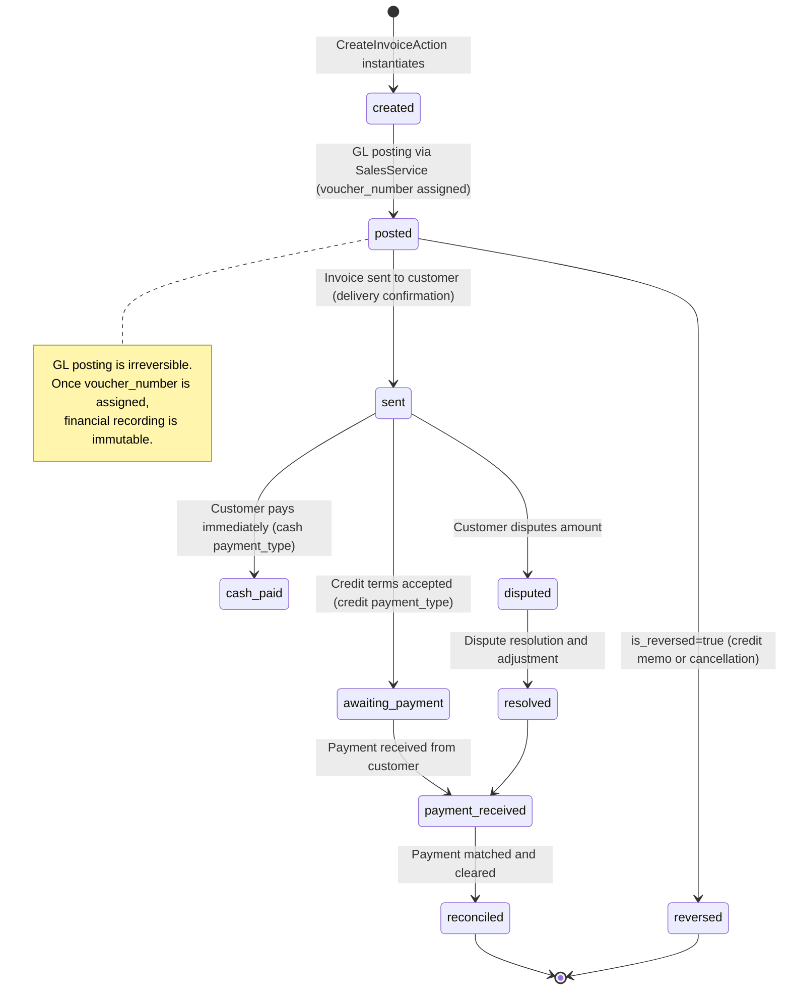

# Quote-to-Cash Process Lifecycle

## Overview

The Quote-to-Cash (Q2C) lifecycle is the core business process spanning customer engagement, invoice generation, GL posting, and payment collection. An Invoice entity progresses through creation, GL posting, customer delivery, payment, and potential reversal. This lifecycle is critical to financial accuracy, revenue recognition, and cash flow management. Unlike simpler entities, Invoices interact with both Finance (GL posting via voucher_number) and CRM (customer relationships, payment tracking), making the lifecycle uniquely complex and audit-sensitive.

## State Diagram

## State Definitions

| State | Business Meaning | Entry Condition | Exit Condition |
|-------|-----------------|-----------------|----------------|
| **Created** | Invoice record instantiated; GL not yet posted. | CreateInvoiceAction completes; voucher_number is null. | GL posting succeeds OR creation validation fails. |
| **Posted** | Invoice GL posting complete; amounts recorded in GL. | SalesService.createInvoice() posts GL entries and returns voucher_number. | Customer receives invoice (sent) OR reversal initiated. |
| **Sent** | Invoice delivered to customer; awaiting payment or acceptance. | Invoice marked as sent (delivery confirmation recorded). | Cash received (cash_type) OR credit accepted (awaiting_payment) OR dispute raised. |
| **Cash Paid** | Invoice paid immediately (POS or walk-in cash sale). | Payment received and matched to invoice on creation. | Payment cleared and reconciled. |
| **Awaiting Payment** | Invoice issued on credit terms; payment expected within terms. | payment_type='credit' and sent date recorded. | Payment received OR credit memo issued OR dispute raised. |
| **Payment Received** | Customer payment received and recorded in AR. | CreateArTransactionAction creates payment record with GL posting. | Payment fully matched and customer balance reconciled. |
| **Reconciled** | Payment matched to invoice; AR updated. | Payment amount equals invoice amount; AR sub-ledger reconciled. | Terminal state (invoice-payment cycle complete). |
| **Reversed** | Invoice reversed via credit memo (is_reversed=true). | DeleteInvoiceAction soft-deletes and posts reversing GL entries. | Terminal state (invoice negated). |
| **Disputed** | Customer disputes invoice amount or terms. | Dispute notification received (from CRM or manual entry). | Dispute resolved (adjustment issued) OR customer payment received despite dispute. |
| **Resolved** | Dispute settlement agreement reached. | Adjustment GL posting completed; dispute closed in CRM. | Payment received OR further escalation. |

## Transition Rules

1. **Created → Posted** — CreateInvoiceAction delegates to SalesService.createInvoice(), which constructs GL entries (DEBIT AR/Cash, CREDIT Sales Revenue, DEBIT/CREDIT Tax Lines), posts via Finance.LedgerService, and returns voucher_number. Transition is atomic (all-or-nothing).

2. **Posted → Sent** — Manual operator marks invoice as sent (may be API call to status endpoint). Initiates delivery workflow (email, document printing, or ERP transmission to customer system).

3. **Sent → Cash Paid (cash_type only)** — For payment_type='cash', payment is assumed simultaneous with invoice creation. ArTransaction created with type='payment'. Customer balance updated in CRM.

4. **Sent → Awaiting Payment (credit_type only)** — For payment_type='credit', invoice waits for customer payment within terms. No immediate GL payment entry. AR remains open (current_balance reflects outstanding).

5. **Awaiting Payment → Payment Received** — CreateArTransactionAction creates payment record when customer remits funds. GL posting (DEBIT Cash, CREDIT AR) updates Finance. Customer balance recalculated.

6. **Payment Received → Reconciled** — Finance reconciliation batch (daily) matches payment GL entries to invoice GL entries via voucher_number. ArCustomer.current_balance validated against GL AR balance. Terminal state reached.

7. **Posted → Reversed** — DeleteInvoiceAction soft-deletes invoice (is_reversed=true, deleted_at=now()). Posts reversing GL entries (negation of original entries). Equivalent to credit memo.

8. **Sent → Disputed** — Customer or accountant raises dispute (outside invoicing system). CRM records dispute; invoice remains open pending resolution.

9. **Disputed → Resolved** — Dispute settlement: adjustment GL entry posted (credit for disputed amount), invoice adjusted or credit memo issued. Dispute closed in CRM.

10. **Resolved → Payment Received** — After dispute resolved, customer remits payment for adjusted amount. Normal payment flow resumes.

## Irreversibility & Immutability

- **GL Posting is Irreversible** — Once voucher_number is assigned, the GL entries are permanent. Corrections require reversing entries (CreateArTransactionAction with type='return'), not modification.
- **Invoice Amount is Immutable** — Invoice total_amount cannot be edited post-creation. Adjustments require credit memo (CreateSalesReturnAction) or reversal (DeleteInvoiceAction).
- **Reconciled → Disputed is NOT Allowed** — Once a payment is reconciled (matched to GL AR balance), reopening disputes requires unreconciliation (manual intervention, logged).
- **Audit Trail** — Every state transition must be logged with user_id, timestamp, and reason (for reversals and disputes).

## Integration Impact

| Transition | Affected Domain | Event Emitted | Side Effect |
|-----------|-----------------|---------------|------------|
| Created | — | Invoice.Created | No GL impact yet |
| Posted | Finance | Invoice.Posted | GL entries created; voucher_number assigned |
| Sent | CRM, Platform | Invoice.Sent | Delivery workflow triggered; customer notification |
| Payment Received | Finance, CRM | Payment.Posted | GL payment entry; AR sub-ledger updated; customer balance recalculated |
| Reconciled | Finance | AR.Reconciled | Finance confirms GL AR balance = CRM AR balance |
| Reversed | Finance | Invoice.Reversed | Reversing GL entries negate original posting |
| Disputed | CRM, MonitoringCompliance | Invoice.Disputed | Dispute logged for audit; payment hold (optional) |

## Assumptions & Open Questions

<!-- [ASSUMPTION] -->
**Quote and Sales Order Stages Missing**: The lifecycle begins at "Invoice Created." There is no visible Quotation, Sales Order, or Purchase Order stage in the SalesLifecycle. Clarification needed: Are Q (quote) and SO (sales order) stages implicit, or are they delegated to a different domain?

<!-- [ASSUMPTION] -->
**Cash/Credit Determination**: Invoice.payment_type is set at creation and determines whether Q2C follows a cash-paid-immediately path or a credit-awaiting-payment path. Clarification needed: Is payment_type driven by customer credit limit, order size, or sales rep assignment?

<!-- [ASSUMPTION] -->
**Delivery Confirmation**: The "Sent" state assumes invoice is transmitted to customer. However, the mechanism (email, EDI, portal, print) and confirmation receipt are not visible. Clarification needed: Is "Sent" a manual operator action or automatic upon invoice creation?

<!-- [ASSUMPTION] -->
**Dispute Resolution Workflow**: Disputed → Resolved transition is shown but the resolution mechanics (credit memo, write-off, customer concession) are not specified. Clarification needed: Is there a formal dispute approval workflow in CRM?

<!-- [ASSUMPTION] -->
**Partial Payments**: The lifecycle assumes full payment matching. Clarification needed: How are partial payments handled? Does ArTransaction support partial payment application, or must partials be tracked via separate invoice line-item credits?
