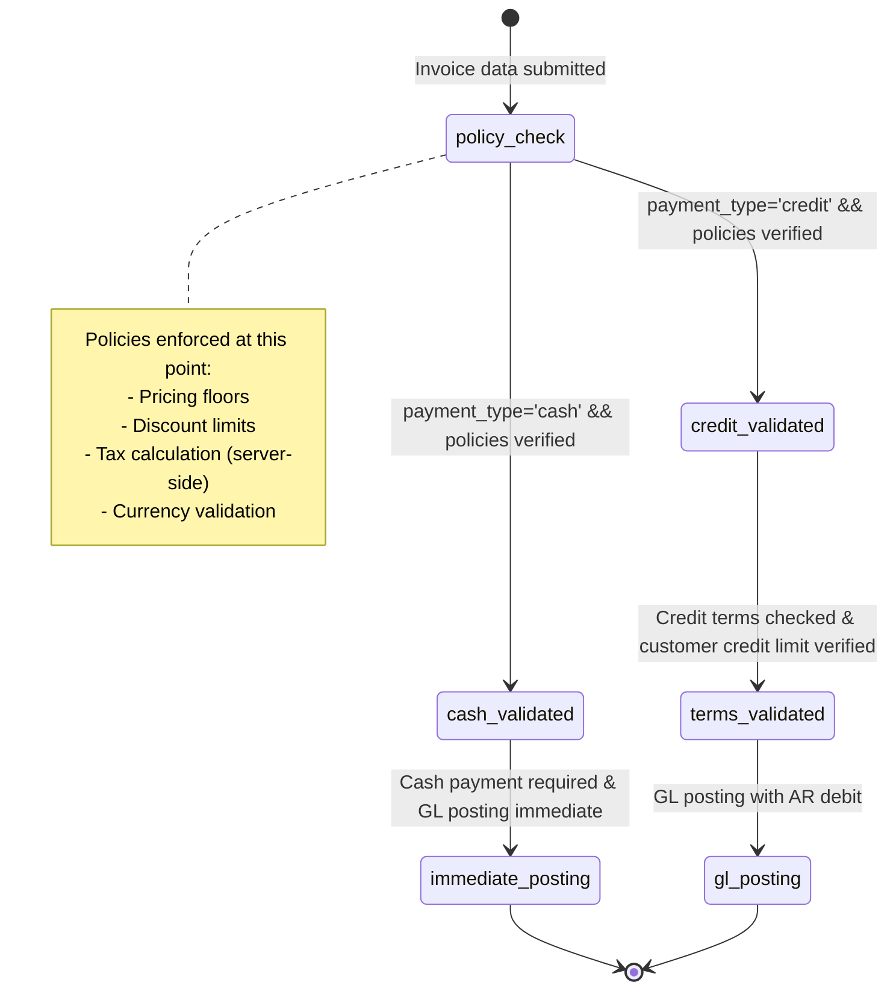

# Sales Contracts & Payment Policies

## Business Context & Objective

Sales contracts and payment policies define the legal and financial terms under which the enterprise conducts business with customers. These policies govern payment methods (cash vs. credit), discount eligibility, pricing floors, tax calculation, and currency handling. Finance controllers, credit managers, and sales operations depend on these policies to ensure consistent enforcement, prevent margin erosion, and manage credit risk. Unlike individual customer contracts (CRM), payment policies are enterprise-wide rules embedded in the sales workflow, ensuring every invoice complies with approved commercial terms.

## Domain Entities

This subdomain implements policies rather than storing discrete contract entities. The Invoice entity embodies policy enforcement through its fields:
- **payment_type** — 'cash' (payment required on invoice creation) or 'credit' (payment deferred).
- **discount_amount** — Applied discount; must comply with discount policies.
- **currency_id** and **exchange_rate** — Multi-currency support with server-validated rates.
- **sales_representative_id** — Links invoice to sales rep for commission and attribution.

## State Machine / Lifecycle

Payment policy is enforced at invoice creation time; no state transitions occur post-creation.

## Business Rules & Constraints

1. **Payment Type Governance** — payment_type is set at invoice creation and determines GL posting pattern (cash vs. AR). Cannot be changed post-creation.
2. **Pricing Floors** — SalesService enforces minimum pricing per product/service. Discounts cannot reduce unit price below floor.
3. **Discount Policies** — Discount amounts are subject to approval thresholds. Large discounts may require manager override.
4. **Server-Side Tax Calculation** — VAT and tax amounts are calculated server-side (TaxCalculator), not client-side. Client cannot submit tax amounts; server computes them.
5. **Tax Compliance** — All invoices must comply with jurisdiction tax requirements before GL posting. Non-compliant invoices are rejected.
6. **Currency Handling** — exchange_rate for multi-currency invoices is validated against central rates (not customer-provided). Stale or divergent rates are rejected.
7. **Credit Limit Enforcement** — For payment_type='credit', customer current_balance + new invoice amount must not exceed credit_limit (unless override granted).
8. **Sales Rep Commission Eligibility** — sales_representative_id links to commission policy; only assigned reps accrue commission on the sale.

## Integration Events

| Event | Direction | Connected Domain | Trigger |
|-------|-----------|-----------------|---------|
| Invoice.PolicyValidated | Internal | SalesLifecycle | Pre-creation policy checks pass |
| Invoice.Created | Outbound | Finance | createInvoice posts GL entries |
| Discount.Applied | Internal | SalesLifecycle | Discount validation passed |
| CreditLimit.Checked | Outbound | CRM | Credit sales require CRM customer credit_limit check |

## Key Operations

**SalesService.createInvoice()** — Master invoice creation method. Validates all sales policies (pricing floors, discount limits, tax compliance, credit limit if applicable), constructs GL entries, posts to GL, creates Invoice record, and links to ArTransaction (for cash) or ArCustomer balance (for credit).

**TaxCalculator.calculateTax()** — Server-side tax computation. Accepts invoice details and customer jurisdiction. Returns tax_type, tax_rate, and tax_amount. Non-overridable by client.

**InventoryCostingService** — Validates inventory availability and calculates COGS for each line item. Prevents overselling; validates cost-per-unit.

**Discount Approval Workflow** — Discounts above threshold require manager approval. Implementation delegates to EnterpriseCore RBAC.

## Known Constraints

1. <!-- [ASSUMPTION] --> Discount policies are not visible in current implementation; discount_amount is accepted without validation against policy thresholds.
2. Pricing floors are referenced in SalesService docstring but the enforcement mechanism is not visible in accessible code.
3. Multi-currency exchange_rate validation mechanism not visible; unclear whether rates are cached, pulled from external sources, or manually entered.
4. Sales rep commission rules (percentage, fixed fee, tiered) not visible; only commission transaction recording is implemented.
5. Credit term policies (Net 30, Net 60, etc.) are not encoded in Invoice model; credit terms may be stored in OrganizationGovernance.Setting or CRM customer record.
6. No contract entity (like SalesContract or Purchase Agreement) visible; all terms are implicit in Invoice policy enforcement.

## Assumptions & Open Questions

<!-- [ASSUMPTION] -->
**Missing SalesGovernance Subdomain**: The task specifies a SalesGovernance subdomain, but no such directory exists in the backend. This document covers sales governance concepts within SalesLifecycle. Clarification needed: Should contract and policy management be formalized as a separate SalesGovernance module?

<!-- [ASSUMPTION] -->
**Pricing Floor Enforcement**: SalesService docstring mentions "pricing floors," but the validation code is not visible. Clarification needed: Are pricing floors per-product, per-customer-segment, or global? How are they configured?

<!-- [ASSUMPTION] -->
**Discount Threshold Logic**: Discounts are accepted but approval thresholds are not implemented in visible code. Clarification needed: Are discount approvals manually managed, or is there an automated workflow?

<!-- [ASSUMPTION] -->
**Credit Term Policies**: Invoice does not contain payment_due_date or credit_term_days. Clarification needed: Where are credit terms (Net 30, 2/10 Net 30, etc.) stored? Are they per-customer or per-product-category?

<!-- [ASSUMPTION] -->
**Multi-Tenant Policy Enforcement**: Policies appear to be global (no tenant_id in policy tables). Clarification needed: For multi-tenant ACCSYSTEM, how are per-tenant sales policies enforced?
