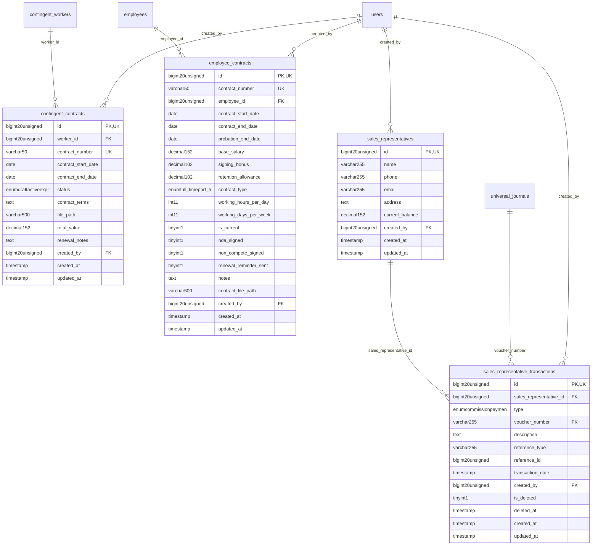

# Commercial - SalesLifecycle

> **Bounded Context Schema & ERD**
> 4 Tables | Generated dynamically by ACCSYSTEM engine

---

## Tables List

- `contingent_contracts`
- `employee_contracts`
- `sales_representative_transactions`
- `sales_representatives`

---

## Entity Relationship Diagram

---

## Data Dictionary

### Table: `contingent_contracts`

| Column | Type | Nullable | Default | Indexes | Foreign Keys |
|---|---|---|---|---|---|
| `id` | `bigint(20) unsigned` | No |  | **PK** |  |
| `worker_id` | `bigint(20) unsigned` | No |  | IDX | -> `contingent_workers.id` |
| `contract_number` | `varchar(50)` | No |  | *UK* |  |
| `contract_start_date` | `date` | No |  |  |  |
| `contract_end_date` | `date` | Yes | `NULL` |  |  |
| `status` | `enum('draft','active','expired','terminated','renewed')` | No | `'draft'` |  |  |
| `contract_terms` | `text` | Yes | `NULL` |  |  |
| `file_path` | `varchar(500)` | Yes | `NULL` |  |  |
| `total_value` | `decimal(15,2)` | Yes | `NULL` |  |  |
| `renewal_notes` | `text` | Yes | `NULL` |  |  |
| `created_by` | `bigint(20) unsigned` | Yes | `NULL` | IDX | -> `users.id` |
| `created_at` | `timestamp` | Yes | `NULL` |  |  |
| `updated_at` | `timestamp` | Yes | `NULL` |  |  |

### Table: `employee_contracts`

| Column | Type | Nullable | Default | Indexes | Foreign Keys |
|---|---|---|---|---|---|
| `id` | `bigint(20) unsigned` | No |  | **PK** |  |
| `contract_number` | `varchar(50)` | Yes | `NULL` | *UK* |  |
| `employee_id` | `bigint(20) unsigned` | No |  | IDX | -> `employees.id` |
| `contract_start_date` | `date` | No |  | IDX |  |
| `contract_end_date` | `date` | Yes | `NULL` |  |  |
| `probation_end_date` | `date` | Yes | `NULL` |  |  |
| `base_salary` | `decimal(15,2)` | No |  |  |  |
| `signing_bonus` | `decimal(10,2)` | No | `0.00` |  |  |
| `retention_allowance` | `decimal(10,2)` | No | `0.00` |  |  |
| `contract_type` | `enum('full_time','part_time','contract','freelance')` | No | `'full_time'` |  |  |
| `working_hours_per_day` | `int(11)` | No | `8` |  |  |
| `working_days_per_week` | `int(11)` | No | `5` |  |  |
| `is_current` | `tinyint(1)` | No | `1` | IDX |  |
| `nda_signed` | `tinyint(1)` | No | `0` |  |  |
| `non_compete_signed` | `tinyint(1)` | No | `0` |  |  |
| `renewal_reminder_sent` | `tinyint(1)` | No | `0` |  |  |
| `notes` | `text` | Yes | `NULL` |  |  |
| `contract_file_path` | `varchar(500)` | Yes | `NULL` |  |  |
| `created_by` | `bigint(20) unsigned` | Yes | `NULL` | IDX | -> `users.id` |
| `created_at` | `timestamp` | Yes | `NULL` |  |  |
| `updated_at` | `timestamp` | Yes | `NULL` |  |  |

### Table: `sales_representative_transactions`

| Column | Type | Nullable | Default | Indexes | Foreign Keys |
|---|---|---|---|---|---|
| `id` | `bigint(20) unsigned` | No |  | **PK** |  |
| `sales_representative_id` | `bigint(20) unsigned` | No |  | IDX | -> `sales_representatives.id` |
| `type` | `enum('commission','payment','return','adjustment')` | No |  |  |  |
| `voucher_number` | `varchar(255)` | Yes | `NULL` | IDX | -> `universal_journals.voucher_number` |
| `description` | `text` | Yes | `NULL` |  |  |
| `reference_type` | `varchar(255)` | Yes | `NULL` |  |  |
| `reference_id` | `bigint(20) unsigned` | Yes | `NULL` |  |  |
| `transaction_date` | `timestamp` | No | `current_timestamp()` |  |  |
| `created_by` | `bigint(20) unsigned` | Yes | `NULL` | IDX | -> `users.id` |
| `is_deleted` | `tinyint(1)` | No | `0` |  |  |
| `deleted_at` | `timestamp` | Yes | `NULL` |  |  |
| `created_at` | `timestamp` | Yes | `NULL` |  |  |
| `updated_at` | `timestamp` | Yes | `NULL` |  |  |

### Table: `sales_representatives`

| Column | Type | Nullable | Default | Indexes | Foreign Keys |
|---|---|---|---|---|---|
| `id` | `bigint(20) unsigned` | No |  | **PK** |  |
| `name` | `varchar(255)` | No |  |  |  |
| `phone` | `varchar(255)` | Yes | `NULL` |  |  |
| `email` | `varchar(255)` | Yes | `NULL` |  |  |
| `address` | `text` | Yes | `NULL` |  |  |
| `current_balance` | `decimal(15,2)` | No | `0.00` |  |  |
| `created_by` | `bigint(20) unsigned` | Yes | `NULL` | IDX | -> `users.id` |
| `created_at` | `timestamp` | Yes | `NULL` |  |  |
| `updated_at` | `timestamp` | Yes | `NULL` |  |  |

