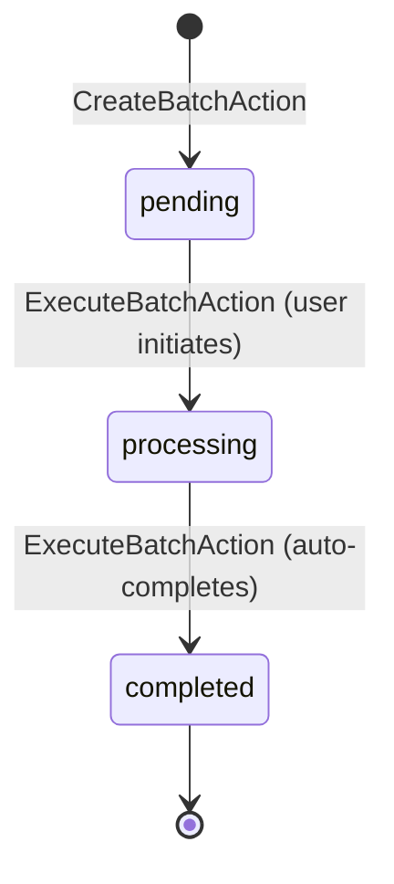

# Automation & Orchestration Rules

## Business Context & Objective

The Automation subdomain provides enterprise-wide orchestration and scheduling capabilities for repeating and batched business operations. Rather than managing its own business entities, Automation acts as a meta-coordinator for operations originating from other domains—batch processing from SupplyChain, recurring transactions from Finance, and system templates from HumanCapital. This subdomain solves the business problem of reducing manual effort, ensuring consistency, and enabling scheduled execution of complex multi-step operations across domain boundaries.

Key stakeholders include Finance teams automating recurring entries, Supply Chain managers orchestrating bulk inventory operations, and System Administrators managing system-wide automation policies.

## Domain Entities

| Entity | Business Definition | Role |
|--------|-------------------|------|
| **Batch** | A logical grouping of items or operations to be processed together as a single unit. | Encapsulates multiple items for coordinated execution; tracks processing status and completion timestamp. |
| **RecurringTransaction** | A template-based financial entry configured to execute automatically on a defined schedule. | Automates repetitive journal entries, reducing manual data entry and ensuring consistency. |
| **SystemTemplate** | A reusable operation definition that enforces type-specific validation and structure. | Provides governance over which templates may be created; enables rapid provisioning of approved patterns. |

## State Machine / Lifecycle

Batches follow a three-state lifecycle:

<!-- [ASSUMPTION] --> Batches are immutable once completed. No transitions from completed or processing states back to pending are permitted.

## Business Rules & Constraints

1. **Batch Creation** — A batch must have a name, type, and optionally a description. Status defaults to `pending`.
2. **Batch Execution** — Only batches in `pending` status may transition to `processing` and subsequently to `completed`.
3. **Recurring Transaction Scheduling** — A recurring transaction must define an execution frequency (daily, weekly, monthly, quarterly, annually).
4. **System Template Validation** — Templates must belong to approved system types; HR-specific templates are excluded from system template creation.
5. **Template Type Registry** — All template types must be registered in TemplateRegistry with metadata indicating their module scope (system, hr, domain-specific).
6. **Audit Logging** — Every Batch or RecurringTransaction operation (CREATE, EXECUTE, UPDATE, DELETE) must be logged to the Telescope audit trail with user_id, timestamp, ip_address, and value changes.

## Integration Events

| Event | Direction | Connected Domain | Trigger |
|-------|-----------|-----------------|---------|
| Batch.Created | Outbound | MonitoringCompliance | CreateBatchAction completes |
| Batch.Executed | Outbound | MonitoringCompliance | ExecuteBatchAction transitions to completed |
| RecurringTransaction.Created | Outbound | Finance.Treasury | CreateRecurringTransactionAction completes |
| RecurringTransaction.Processed | Outbound | Finance.Treasury | ProcessRecurringTransactionAction triggers scheduled execution |
| SystemTemplate.Created | Outbound | HumanCapital.HRAdvanced | CreateSystemTemplateAction completes (non-HR types only) |
| Operation.Audited | Outbound | MonitoringCompliance | TelescopeService logs any CRUD operation |

## Key Operations

**CreateBatchAction** — Creates a new batch with provided name, type, and optional description. Initializes status to `pending` and total_items to 0. Logs the operation to Telescope.

**ExecuteBatchAction** — Transitions a pending batch to processing, records start timestamp, simulates processing, then completes the batch with completion timestamp. Throws an exception if the batch is not in pending status.

**CreateRecurringTransactionAction** — Establishes a recurring transaction in Finance.Treasury with template data (frequency, amount, account mappings).

**ProcessRecurringTransactionAction** — Triggers the scheduled execution of a recurring transaction, generating actual transaction entries in Finance based on the template definition.

**CreateSystemTemplateAction** — Validates template type against approved system types, validates template structure and HTML body, then delegates to HumanCapital's TemplateService for creation.

**ListBatchesAction** & **ShowBatchAction** — Retrieve batch data with filtering and detail views.

## Known Constraints

1. Batches cannot be deleted once created; only status transitions are permitted.
2. RecurringTransaction frequency cannot be modified after creation (no ad-hoc frequency changes).
3. System templates must pass HTML validation and type registry validation before creation succeeds.
4. Telescope audit logging must not block operation completion; failures are logged separately.
5. No cross-domain batch coordination—each domain manages its own batch semantics.

## Assumptions & Open Questions

<!-- [ASSUMPTION] -->
**Async Processing**: ExecuteBatchAction currently simulates batch execution synchronously. In production, this operation should trigger an async job queue (Laravel Horizon or similar) to prevent long-running operations from blocking HTTP responses. Verification required from Platform domain architecture (ARCH-004: Event Bus).

<!-- [ASSUMPTION] -->
**RecurringTransaction Execution**: ProcessRecurringTransactionAction is described as being scheduled, but the scheduling mechanism (cron, queue, or event-driven) is not visible in the source code. Clarification needed on triggering mechanism.

<!-- [ASSUMPTION] -->
**TemplateRegistry Governance**: The TemplateRegistry that determines approved system types is owned by HumanCapital.HRAdvanced, creating a dependency. If template types must be added, the process and approval workflow require documentation.
