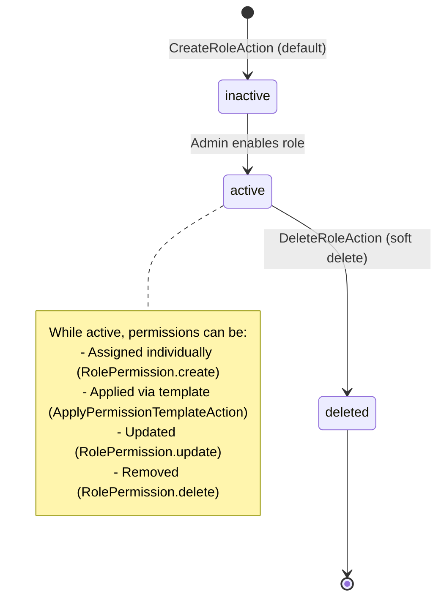

# Role-Based Access Control (RBAC)

## Business Context & Objective

Role-Based Access Control (RBAC) is the enterprise security framework that determines who can perform what actions on which business modules and data. Rather than assigning individual permissions to each user, RBAC groups permissions into roles that reflect organizational responsibilities. System administrators and security officers depend on RBAC to enforce the principle of least privilege, ensuring users have only the permissions necessary to perform their assigned duties. This prevents unauthorized access, reduces audit risk, and enables rapid access provisioning and de-provisioning as organizational structures change.

## Domain Entities

| Entity | Business Definition | Role |
|--------|-------------------|------|
| **User** | A person with system access credentials, assigned to a single Role. | The subject whose access is controlled. Each user inherits all permissions from their assigned role. |
| **Role** | A named set of permissions representing an organizational responsibility level. | Encapsulates a reusable permission bundle. Roles can be system-defined (immutable, core enterprise) or custom-defined (modifiable). |
| **RolePermission** | A tuple linking a Role to a Module with granular CRUD permissions (view, create, edit, delete). | Defines what operations a role may perform within a specific module. Granularity is at the module level, not object level. |
| **Module** | A functional area of the system (Finance, Commercial, SupplyChain, etc.). | Serves as the permission scope. Each module is represented as a discrete permission unit. |
| **PermissionTemplate** | A pre-defined, reusable set of module-level permissions that can be rapidly applied to new or existing roles. | Accelerates role provisioning; enables consistency by encoding organizational standards into templates. |

## State Machine / Lifecycle

Roles transition through activation and deletion states; permissions are continuously managed:

<!-- [ASSUMPTION] --> Roles use soft-delete semantics; deleted roles are marked is_active=false but not purged from the database.

## Business Rules & Constraints

1. **User-Role Assignment** — Each user must have exactly one active role at any time.
2. **Module-Level Permissions** — Permissions are granted or denied at the module level (e.g., "Finance" module, not individual ledger accounts).
3. **CRUD Granularity** — Within a module, permissions are granular to CRUD operations: can_view, can_create, can_edit, can_delete.
4. **System Roles Immutable** — System-defined roles (is_system=true) cannot be deleted or have their foundational permission structure modified.
5. **Permission Template Atomicity** — ApplyPermissionTemplateAction applies all permissions from a template to a role atomically; partial failures are not permitted.
6. **Role Activation** — A role must be explicitly activated (is_active=true) before it can be assigned to users.
7. **Audit Trail** — All RolePermission changes must record the user making the change (created_by).
8. **No Direct Permission Assignment** — Users do not have direct permissions; permissions always flow through roles.

## Integration Events

| Event | Direction | Connected Domain | Trigger |
|-------|-----------|-----------------|---------|
| Role.Created | Outbound | MonitoringCompliance | CreateRoleAction completes |
| RolePermission.Updated | Outbound | MonitoringCompliance | ApplyPermissionTemplateAction or manual permission update |
| User.RoleAssigned | Outbound | MonitoringCompliance | User role_id is modified |
| PermissionTemplate.Applied | Outbound | MonitoringCompliance | ApplyPermissionTemplateAction executes |

## Key Operations

**CreateRoleAction** — Creates a new role with role_key (unique identifier), localized names (role_name_ar, role_name_en), description, and is_system flag. Defaults to is_active=false; must be explicitly activated before use.

**CreateUserAction** — Creates a new user with username, hashed password, full_name, and role_id. The role must exist and be active. Records the creator (created_by).

**ApplyPermissionTemplateAction** — Accepts a PermissionTemplate ID and Role ID. Iterates through all permissions in the template, resolves each module by key, and creates or updates RolePermission records atomically.

**UpdatePermissionTemplateAction** — Modifies a PermissionTemplate's permissions array. Existing template applications are not retroactively updated; future applications use the new definition.

**ListRolesAction** & **ListUsersAction** — Retrieve role and user data with filtering by active status, organizational position, or manager hierarchy.

**DeleteRoleAction** — Soft-deletes a role by setting is_active=false. System roles cannot be deleted. Existing users with the deleted role must be reassigned to another role.

## Known Constraints

1. Roles cannot be completely deleted from the database (soft-delete only); archived roles occupy storage indefinitely.
2. Users cannot have multiple roles simultaneously; role switching requires direct database update or CreateUserAction replacement.
3. PermissionTemplate is a static snapshot; applying a template does not create a persistent link between template and role (no automatic sync if template is updated).
4. Permission granularity is module-level; row-level security (row-level access control) is not supported within RBAC.
5. No delegation of RBAC administration; only users with explicit system admin role can modify roles and permissions.
6. Role inheritance and hierarchical permission calculations are not supported; each role is independent.

## Assumptions & Open Questions

<!-- [ASSUMPTION] -->
**Permission Enforcement Mechanism**: The RBAC document defines the data model (roles, permissions, templates) but does not specify WHERE or HOW permissions are enforced at runtime. Clarification needed: Are permissions checked at the API endpoint level, at the Action level, or within domain services? Is there a centralized Authorization service in the Platform domain that consumes this RBAC data?

<!-- [ASSUMPTION] -->
**Module Definition and Registration**: RolePermission references Module entities, but it's unclear how modules are defined, registered, or kept in sync with domain boundaries. This suggests an external registry may exist in the OrganizationGovernance subdomain.

<!-- [ASSUMPTION] -->
**Permission Template Versioning**: PermissionTemplate supports updating existing templates, but there is no versioning strategy. If a template is modified, do existing role assignments reflect old or new permissions?
