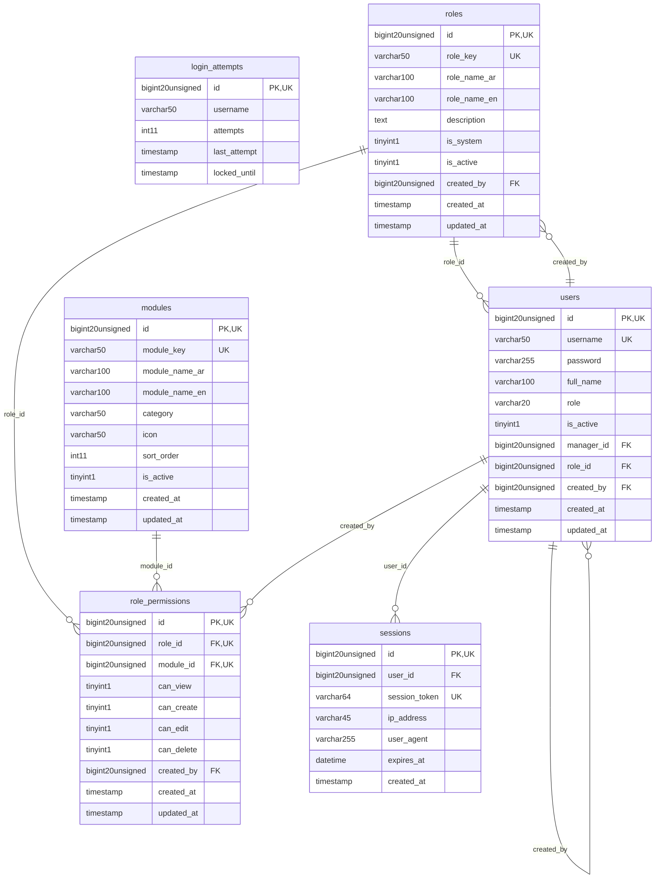

# EnterpriseCore - IdentityAccess

> **Bounded Context Schema & ERD**
> 6 Tables | Generated dynamically by ACCSYSTEM engine

---

## Tables List

- `login_attempts`
- `modules`
- `role_permissions`
- `roles`
- `sessions`
- `users`

---

## Entity Relationship Diagram

---

## Data Dictionary

### Table: `login_attempts`

| Column | Type | Nullable | Default | Indexes | Foreign Keys |
|---|---|---|---|---|---|
| `id` | `bigint(20) unsigned` | No |  | **PK** |  |
| `username` | `varchar(50)` | No |  | IDX |  |
| `attempts` | `int(11)` | No | `1` |  |  |
| `last_attempt` | `timestamp` | No | `current_timestamp()` |  |  |
| `locked_until` | `timestamp` | Yes | `NULL` |  |  |

### Table: `modules`

| Column | Type | Nullable | Default | Indexes | Foreign Keys |
|---|---|---|---|---|---|
| `id` | `bigint(20) unsigned` | No |  | **PK** |  |
| `module_key` | `varchar(50)` | No |  | IDX, *UK* |  |
| `module_name_ar` | `varchar(100)` | No |  |  |  |
| `module_name_en` | `varchar(100)` | No |  |  |  |
| `category` | `varchar(50)` | Yes | `NULL` | IDX |  |
| `icon` | `varchar(50)` | Yes | `NULL` |  |  |
| `sort_order` | `int(11)` | No | `0` |  |  |
| `is_active` | `tinyint(1)` | No | `1` | IDX |  |
| `created_at` | `timestamp` | Yes | `NULL` |  |  |
| `updated_at` | `timestamp` | Yes | `NULL` |  |  |

### Table: `role_permissions`

| Column | Type | Nullable | Default | Indexes | Foreign Keys |
|---|---|---|---|---|---|
| `id` | `bigint(20) unsigned` | No |  | **PK** |  |
| `role_id` | `bigint(20) unsigned` | No |  | IDX, *UK* | -> `roles.id` |
| `module_id` | `bigint(20) unsigned` | No |  | IDX, *UK* | -> `modules.id` |
| `can_view` | `tinyint(1)` | No | `0` |  |  |
| `can_create` | `tinyint(1)` | No | `0` |  |  |
| `can_edit` | `tinyint(1)` | No | `0` |  |  |
| `can_delete` | `tinyint(1)` | No | `0` |  |  |
| `created_by` | `bigint(20) unsigned` | Yes | `NULL` | IDX | -> `users.id` |
| `created_at` | `timestamp` | Yes | `NULL` |  |  |
| `updated_at` | `timestamp` | Yes | `NULL` |  |  |

### Table: `roles`

| Column | Type | Nullable | Default | Indexes | Foreign Keys |
|---|---|---|---|---|---|
| `id` | `bigint(20) unsigned` | No |  | **PK** |  |
| `role_key` | `varchar(50)` | No |  | IDX, *UK* |  |
| `role_name_ar` | `varchar(100)` | No |  |  |  |
| `role_name_en` | `varchar(100)` | No |  |  |  |
| `description` | `text` | Yes | `NULL` |  |  |
| `is_system` | `tinyint(1)` | No | `0` |  |  |
| `is_active` | `tinyint(1)` | No | `1` | IDX |  |
| `created_by` | `bigint(20) unsigned` | Yes | `NULL` | IDX | -> `users.id` |
| `created_at` | `timestamp` | Yes | `NULL` |  |  |
| `updated_at` | `timestamp` | Yes | `NULL` |  |  |

### Table: `sessions`

| Column | Type | Nullable | Default | Indexes | Foreign Keys |
|---|---|---|---|---|---|
| `id` | `bigint(20) unsigned` | No |  | **PK** |  |
| `user_id` | `bigint(20) unsigned` | No |  | IDX | -> `users.id` |
| `session_token` | `varchar(64)` | No |  | *UK* |  |
| `ip_address` | `varchar(45)` | Yes | `NULL` |  |  |
| `user_agent` | `varchar(255)` | Yes | `NULL` |  |  |
| `expires_at` | `datetime` | No |  |  |  |
| `created_at` | `timestamp` | No | `current_timestamp()` |  |  |

### Table: `users`

| Column | Type | Nullable | Default | Indexes | Foreign Keys |
|---|---|---|---|---|---|
| `id` | `bigint(20) unsigned` | No |  | **PK** |  |
| `username` | `varchar(50)` | No |  | *UK* |  |
| `password` | `varchar(255)` | No |  |  |  |
| `full_name` | `varchar(100)` | Yes | `NULL` |  |  |
| `role` | `varchar(20)` | No | `'admin'` |  |  |
| `is_active` | `tinyint(1)` | No | `1` |  |  |
| `manager_id` | `bigint(20) unsigned` | Yes | `NULL` | IDX | -> `users.id` |
| `role_id` | `bigint(20) unsigned` | Yes | `NULL` | IDX | -> `roles.id` |
| `created_by` | `bigint(20) unsigned` | Yes | `NULL` | IDX | -> `users.id` |
| `created_at` | `timestamp` | Yes | `NULL` |  |  |
| `updated_at` | `timestamp` | Yes | `NULL` |  |  |

