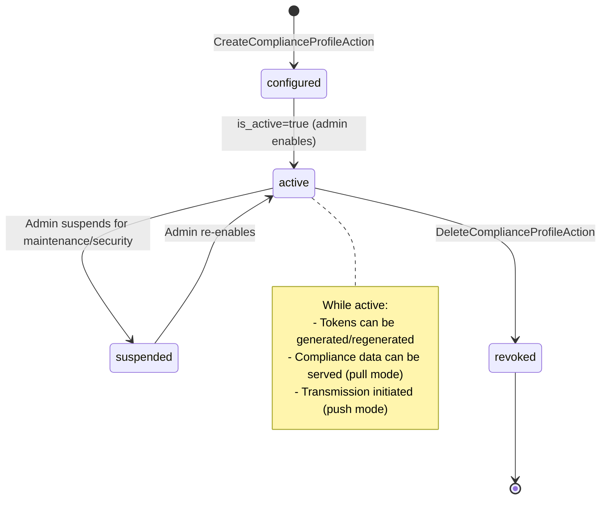

# Audit Logging & Compliance

## Business Context & Objective

The Audit Logging & Compliance subdomain provides comprehensive system-wide operation tracking and compliance reporting infrastructure. Every material change to business data—financial entries, roles, settings, compliance profiles—must be logged immutably to satisfy regulatory audit requirements, support forensic investigations, and demonstrate accountability. Compliance officers, auditors, and tax authorities depend on this subdomain to retrieve audit trails proving data integrity and regulatory adherence. The subdomain also manages Compliance Profiles: integration points with external tax and regulatory authorities, enabling organizations to transmit or expose compliance-relevant data according to local jurisdiction requirements.

## Domain Entities

| Entity | Business Definition | Role |
|--------|-------------------|------|
| **Telescope** | An immutable audit log entry recording a single data operation (CREATE, UPDATE, DELETE) with before/after values. | Provides proof of what changed, when, by whom, and from which IP. Central audit trail for all regulatory and forensic investigations. |
| **ComplianceProfile** | A configuration defining how compliance data is transmitted to or accessed by tax authorities and regulatory bodies. | Enables push (organization sends) or pull (authority fetches) transmission of compliance-relevant data. Manages token-based access control and format translation. |
| **ComplianceProfileToken** | A short-lived or long-lived access credential used by tax authorities to authenticate pull requests. | Replaces static credentials with token-based, revocable access. Tracks token expiration, usage, and allowed IP ranges. |

## State Machine / Lifecycle

Compliance profiles follow a provisioning-to-active lifecycle:

## Business Rules & Constraints

1. **Audit Trail Immutability** — Telescope entries cannot be modified, deleted, or filtered after creation. All CRUD operations across all domains must be logged.
2. **Operation Completeness** — Every Telescope entry must capture: user_id, operation type (CREATE/UPDATE/DELETE), table_name, record_id, old_values, new_values, ip_address, user_agent, timestamp.
3. **Compliance Profile Governance** — A profile must specify: transmission policy (push/pull), format (JSON/XML), tax authority, and authentication method.
4. **Token-Based Access Control** — Pull-mode profiles must use bearer tokens; tokens expire based on configuration and must be regenerated before expiration.
5. **IP Whitelisting** — Pull-mode profiles may restrict access to whitelisted IP ranges. Access from non-whitelisted IPs is rejected.
6. **Format Validation** — All transmission formats must conform to structure_template before export; transmission fails if validation fails.
7. **One-Active-Profile-Per-Authority** — Only one active ComplianceProfile per tax_authority may exist at a time to prevent conflicting data transmissions.
8. **Sensitive Data Masking** — Telescope does not store encrypted values; plaintext sensitive data (passwords, tokens) must be masked before logging.

## Integration Events

| Event | Direction | Connected Domain | Trigger |
|-------|-----------|-----------------|---------|
| DataChange.Logged | Outbound | All Domains (pull) | Any CRUD operation via TelescopeService |
| ComplianceProfile.Created | Outbound | HumanCapital.WorkforceAdmin | CreateComplianceProfileAction completes |
| ComplianceToken.Generated | Outbound | HumanCapital.WorkforceAdmin | GenerateComplianceProfileTokenAction completes |
| ComplianceToken.Revoked | Outbound | HumanCapital.WorkforceAdmin | RevokeComplianceProfileTokenAction completes |

## Key Operations

**TelescopeService.logOperation()** — Static utility called by all domain services. Records user, operation type, table, record ID, before/after values. Failures are logged but do not block the triggering operation.

**CreateComplianceProfileAction** — Creates a new compliance profile with transmission policy, format, tax authority, and authentication details. For pull-mode profiles, generates and returns an initial access token.

**GenerateComplianceProfileTokenAction** — Issues a new access token for a pull-mode profile. Invalidates previous tokens. Token is returned once; subsequent retrieval requires hashing or re-generation.

**RevokeComplianceProfileTokenAction** — Immediately invalidates all active tokens for a profile. External systems must obtain new credentials to resume access.

**ValidateComplianceStructureAction** — Validates compliance data structure against the profile's structure_template. Used to test format compliance before transmission.

**ServeCompliancePullDataAction** — HTTP endpoint handler. Validates incoming bearer token and IP whitelist. Retrieves compliance-relevant data from Telescope and other domains. Serves in the format specified by the profile.

**ListComplianceProfilesAction** & **ShowComplianceProfileAction** — Retrieve profile metadata. Sensitive fields (auth_credentials, access_token) are not returned in API responses.

## Known Constraints

1. Telescope stores raw audit entries without aggregation; querying large audit trails is O(n) without proper indexing on (user_id, table_name, created_at).
2. ComplianceProfiles reference external tax authorities, creating a cross-domain dependency on HumanCapital. Profile validation may fail if tax authority is not found.
3. Pull-mode data serving requires real-time access to Telescope; no caching or batch export capability.
4. Token expiration is manually managed; no automatic renewal or remind-before-expiration functionality.
5. Audit data retention is permanent; no archival or retention policy (compliance risk if not managed operationally).

## Assumptions & Open Questions

<!-- [ASSUMPTION] -->
**Telescope Logging Scope**: TelescopeService is called by Automation, IdentityAccess, and other domains, but it is unclear if all domain operations are hooked to TelescopeService or only specific domains. Clarification needed: Is this opt-in per domain or is there a central middleware/hook?

<!-- [ASSUMPTION] -->
**Compliance Data Format Translation**: The profile's transmission_format (JSON/XML) and structure_template suggest format translation logic, but the implementation is not visible. Clarification needed: How is domain data translated to compliance format? Is there a dedicated transformer per authority type?

<!-- [ASSUMPTION] -->
**Token Preview Security**: The ComplianceProfile model appends 'token_preview' in JSON responses to avoid exposing raw tokens. Clarification needed: What is the preview format (e.g., last 4 characters), and does it meet security standards for compliance systems?
