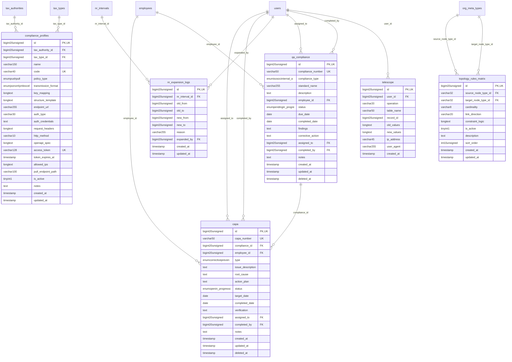

# EnterpriseCore - MonitoringCompliance

> **Bounded Context Schema & ERD**
> 6 Tables | Generated dynamically by ACCSYSTEM engine

---

## Tables List

- `capa`
- `compliance_profiles`
- `nr_expansion_logs`
- `qa_compliance`
- `telescope`
- `topology_rules_matrix`

---

## Entity Relationship Diagram

---

## Data Dictionary

### Table: `capa`

| Column | Type | Nullable | Default | Indexes | Foreign Keys |
|---|---|---|---|---|---|
| `id` | `bigint(20) unsigned` | No |  | **PK** |  |
| `capa_number` | `varchar(50)` | No |  | *UK* |  |
| `compliance_id` | `bigint(20) unsigned` | Yes | `NULL` | IDX | -> `qa_compliance.id` |
| `employee_id` | `bigint(20) unsigned` | Yes | `NULL` | IDX | -> `employees.id` |
| `type` | `enum('corrective','preventive')` | No | `'corrective'` |  |  |
| `issue_description` | `text` | No |  |  |  |
| `root_cause` | `text` | Yes | `NULL` |  |  |
| `action_plan` | `text` | Yes | `NULL` |  |  |
| `status` | `enum('open','in_progress','completed','closed','cancelled')` | No | `'open'` |  |  |
| `target_date` | `date` | Yes | `NULL` |  |  |
| `completed_date` | `date` | Yes | `NULL` |  |  |
| `verification` | `text` | Yes | `NULL` |  |  |
| `assigned_to` | `bigint(20) unsigned` | Yes | `NULL` | IDX | -> `users.id` |
| `completed_by` | `bigint(20) unsigned` | Yes | `NULL` | IDX | -> `users.id` |
| `notes` | `text` | Yes | `NULL` |  |  |
| `created_at` | `timestamp` | Yes | `NULL` |  |  |
| `updated_at` | `timestamp` | Yes | `NULL` |  |  |
| `deleted_at` | `timestamp` | Yes | `NULL` |  |  |

### Table: `compliance_profiles`

| Column | Type | Nullable | Default | Indexes | Foreign Keys |
|---|---|---|---|---|---|
| `id` | `bigint(20) unsigned` | No |  | **PK** |  |
| `tax_authority_id` | `bigint(20) unsigned` | No |  | IDX | -> `tax_authorities.id` |
| `tax_type_id` | `bigint(20) unsigned` | Yes | `NULL` | IDX | -> `tax_types.id` |
| `name` | `varchar(150)` | No |  |  |  |
| `code` | `varchar(40)` | No |  | *UK* |  |
| `policy_type` | `enum('push','pull')` | No | `'push'` | IDX |  |
| `transmission_format` | `enum('json','xml','yml','excel')` | No | `'json'` |  |  |
| `key_mapping` | `longtext` | Yes | `NULL` |  |  |
| `structure_template` | `longtext` | Yes | `NULL` |  |  |
| `endpoint_url` | `varchar(255)` | Yes | `NULL` |  |  |
| `auth_type` | `varchar(30)` | Yes | `NULL` |  |  |
| `auth_credentials` | `text` | Yes | `NULL` |  |  |
| `request_headers` | `longtext` | Yes | `NULL` |  |  |
| `http_method` | `varchar(10)` | No | `'POST'` |  |  |
| `openapi_spec` | `longtext` | Yes | `NULL` |  |  |
| `access_token` | `varchar(128)` | Yes | `NULL` | *UK* |  |
| `token_expires_at` | `timestamp` | Yes | `NULL` |  |  |
| `allowed_ips` | `longtext` | Yes | `NULL` |  |  |
| `pull_endpoint_path` | `varchar(100)` | Yes | `NULL` |  |  |
| `is_active` | `tinyint(1)` | No | `1` | IDX |  |
| `notes` | `text` | Yes | `NULL` |  |  |
| `created_at` | `timestamp` | Yes | `NULL` |  |  |
| `updated_at` | `timestamp` | Yes | `NULL` |  |  |

### Table: `nr_expansion_logs`

| Column | Type | Nullable | Default | Indexes | Foreign Keys |
|---|---|---|---|---|---|
| `id` | `bigint(20) unsigned` | No |  | **PK** |  |
| `nr_interval_id` | `bigint(20) unsigned` | No |  | IDX | -> `nr_intervals.id` |
| `old_from` | `bigint(20) unsigned` | No |  |  |  |
| `old_to` | `bigint(20) unsigned` | No |  |  |  |
| `new_from` | `bigint(20) unsigned` | No |  |  |  |
| `new_to` | `bigint(20) unsigned` | No |  |  |  |
| `reason` | `varchar(255)` | Yes | `NULL` |  |  |
| `expanded_by` | `bigint(20) unsigned` | Yes | `NULL` | IDX | -> `users.id` |
| `created_at` | `timestamp` | Yes | `NULL` |  |  |
| `updated_at` | `timestamp` | Yes | `NULL` |  |  |

### Table: `qa_compliance`

| Column | Type | Nullable | Default | Indexes | Foreign Keys |
|---|---|---|---|---|---|
| `id` | `bigint(20) unsigned` | No |  | **PK** |  |
| `compliance_number` | `varchar(50)` | No |  | *UK* |  |
| `compliance_type` | `enum('iso','soc','internal_audit','regulatory','other')` | No | `'internal_audit'` |  |  |
| `standard_name` | `varchar(255)` | No |  |  |  |
| `description` | `text` | Yes | `NULL` |  |  |
| `employee_id` | `bigint(20) unsigned` | Yes | `NULL` | IDX | -> `employees.id` |
| `status` | `enum('pending','in_progress','completed','non_compliant','cancelled')` | No | `'pending'` |  |  |
| `due_date` | `date` | Yes | `NULL` |  |  |
| `completed_date` | `date` | Yes | `NULL` |  |  |
| `findings` | `text` | Yes | `NULL` |  |  |
| `corrective_action` | `text` | Yes | `NULL` |  |  |
| `assigned_to` | `bigint(20) unsigned` | Yes | `NULL` | IDX | -> `users.id` |
| `completed_by` | `bigint(20) unsigned` | Yes | `NULL` | IDX | -> `users.id` |
| `notes` | `text` | Yes | `NULL` |  |  |
| `created_at` | `timestamp` | Yes | `NULL` |  |  |
| `updated_at` | `timestamp` | Yes | `NULL` |  |  |
| `deleted_at` | `timestamp` | Yes | `NULL` |  |  |

### Table: `telescope`

| Column | Type | Nullable | Default | Indexes | Foreign Keys |
|---|---|---|---|---|---|
| `id` | `bigint(20) unsigned` | No |  | **PK** |  |
| `user_id` | `bigint(20) unsigned` | Yes | `NULL` | IDX | -> `users.id` |
| `operation` | `varchar(20)` | No |  |  |  |
| `table_name` | `varchar(50)` | No |  |  |  |
| `record_id` | `bigint(20) unsigned` | Yes | `NULL` |  |  |
| `old_values` | `longtext` | Yes | `NULL` |  |  |
| `new_values` | `longtext` | Yes | `NULL` |  |  |
| `ip_address` | `varchar(45)` | Yes | `NULL` |  |  |
| `user_agent` | `varchar(255)` | Yes | `NULL` |  |  |
| `created_at` | `timestamp` | No | `current_timestamp()` |  |  |

### Table: `topology_rules_matrix`

| Column | Type | Nullable | Default | Indexes | Foreign Keys |
|---|---|---|---|---|---|
| `id` | `bigint(20) unsigned` | No |  | **PK** |  |
| `source_node_type_id` | `varchar(32)` | No |  | IDX | -> `org_meta_types.id` |
| `target_node_type_id` | `varchar(32)` | No |  | IDX | -> `org_meta_types.id` |
| `cardinality` | `varchar(8)` | No | `'N:1'` |  |  |
| `link_direction` | `varchar(20)` | No | `'source_to_target'` |  |  |
| `constraint_logic` | `longtext` | Yes | `NULL` |  |  |
| `is_active` | `tinyint(1)` | No | `1` |  |  |
| `description` | `text` | Yes | `NULL` |  |  |
| `sort_order` | `int(10) unsigned` | No | `0` |  |  |
| `created_at` | `timestamp` | Yes | `NULL` |  |  |
| `updated_at` | `timestamp` | Yes | `NULL` |  |  |

