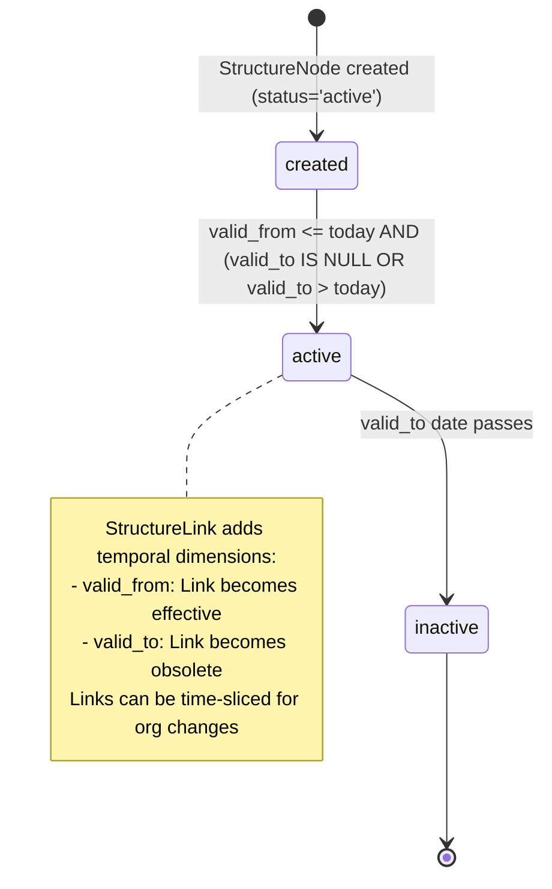

# Company Structure & Organizational Hierarchy

## Business Context & Objective

The OrganizationGovernance subdomain provides a flexible, schema-driven framework for defining company structures, organizational hierarchies, and governance models without requiring code changes or database schema modifications. Rather than hard-coding entity types (Company Code, Plant, Cost Center, Division), accorees a polymorphic StructureNode model where administrators define organizational unit types dynamically via OrgMetaType. Finance controllers, organizational planners, and system administrators depend on this subdomain to mirror their real-world corporate structure—multi-company consolidations, subsidiary hierarchies, cost center rollups, profit center assignments—enabling accurate cost allocation, consolidation reporting, and authority delegation. Without flexible organizational structures, the ERP cannot scale to complex enterprises or adapt to organizational changes (mergers, spin-offs, restructuring).

## Domain Entities

| Entity | Business Definition | Role |
|--------|-------------------|------|
| **StructureNode** | A polymorphic organizational unit (Company Code, Plant, Cost Center, etc.). | Represents any hierarchical unit in the organization. Uses attributes_json to store type-specific data without schema changes. |
| **OrgMetaType** | A definition of a node type (Company, Plant, Cost Center). | Defines which types of nodes may exist and which attributes they carry. Enables schema flexibility. |
| **StructureLink** | A directed edge between two StructureNodes (Parent-Child relationship). | Establishes hierarchical relationships. Validated against TopologyRule before creation. |
| **TopologyRule** | A governance rule defining valid link relationships between node types. | Enforces cardinality (e.g., "Many Plants can report to One Company Code"). Prevents invalid structures. |
| **OrgMetaTypeAttribute** | A metadata descriptor for attributes stored in StructureNode.attributes_json. | Describes the structure and validation rules for custom attributes (data type, required, format). |
| **Module** | A functional area of the system (Finance, Commercial, SupplyChain). | Provides a framework for organizing system functionality. Module.id is referenced by RolePermission. |
| **Setting** | A master system variable or configuration parameter. | Stores global configuration (company code default, fiscal year, currency). |

## State Machine / Lifecycle

StructureNodes and StructureLinks follow a validity-window lifecycle:

## Business Rules & Constraints

1. **Node Polymorphism** — All organizational units (companies, plants, cost centers, divisions) are stored as StructureNodes. The node_type_id field determines the type.
2. **Unique Node Codes** — Each code within a node type must be globally unique. Code is the human-readable identifier.
3. **Topology Validation** — Before creating a StructureLink, the system validates that the source and target node types are compatible per TopologyRule.
4. **Cardinality Enforcement** — TopologyRule defines cardinality rules (e.g., Many:One, One:One). Links violating cardinality are rejected.
5. **Link Direction** — TopologyRule specifies whether links are unidirectional or bidirectional.
6. **Temporal Validity** — StructureNodes and StructureLinks have valid_from and valid_to dates. A node is "active" only within its validity window.
7. **Attributes Extensibility** — StructureNode.attributes_json stores type-specific attributes without schema migration. OrgMetaTypeAttribute defines allowed attributes per type.
8. **Circular Reference Prevention** — The system prevents circular links (a node cannot be its own ancestor).
9. **Acyclic Hierarchy** — The organizational structure must be a directed acyclic graph (DAG); cycles are detected and prevented before insertion.

## Integration Events

| Event | Direction | Connected Domain | Trigger |
|-------|-----------|-----------------|---------|
| StructureNode.Created | Outbound | All Domains (read) | CreateStructureNodeAction completes |
| StructureLink.Created | Outbound | Finance, Commercial, SupplyChain | CreateStructureLinkAction completes; enables cost allocation routing |
| OrgMetaType.Created | Outbound | MonitoringCompliance | New organizational unit type is defined |
| TopologyRule.Validated | Internal | OrganizationGovernance | Before inserting StructureLink; validation result logged |

## Key Operations

**CreateStructureNode** — Creates a new node (Company, Plant, Cost Center) with node_type_id, code, attributes_json, validity dates, and status. Generates a UUID as node_uuid for uniqueness and portability.

**CreateStructureLink** — Establishes a parent-child relationship between two nodes. Validates topology rules, checks for circularity, and enforces cardinality constraints before insertion.

**DefineOrgMetaType** — Registers a new organizational unit type (e.g., "Cost Center") with name, description, and attribute schema. Once defined, administrators can create StructureNodes of that type.

**DefineTopologyRule** — Registers a governance rule (e.g., "Plants must report to exactly one Company Code") with source/target types, cardinality, and constraint logic.

**ListStructureNodes**, **ShowStructureNode** — Retrieve node hierarchies. Typically called to build organizational charts or perform cost center rollup queries.

**RestructureOrganization** — Creates new StructureLinks or marks old links as valid_to=today, implementing organizational changes without deleting historical data.

## Known Constraints

1. <!-- [ASSUMPTION] --> StructureLink validity windows support time-slicing (e.g., a Plant reports to CompanyA until 2026-01-01, then to CompanyB), but the system does not enforce "temporal consistency" rules (e.g., a node cannot report to two parents simultaneously).
2. StructureNode.attributes_json is untyped and unvalidated at the database level. Validation is application-layer responsibility, increasing risk of data inconsistency.
3. Circular reference detection requires an O(n) graph traversal; performance degrades with very large hierarchies (>10,000 nodes).
4. No audit trail for topology rule changes; rule modifications may silently break existing hierarchies.
5. TopologyRule cardinality is declarative but not enforced by database constraints (e.g., no unique constraint on (source_node_uuid, topology_rule_id)).

## Assumptions & Open Questions

<!-- [ASSUMPTION] -->
**Temporal Consistency Rules**: The model supports overlapping validity windows (a node active in Period A, then inactive, then active again). It is unclear whether the system enforces temporal consistency (e.g., preventing a node from reporting to two parents at the same time). Clarification needed: What temporal constraints apply to StructureLink.valid_from and valid_to?

<!-- [ASSUMPTION] -->
**Cardinality Enforcement**: TopologyRule.cardinality is stored as text or enum but there is no database-level enforcement. Clarification needed: If TopologyRule.cardinality='1:N' (one parent to many children), does the system prevent creating a second parent link? Is this enforced at the application layer or the database layer?

<!-- [ASSUMPTION] -->
**Integration with Finance Postings**: StructureNodes (Company Codes, Profit Centers, Cost Centers) are primary to financial posting logic. Clarification needed: How does the Finance domain reference StructureNode? Is it via node_code or node_uuid, and what happens if a code is reused or a node is deactivated?
