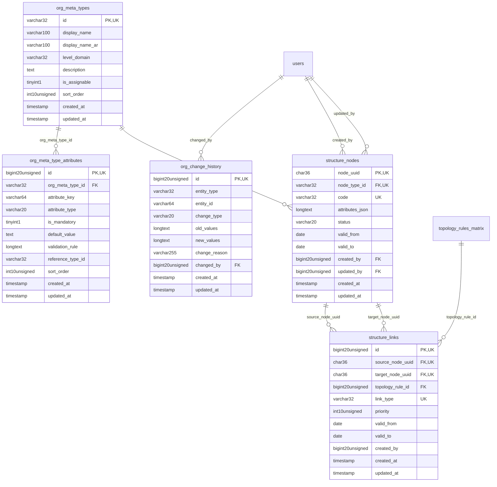

# EnterpriseCore - OrganizationGovernance

> **Bounded Context Schema & ERD**
> 5 Tables | Generated dynamically by accore engine

---

## Tables List

- `org_change_history`
- `org_meta_type_attributes`
- `org_meta_types`
- `structure_links`
- `structure_nodes`

---

## Entity Relationship Diagram

---

## Data Dictionary

### Table: `org_change_history`

| Column | Type | Nullable | Default | Indexes | Foreign Keys |
|---|---|---|---|---|---|
| `id` | `bigint(20) unsigned` | No |  | **PK** |  |
| `entity_type` | `varchar(32)` | No |  | IDX |  |
| `entity_id` | `varchar(64)` | No |  | IDX |  |
| `change_type` | `varchar(20)` | No |  | IDX |  |
| `old_values` | `longtext` | Yes | `NULL` |  |  |
| `new_values` | `longtext` | Yes | `NULL` |  |  |
| `change_reason` | `varchar(255)` | Yes | `NULL` |  |  |
| `changed_by` | `bigint(20) unsigned` | Yes | `NULL` | IDX | -> `users.id` |
| `created_at` | `timestamp` | Yes | `NULL` |  |  |
| `updated_at` | `timestamp` | Yes | `NULL` |  |  |

### Table: `org_meta_type_attributes`

| Column | Type | Nullable | Default | Indexes | Foreign Keys |
|---|---|---|---|---|---|
| `id` | `bigint(20) unsigned` | No |  | **PK** |  |
| `org_meta_type_id` | `varchar(32)` | No |  | IDX | -> `org_meta_types.id` |
| `attribute_key` | `varchar(64)` | No |  |  |  |
| `attribute_type` | `varchar(20)` | No | `'string'` |  |  |
| `is_mandatory` | `tinyint(1)` | No | `0` |  |  |
| `default_value` | `text` | Yes | `NULL` |  |  |
| `validation_rule` | `longtext` | Yes | `NULL` |  |  |
| `reference_type_id` | `varchar(32)` | Yes | `NULL` |  |  |
| `sort_order` | `int(10) unsigned` | No | `0` |  |  |
| `created_at` | `timestamp` | Yes | `NULL` |  |  |
| `updated_at` | `timestamp` | Yes | `NULL` |  |  |

### Table: `org_meta_types`

| Column | Type | Nullable | Default | Indexes | Foreign Keys |
|---|---|---|---|---|---|
| `id` | `varchar(32)` | No |  | **PK** |  |
| `display_name` | `varchar(100)` | No |  |  |  |
| `display_name_ar` | `varchar(100)` | Yes | `NULL` |  |  |
| `level_domain` | `varchar(32)` | No | `'Financial'` |  |  |
| `description` | `text` | Yes | `NULL` |  |  |
| `is_assignable` | `tinyint(1)` | No | `1` |  |  |
| `sort_order` | `int(10) unsigned` | No | `0` |  |  |
| `created_at` | `timestamp` | Yes | `NULL` |  |  |
| `updated_at` | `timestamp` | Yes | `NULL` |  |  |

### Table: `structure_links`

| Column | Type | Nullable | Default | Indexes | Foreign Keys |
|---|---|---|---|---|---|
| `id` | `bigint(20) unsigned` | No |  | **PK** |  |
| `source_node_uuid` | `char(36)` | No |  | *UK* | -> `structure_nodes.node_uuid` |
| `target_node_uuid` | `char(36)` | No |  | *UK*, IDX | -> `structure_nodes.node_uuid` |
| `topology_rule_id` | `bigint(20) unsigned` | Yes | `NULL` | IDX | -> `topology_rules_matrix.id` |
| `link_type` | `varchar(32)` | No | `'assignment'` | *UK* |  |
| `priority` | `int(10) unsigned` | No | `0` |  |  |
| `valid_from` | `date` | Yes | `NULL` |  |  |
| `valid_to` | `date` | Yes | `NULL` |  |  |
| `created_by` | `bigint(20) unsigned` | Yes | `NULL` |  |  |
| `created_at` | `timestamp` | Yes | `NULL` |  |  |
| `updated_at` | `timestamp` | Yes | `NULL` |  |  |

### Table: `structure_nodes`

| Column | Type | Nullable | Default | Indexes | Foreign Keys |
|---|---|---|---|---|---|
| `node_uuid` | `char(36)` | No |  | **PK** |  |
| `node_type_id` | `varchar(32)` | No |  | *UK* | -> `org_meta_types.id` |
| `code` | `varchar(32)` | No |  | *UK* |  |
| `attributes_json` | `longtext` | Yes | `NULL` |  |  |
| `status` | `varchar(20)` | No | `'active'` |  |  |
| `valid_from` | `date` | Yes | `NULL` |  |  |
| `valid_to` | `date` | Yes | `NULL` |  |  |
| `created_by` | `bigint(20) unsigned` | Yes | `NULL` | IDX | -> `users.id` |
| `updated_by` | `bigint(20) unsigned` | Yes | `NULL` | IDX | -> `users.id` |
| `created_at` | `timestamp` | Yes | `NULL` |  |  |
| `updated_at` | `timestamp` | Yes | `NULL` |  |  |

