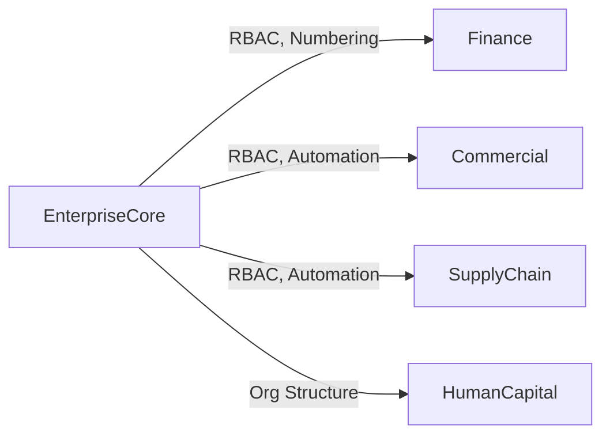

# EnterpriseCore — Domain Overview

## Business Purpose

EnterpriseCore is the foundational domain of accore that provides enterprise-grade governance, identity management, and system configuration capabilities. It serves as the central nervous system for organizational control, user access, and system-wide automation orchestration. Business stakeholders across Finance, Commercial, SupplyChain, and HumanCapital depend on EnterpriseCore to establish organizational boundaries, enforce role-based access control, manage user sessions, audit system activity, and automate recurring business processes. Without EnterpriseCore, the ERP lacks the governance infrastructure necessary to maintain regulatory compliance, data security, and operational control.

## Bounded Context Boundaries

EnterpriseCore owns and manages:
- All user authentication, session management, and role-based access control
- System-wide governance settings, audit trails, and compliance logging
- Organizational structure (hierarchy nodes, links, topology rules)
- System-wide automation and batch processing capabilities
- Document sequencing, numbering rules, and document templates
- Monitoring and compliance event tracking

EnterpriseCore explicitly excludes:
- Domain-specific business logic (Finance posting rules, Commercial revenue recognition, etc.)
- Domain-specific workflows and validations
- Cross-domain event processing (handled by Platform domain)
- User-facing reporting and analytics (handled by Intelligence domain)

## Subdomains

| Subdomain | Description |
|-----------|-------------|
| **IdentityAccess** | User authentication, role-based access control (RBAC), permission templates, sessions, and login attempt tracking. |
| **OrganizationGovernance** | Organizational structure (hierarchy nodes, topology rules), document templates, system settings, and metadata types. |
| **SystemOverview** | Document sequencing, number ranges, number intervals, and numbering group configuration. |
| **Automation** | Batch job orchestration, recurring transaction scheduling, system templates, and process automation. |
| **MonitoringCompliance** | Audit logging, compliance event tracking, and system health monitoring. |

## Key Domain Entities

**IdentityAccess Models:**
- **User** — Represents system users with authentication credentials, status, and tenant association.
- **Role** — Defines role definitions with permission assignments.
- **RolePermission** — Maps permissions to roles, enforcing access control policy.
- **Session** — Tracks user login sessions with expiration and token management.
- **LoginAttempt** — Records authentication attempts for security monitoring.
- **PermissionTemplate** — Pre-defined permission templates for rapid role provisioning.

**OrganizationGovernance Models:**
- **StructureNode** — Represents hierarchical organizational units (companies, divisions, departments).
- **StructureLink** — Defines parent-child relationships between organizational nodes.
- **TopologyRule** — Enforces validation rules on organizational hierarchy structure.
- **OrgMetaType** — Defines custom metadata types applicable to organizational entities.
- **DocumentTemplate** — System and domain-specific templates for document generation.
- **Setting** — System configuration parameters and feature flags.

**SystemOverview Models:**
- **NrGroup** — Logical grouping of numbering sequences for documents and transactions.
- **NrInterval** — Defines number allocation ranges with start, end, and status tracking.
- **NrObject** — Associates objects (invoices, journal entries, etc.) with number sequences.
- **DocumentSequence** — Manages document sequence counters for sequential numbering.

## Integration Points

EnterpriseCore is consumed by all other domains. <!-- [ASSUMPTION] --> EnterpriseCore does not emit domain events to other domains; rather, it provides capabilities consumed on-demand through Action invocations.

## Governance Rules

1. **User Authentication** — All system access requires valid user credentials and active session.
2. **Role-Based Access Control** — All data modifications require explicit role permission.
3. **Session Expiration** — Sessions automatically expire after configured inactivity period.
4. **Audit Trail Immutability** — Audit logs cannot be modified or deleted after creation.
5. **Organizational Hierarchy Integrity** — Circular references and orphaned nodes are prevented by TopologyRule validation.
6. **Document Numbering Continuity** — Number sequences must be continuous; gaps trigger alert events.
7. **Permission Template Immutability** — Approved permission templates cannot be modified (versioned instead).

## Documentation Scope

The following documentation pages are planned for the EnterpriseCore domain:

| Document | Task ID | Status |
|----------|---------|--------|
| EnterpriseCore Domain Overview | EC-001 | In Progress |
| Automation & Orchestration | EC-002 | Pending |
| Role-Based Access Control (RBAC) | EC-003 | Pending |
| Audit Logging & Compliance | EC-004 | Pending |
| Organizational Structure & Hierarchy | EC-005 | Pending |
| Master Variables & Multi-Tenancy | EC-006 | Pending |

---

## Assumptions & Open Questions

<!-- [ASSUMPTION] -->
**Integration Pattern**: EnterpriseCore operates as a provider domain rather than an event emitter. Other domains invoke EnterpriseCore capabilities (RBAC checks, numbering) rather than reacting to EnterpriseCore events. This assumption should be verified against the Platform domain's event bus specification (ARCH-005).
