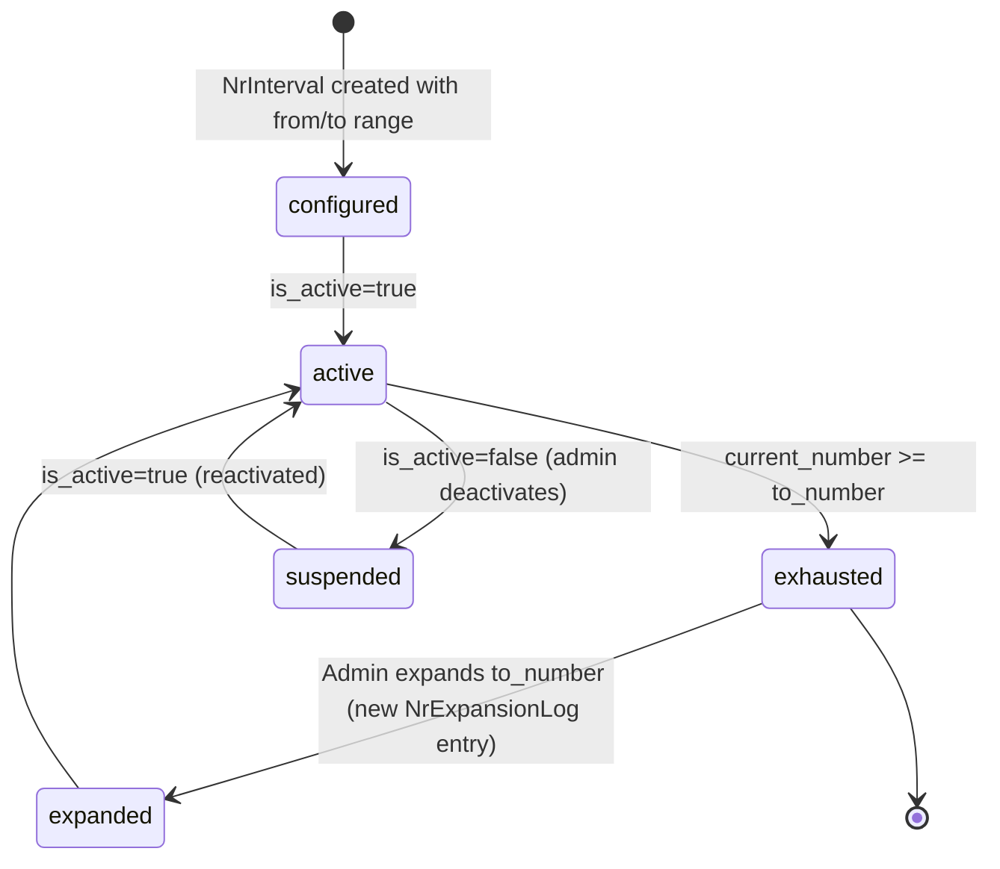

# Master Variables & Tenancy

## Business Context & Objective

The SystemOverview subdomain manages critical system-wide configuration and document numbering infrastructure that governs the entire enterprise. Master Variables define the system's operational parameters (number formats, sequence rules, entity configurations), while the Tenancy model ensures multi-entity support—allowing a single accorestallation to serve multiple independent companies or business units with separate accounting, compliance, and reporting requirements. System administrators, finance controllers, and operations teams depend on this subdomain to configure sequential numbering for all business documents (invoices, journals, purchase orders, employee IDs) and establish the foundational multi-entity structure. Without proper sequencing, regulatory compliance becomes impossible; without multi-tenancy, consolidating operations across subsidiary companies becomes operationally infeasible.

## Domain Entities

| Entity | Business Definition | Role |
|--------|-------------------|------|
| **NrObject** | A document or entity type (Employee, Customer, Invoice, Journal Entry) requiring sequential numbering. | Defines the numbering context, digit width, prefix rules, and which sequences apply to the object type. |
| **NrGroup** | A classification bucket within an NrObject (e.g., Invoices by sales channel: Retail, Wholesale). | Enables per-group number ranges; allows different invoice sequences for different business units. |
| **NrInterval** | A numeric range [from_number .. to_number] with continuous allocation tracking. | Stores the starting number, ending number, current assigned number, and whether numbers are externally assigned or system-generated. |
| **NrGroupIntervalAssignment** | Maps an NrGroup to an NrInterval, defining which sequences apply to which groups. | Enables flexible assignment of numeric ranges to classification buckets without requiring code changes. |
| **DocumentSequence** | A counter tracking the next document number for a specific sequence. | Provides atomic increment-and-read operations for sequential numbering across concurrent requests. |
| **NrExpansionLog** | Audit log entry for each interval expansion (when an interval runs out of numbers). | Records timestamp, old range, new range, and expansion reason for compliance auditing. |

## State Machine / Lifecycle

NrInterval and NrGroup follow activation and exhaustion states:

## Business Rules & Constraints

1. **Sequential Integrity** — Every NrObject must have at least one active NrInterval assigned; numbers must be allocated sequentially (no gaps or reuse).
2. **Interval Immutability** — Once created, an NrInterval's from_number and to_number are immutable; expansion only increases to_number.
3. **Current Number Monotonicity** — current_number can only increase, never decrease; it tracks the last allocated number within the interval.
4. **External vs. System Numbering** — An interval is marked is_external=true if users manually assign numbers (e.g., customer PO numbers). System-generated intervals auto-increment.
5. **Number Length Enforcement** — All numbers assigned to an NrObject must conform to the object's number_length (digit width and optional prefix).
6. **Group-to-Interval Uniqueness** — Each NrGroup is assigned exactly one active NrInterval at any point in time.
7. **Exhaustion Prevention** — When current_number approaches to_number (e.g., 95% capacity), a warning event is triggered; allocation fails when current_number >= to_number.
8. **Audit Trail of Expansions** — Every interval expansion must be logged to NrExpansionLog with operator, timestamp, and business reason.

## Integration Events

| Event | Direction | Connected Domain | Trigger |
|-------|-----------|-----------------|---------|
| NrObject.Configured | Outbound | All Domains (pull) | SystemOverview config defines which entities get sequences |
| Interval.Exhausted | Outbound | MonitoringCompliance | current_number reaches to_number; alert sent |
| Interval.Expanded | Outbound | MonitoringCompliance | NrExpansionLog entry created when to_number is increased |
| DocumentSequence.Incremented | Internal | SystemOverview | Every numbering operation increments DocumentSequence |

## Key Operations

**ConfigureNrObject** — Creates or updates an NrObject with object_type (unique key), number_length, prefix, and active status. Example: "Invoice" with number_length=10, prefix="INV-".

**CreateNrInterval** — Establishes a numeric range with from_number, to_number, description, and is_external flag. Initializes current_number=from_number.

**AllocateNumber** — Atomic operation: reads current DocumentSequence counter for the NrGroup, increments it, validates against the assigned NrInterval, and returns the formatted number (prefix + padded number). Fails if current >= to_number.

**ExpandInterval** — Increases an NrInterval's to_number when approaching exhaustion. Records old/new ranges in NrExpansionLog. Requires admin approval and business justification.

**AssignGroupToInterval** — Maps an NrGroup to an NrInterval, replacing any previous assignment. Validation ensures the new interval is compatible with existing allocated numbers.

**ListNrObjects**, **ShowNrInterval**, **ShowDocumentSequence** — Retrieve configuration and status data. Support filtering by active status and object type.

## Known Constraints

1. Once a number is allocated from an NrInterval, it cannot be reclaimed or reallocated to another NrGroup.
2. Multi-interval assignment to a single NrGroup is not supported; only one active interval per group at a time.
3. <!-- [ASSUMPTION] --> NrExpansionLog records expansions but does not trigger approval workflows; administrators can expand intervals without escalation.
4. DocumentSequence atomicity relies on database-level locking (SELECT FOR UPDATE); performance may degrade under very high concurrency (>1000 allocations/second).
5. Prefix formatting is static; dynamic prefixes based on date or period are not supported.
6. No automatic archival of exhausted or superseded NrIntervals; old ranges persist in the database indefinitely.

## Assumptions & Open Questions

<!-- [ASSUMPTION] -->
**Multi-Tenancy Implementation**: The task objective mentions "Tenancy configuration," but the SystemOverview entities (NrObject, NrInterval) show no explicit tenant_id column. It is unclear whether multi-tenancy is implemented at the application layer (soft-tenant using context), the database layer (schema-per-tenant), or delegated to the Platform domain. Clarification needed: How does accoreolate document sequences between independent tenants?

<!-- [ASSUMPTION] -->
**Master Variables Storage**: "Master Variables" is mentioned in the task title but is not implemented within SystemOverview models. It is likely that master configuration variables (general ledger close dates, fiscal periods, thresholds) are stored in OrganizationGovernance.Setting. Clarification needed: What constitutes "master variables" and where are they stored?

<!-- [ASSUMPTION] -->
**DocumentSequence Atomicity**: DocumentSequence uses database-level SELECT FOR UPDATE for atomic allocation. If the database is distributed (read replicas, sharding), this mechanism may not be reliable. Clarification needed: Is DocumentSequence guaranteed to be on a single primary instance?
