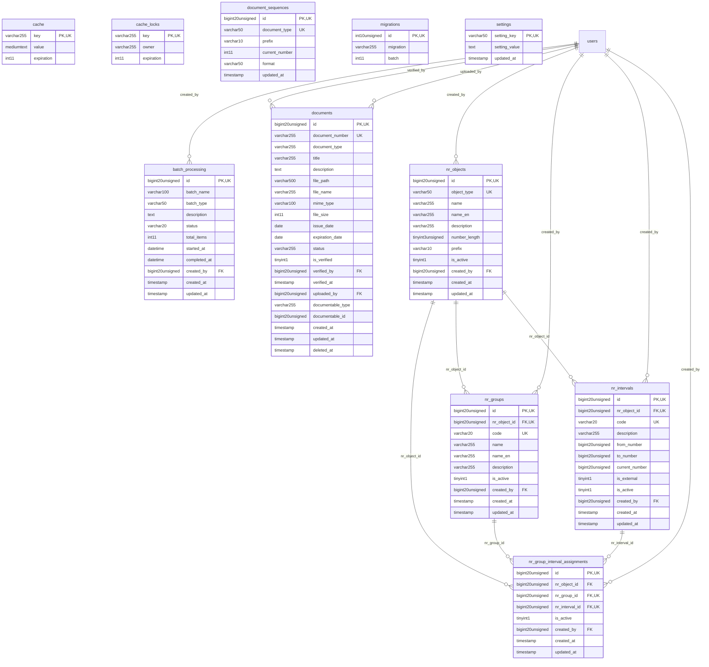

# EnterpriseCore - SystemOverview

> **Bounded Context Schema & ERD**
> 11 Tables | Generated dynamically by ACCSYSTEM engine

---

## Tables List

- `batch_processing`
- `cache`
- `cache_locks`
- `document_sequences`
- `documents`
- `migrations`
- `nr_group_interval_assignments`
- `nr_groups`
- `nr_intervals`
- `nr_objects`
- `settings`

---

## Entity Relationship Diagram

---

## Data Dictionary

### Table: `batch_processing`

| Column | Type | Nullable | Default | Indexes | Foreign Keys |
|---|---|---|---|---|---|
| `id` | `bigint(20) unsigned` | No |  | **PK** |  |
| `batch_name` | `varchar(100)` | No |  |  |  |
| `batch_type` | `varchar(50)` | No |  |  |  |
| `description` | `text` | Yes | `NULL` |  |  |
| `status` | `varchar(20)` | No | `'pending'` |  |  |
| `total_items` | `int(11)` | No | `0` |  |  |
| `started_at` | `datetime` | Yes | `NULL` |  |  |
| `completed_at` | `datetime` | Yes | `NULL` |  |  |
| `created_by` | `bigint(20) unsigned` | Yes | `NULL` | IDX | -> `users.id` |
| `created_at` | `timestamp` | Yes | `NULL` |  |  |
| `updated_at` | `timestamp` | Yes | `NULL` |  |  |

### Table: `cache`

| Column | Type | Nullable | Default | Indexes | Foreign Keys |
|---|---|---|---|---|---|
| `key` | `varchar(255)` | No |  | **PK** |  |
| `value` | `mediumtext` | No |  |  |  |
| `expiration` | `int(11)` | No |  |  |  |

### Table: `cache_locks`

| Column | Type | Nullable | Default | Indexes | Foreign Keys |
|---|---|---|---|---|---|
| `key` | `varchar(255)` | No |  | **PK** |  |
| `owner` | `varchar(255)` | No |  |  |  |
| `expiration` | `int(11)` | No |  |  |  |

### Table: `document_sequences`

| Column | Type | Nullable | Default | Indexes | Foreign Keys |
|---|---|---|---|---|---|
| `id` | `bigint(20) unsigned` | No |  | **PK** |  |
| `document_type` | `varchar(50)` | No |  | *UK* |  |
| `prefix` | `varchar(10)` | No | `''` |  |  |
| `current_number` | `int(11)` | No | `0` |  |  |
| `format` | `varchar(50)` | No | `'{PREFIX}-{NUMBER}'` |  |  |
| `updated_at` | `timestamp` | No | `current_timestamp()` |  |  |

### Table: `documents`

| Column | Type | Nullable | Default | Indexes | Foreign Keys |
|---|---|---|---|---|---|
| `id` | `bigint(20) unsigned` | No |  | **PK** |  |
| `document_number` | `varchar(255)` | Yes | `NULL` | *UK* |  |
| `document_type` | `varchar(255)` | No |  |  |  |
| `title` | `varchar(255)` | No |  |  |  |
| `description` | `text` | Yes | `NULL` |  |  |
| `file_path` | `varchar(500)` | No |  |  |  |
| `file_name` | `varchar(255)` | No |  |  |  |
| `mime_type` | `varchar(100)` | Yes | `NULL` |  |  |
| `file_size` | `int(11)` | Yes | `NULL` |  |  |
| `issue_date` | `date` | Yes | `NULL` |  |  |
| `expiration_date` | `date` | Yes | `NULL` |  |  |
| `status` | `varchar(255)` | No | `'active'` |  |  |
| `is_verified` | `tinyint(1)` | No | `0` |  |  |
| `verified_by` | `bigint(20) unsigned` | Yes | `NULL` | IDX | -> `users.id` |
| `verified_at` | `timestamp` | Yes | `NULL` |  |  |
| `uploaded_by` | `bigint(20) unsigned` | Yes | `NULL` | IDX | -> `users.id` |
| `documentable_type` | `varchar(255)` | Yes | `NULL` | IDX |  |
| `documentable_id` | `bigint(20) unsigned` | Yes | `NULL` | IDX |  |
| `created_at` | `timestamp` | Yes | `NULL` |  |  |
| `updated_at` | `timestamp` | Yes | `NULL` |  |  |
| `deleted_at` | `timestamp` | Yes | `NULL` |  |  |

### Table: `migrations`

| Column | Type | Nullable | Default | Indexes | Foreign Keys |
|---|---|---|---|---|---|
| `id` | `int(10) unsigned` | No |  | **PK** |  |
| `migration` | `varchar(255)` | No |  |  |  |
| `batch` | `int(11)` | No |  |  |  |

### Table: `nr_group_interval_assignments`

| Column | Type | Nullable | Default | Indexes | Foreign Keys |
|---|---|---|---|---|---|
| `id` | `bigint(20) unsigned` | No |  | **PK** |  |
| `nr_object_id` | `bigint(20) unsigned` | No |  | IDX | -> `nr_objects.id` |
| `nr_group_id` | `bigint(20) unsigned` | No |  | *UK* | -> `nr_groups.id` |
| `nr_interval_id` | `bigint(20) unsigned` | No |  | *UK*, IDX | -> `nr_intervals.id` |
| `is_active` | `tinyint(1)` | No | `1` |  |  |
| `created_by` | `bigint(20) unsigned` | Yes | `NULL` | IDX | -> `users.id` |
| `created_at` | `timestamp` | Yes | `NULL` |  |  |
| `updated_at` | `timestamp` | Yes | `NULL` |  |  |

### Table: `nr_groups`

| Column | Type | Nullable | Default | Indexes | Foreign Keys |
|---|---|---|---|---|---|
| `id` | `bigint(20) unsigned` | No |  | **PK** |  |
| `nr_object_id` | `bigint(20) unsigned` | No |  | *UK* | -> `nr_objects.id` |
| `code` | `varchar(20)` | No |  | *UK* |  |
| `name` | `varchar(255)` | No |  |  |  |
| `name_en` | `varchar(255)` | Yes | `NULL` |  |  |
| `description` | `varchar(255)` | Yes | `NULL` |  |  |
| `is_active` | `tinyint(1)` | No | `1` |  |  |
| `created_by` | `bigint(20) unsigned` | Yes | `NULL` | IDX | -> `users.id` |
| `created_at` | `timestamp` | Yes | `NULL` |  |  |
| `updated_at` | `timestamp` | Yes | `NULL` |  |  |

### Table: `nr_intervals`

| Column | Type | Nullable | Default | Indexes | Foreign Keys |
|---|---|---|---|---|---|
| `id` | `bigint(20) unsigned` | No |  | **PK** |  |
| `nr_object_id` | `bigint(20) unsigned` | No |  | *UK* | -> `nr_objects.id` |
| `code` | `varchar(20)` | No |  | *UK* |  |
| `description` | `varchar(255)` | Yes | `NULL` |  |  |
| `from_number` | `bigint(20) unsigned` | No |  |  |  |
| `to_number` | `bigint(20) unsigned` | No |  |  |  |
| `current_number` | `bigint(20) unsigned` | No | `0` |  |  |
| `is_external` | `tinyint(1)` | No | `0` |  |  |
| `is_active` | `tinyint(1)` | No | `1` |  |  |
| `created_by` | `bigint(20) unsigned` | Yes | `NULL` | IDX | -> `users.id` |
| `created_at` | `timestamp` | Yes | `NULL` |  |  |
| `updated_at` | `timestamp` | Yes | `NULL` |  |  |

### Table: `nr_objects`

| Column | Type | Nullable | Default | Indexes | Foreign Keys |
|---|---|---|---|---|---|
| `id` | `bigint(20) unsigned` | No |  | **PK** |  |
| `object_type` | `varchar(50)` | No |  | *UK* |  |
| `name` | `varchar(255)` | No |  |  |  |
| `name_en` | `varchar(255)` | Yes | `NULL` |  |  |
| `description` | `varchar(255)` | Yes | `NULL` |  |  |
| `number_length` | `tinyint(3) unsigned` | No | `8` |  |  |
| `prefix` | `varchar(10)` | Yes | `NULL` |  |  |
| `is_active` | `tinyint(1)` | No | `1` |  |  |
| `created_by` | `bigint(20) unsigned` | Yes | `NULL` | IDX | -> `users.id` |
| `created_at` | `timestamp` | Yes | `NULL` |  |  |
| `updated_at` | `timestamp` | Yes | `NULL` |  |  |

### Table: `settings`

| Column | Type | Nullable | Default | Indexes | Foreign Keys |
|---|---|---|---|---|---|
| `setting_key` | `varchar(50)` | No |  | **PK** |  |
| `setting_value` | `text` | Yes | `NULL` |  |  |
| `updated_at` | `timestamp` | No | `current_timestamp()` |  |  |

