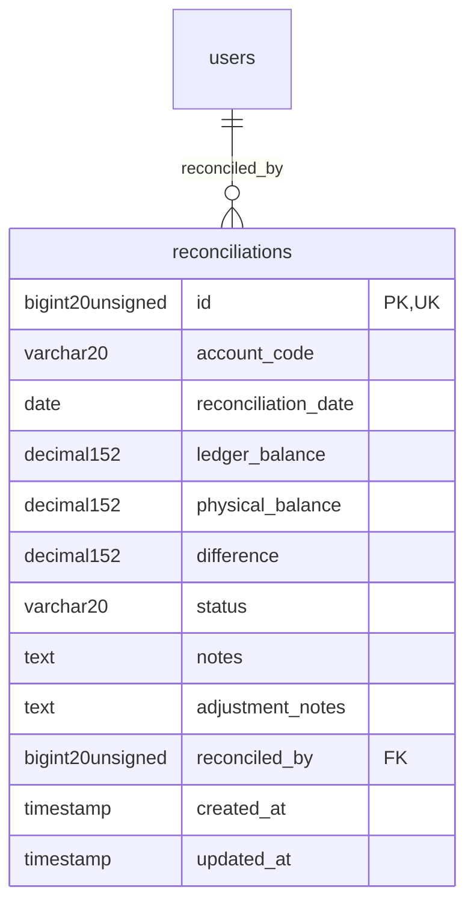

# Finance - AuditCompliance

> **Bounded Context Schema & ERD**
> 1 Tables | Generated dynamically by ACCSYSTEM engine

---

## Tables List

- `reconciliations`

---

## Entity Relationship Diagram

---

## Data Dictionary

### Table: `reconciliations`

| Column | Type | Nullable | Default | Indexes | Foreign Keys |
|---|---|---|---|---|---|
| `id` | `bigint(20) unsigned` | No |  | **PK** |  |
| `account_code` | `varchar(20)` | No |  | IDX |  |
| `reconciliation_date` | `date` | No |  | IDX |  |
| `ledger_balance` | `decimal(15,2)` | No |  |  |  |
| `physical_balance` | `decimal(15,2)` | No |  |  |  |
| `difference` | `decimal(15,2)` | No |  |  |  |
| `status` | `varchar(20)` | No | `'unreconciled'` | IDX |  |
| `notes` | `text` | Yes | `NULL` |  |  |
| `adjustment_notes` | `text` | Yes | `NULL` |  |  |
| `reconciled_by` | `bigint(20) unsigned` | Yes | `NULL` | IDX | -> `users.id` |
| `created_at` | `timestamp` | Yes | `NULL` |  |  |
| `updated_at` | `timestamp` | Yes | `NULL` |  |  |

