# Currency Revaluation & Exchange Rate Management

## Business Context & Objective

The Foreign Exchange (FX) module manages multi-currency transactions and period-end revaluation of foreign currency account balances to the functional currency. The module enforces organizational currency policies, maintains historical exchange rates for audit trails, and automatically calculates realized and unrealized gains/losses from currency fluctuations. Treasury managers, CFOs, and external auditors rely on this module to ensure foreign currency positions are accurately stated in the functional currency for financial reporting.

## Domain Entities

| Entity | Business Definition | Role |
|--------|-------------------|------|
| **Currency** | A monetary unit (e.g., SAR, USD, EUR) with a code, symbol, and current exchange rate. One currency is marked as primary (functional/reference currency). | Defines which currencies the organization transacts in and which is the baseline for reporting. |
| **CurrencyPolicy** | Organizational governance rule that determines how multi-currency transactions are treated (e.g., convert at posting vs. reporting, allow multi-currency balances). | Controls period-to-period consistency in currency handling and ensures compliance with accounting standards. |
| **CurrencyExchangeRateHistory** | Immutable historical record of exchange rates between two currencies as of a specific date and time. | Provides audit trail for revaluation calculations and enables historical foreign currency translation. |
| **CurrencyRevaluation** | Snapshot of a period-end revaluation event, recording the gain/loss from an exchange rate change on a foreign currency balance. | Tracks realized/unrealized gains and losses; supports audit and compliance reporting. |
| **TransactionCurrencyContext** | Links a transaction to a specific currency policy snapshot, preserving policy state at transaction time. | Ensures consistent policy application across time; supports regulatory audit requirements. |

## State Machine / Lifecycle

A foreign currency balance progresses through revaluation cycles tied to fiscal periods:

```mermaid
stateDiagram-v2
    [*] --> Open: Transactions recorded in foreign currency
    Open --> Revaluation_Pending: Fiscal period closing; balances awaiting rate update
    Revaluation_Pending --> Revaluation_Posted: New exchange rate applied; GL entries for gain/loss created
    Revaluation_Posted --> Closed: Period closed; exchange rate locked for historical reference
    Closed --> Archive: Post-close period archived or regulatory hold expired
    Archive --> [*]
    
    note right of Open
        Transactions in multiple currencies.
        GL entries in transaction currency + conversion to reference currency (if policy dictates).
    end note
    
    note right of Revaluation_Pending
        Period is closing.
        Current exchange rates retrieved.
        Revaluation amount calculated but not yet posted.
    end note
    
    note right of Revaluation_Posted
        GL entries created for gains/losses.
        Revaluation record created with before/after rates and impact amounts.
        Unrealized gains/losses now realized if conversion occurred.
    end note
```

## Business Rules & Constraints

1. **One Active Policy:** Only one CurrencyPolicy may be marked `is_active = true` at a time. Activating a new policy deactivates all others.

2. **Primary Currency:** Exactly one Currency must be marked `is_primary = true`. This is the functional/reporting currency to which all foreign amounts are converted for financial statements. <!-- [ASSUMPTION] -->

3. **Exchange Rate Immutability:** Historical exchange rates cannot be edited after creation, ensuring audit integrity. Only new rates can be recorded.

4. **Rate Lookup by Date:** The system retrieves the most recent exchange rate as of a given date (including time component for intraday updates).

5. **Revaluation Gain/Loss Logic:** For each foreign currency account, revaluation amount = (previous balance × previous rate) vs. (previous balance × new rate). Gains occur when the new rate is more favorable; losses when less favorable. <!-- [ASSUMPTION] -->

6. **Policy Snapshot Binding:** Each transaction captures a snapshot of the active CurrencyPolicy at posting time (policy_type, conversion_timing, revaluation_enabled). This prevents retroactive policy changes from affecting historical transactions.

7. **Conversion Timing Control:** Policy determines whether conversion happens at posting (GL entries in reference currency only) or at reporting (GL entries in transaction currency; conversion at report time).

8. **Currency Balance Filtering:** Policy controls whether accounts may carry multi-currency balances. If `allow_multi_currency_balances = false`, all accounts must be settled or converted to reference currency by period end.

## Integration Events

| Event | Direction | Connected Domain | Trigger |
|-------|-----------|-----------------|---------|
| `ExchangeRateUpdated` | Outbound | GeneralLedger | New FX rate recorded; may trigger revaluation recalculation |
| `CurrencyRevaluationPosted` | Outbound | GeneralLedger | Revaluation GL entries created for gains/losses |
| `CurrencyPolicyChanged` | Outbound | (Internal Finance) | Active policy switched; future transactions use new policy |
| `ForeignCurrencyTransactionPosted` | Inbound | Commercial, SupplyChain | Multi-currency transaction requires FX processing |

## Key Operations

**Record Exchange Rate**  
Records a new exchange rate between two currencies as of a specified date and time. Source (manual, API, Bloomberg) and optional reference ID are captured for audit.

**Apply Currency Policy**  
Evaluates the active policy against a transaction's currency and determines whether conversion to reference currency should occur at posting or deferred to reporting.

**Post Revaluation**  
For each foreign currency account with activity, calculates revaluation amount using new and previous exchange rates, creates revaluation record, and (if enabled by policy) posts GL entries for gains/losses.

**Get Exchange Rate on Date**  
Retrieves the effective exchange rate for a currency pair as of a specific date, falling back to the most recent rate before that date if no exact-date rate exists.

**Calculate Rate Change Impact**  
For a foreign currency balance and two exchange rates, computes the gain or loss in reference currency and identifies whether the change is a gain or loss.

## Known Constraints

- Transactions recorded in a foreign currency cannot be converted retroactively if the policy is changed mid-period; only new transactions apply the new policy.
- Revaluation is triggered manually (or scheduled) at period end; the system does not automatically revalue intra-period.
- Exchange rates with identical effective_date and effective_time will overwrite one another (last-write-wins); intraday rate sequences must be recorded with distinct timestamps.
- Multi-currency balances are allowed only if policy explicitly permits; compliance checking occurs at period close.
- Revaluation gain/loss GL entries require the GL posting service and must respect period and account posting constraints (no posting to summary accounts, etc.).

## Assumptions & Open Questions

- **[ASSUMPTION]** Exactly one primary currency exists at all times. The system does not validate that a primary currency has been defined before FX operations begin.
- **[ASSUMPTION]** Exchange rate sources (MANUAL, API, BLOOMBERG) are free-form strings; no enumerated list is validated at the database layer.
- **[ASSUMPTION]** Revaluation gain/loss GL entries are created in a single GL posting transaction; if posting fails, the revaluation record is rolled back.
- **Question:** Should revaluation be prevented if the fiscal period is already closed, or should revaluation be performed before period closure?
- **Question:** Are there currency pairs (e.g., intra-GCC currencies) that should be exempt from revaluation due to peg agreements?
