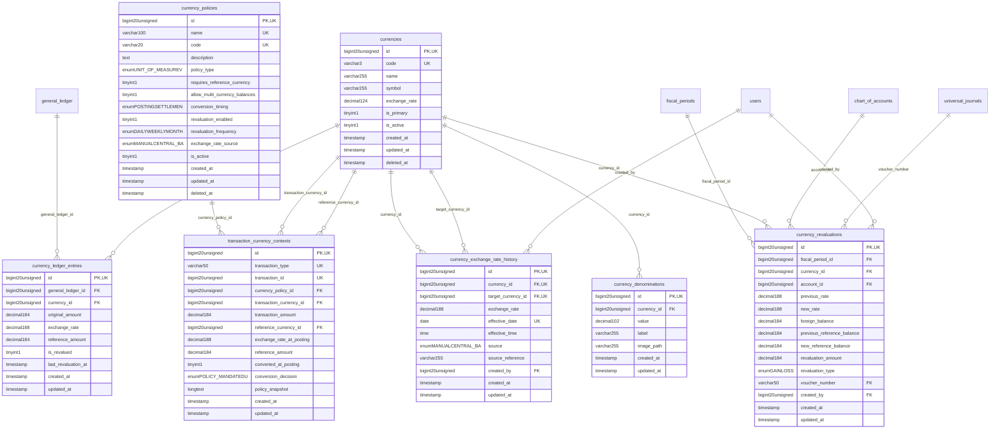

# Finance - ForeignExchange

> **Bounded Context Schema & ERD**
> 7 Tables | Generated dynamically by accoregine

---

## Tables List

- `currencies`
- `currency_denominations`
- `currency_exchange_rate_history`
- `currency_ledger_entries`
- `currency_policies`
- `currency_revaluations`
- `transaction_currency_contexts`

---

## Entity Relationship Diagram

---

## Data Dictionary

### Table: `currencies`

| Column | Type | Nullable | Default | Indexes | Foreign Keys |
|---|---|---|---|---|---|
| `id` | `bigint(20) unsigned` | No |  | **PK** |  |
| `code` | `varchar(3)` | No |  | *UK* |  |
| `name` | `varchar(255)` | No |  |  |  |
| `symbol` | `varchar(255)` | No |  |  |  |
| `exchange_rate` | `decimal(12,4)` | No | `1.0000` |  |  |
| `is_primary` | `tinyint(1)` | No | `0` |  |  |
| `is_active` | `tinyint(1)` | No | `1` |  |  |
| `created_at` | `timestamp` | Yes | `NULL` |  |  |
| `updated_at` | `timestamp` | Yes | `NULL` |  |  |
| `deleted_at` | `timestamp` | Yes | `NULL` |  |  |

### Table: `currency_denominations`

| Column | Type | Nullable | Default | Indexes | Foreign Keys |
|---|---|---|---|---|---|
| `id` | `bigint(20) unsigned` | No |  | **PK** |  |
| `currency_id` | `bigint(20) unsigned` | No |  | IDX | -> `currencies.id` |
| `value` | `decimal(10,2)` | No |  |  |  |
| `label` | `varchar(255)` | No |  |  |  |
| `image_path` | `varchar(255)` | Yes | `NULL` |  |  |
| `created_at` | `timestamp` | Yes | `NULL` |  |  |
| `updated_at` | `timestamp` | Yes | `NULL` |  |  |

### Table: `currency_exchange_rate_history`

| Column | Type | Nullable | Default | Indexes | Foreign Keys |
|---|---|---|---|---|---|
| `id` | `bigint(20) unsigned` | No |  | **PK** |  |
| `currency_id` | `bigint(20) unsigned` | No |  | IDX, *UK* | -> `currencies.id` |
| `target_currency_id` | `bigint(20) unsigned` | No |  | IDX, *UK* | -> `currencies.id` |
| `exchange_rate` | `decimal(18,8)` | No |  |  |  |
| `effective_date` | `date` | No |  | IDX, *UK* |  |
| `effective_time` | `time` | Yes | `NULL` |  |  |
| `source` | `enum('MANUAL','CENTRAL_BANK','API','SYSTEM')` | No | `'MANUAL'` |  |  |
| `source_reference` | `varchar(255)` | Yes | `NULL` |  |  |
| `created_by` | `bigint(20) unsigned` | Yes | `NULL` | IDX | -> `users.id` |
| `created_at` | `timestamp` | Yes | `NULL` |  |  |
| `updated_at` | `timestamp` | Yes | `NULL` |  |  |

### Table: `currency_ledger_entries`

| Column | Type | Nullable | Default | Indexes | Foreign Keys |
|---|---|---|---|---|---|
| `id` | `bigint(20) unsigned` | No |  | **PK** |  |
| `general_ledger_id` | `bigint(20) unsigned` | No |  | IDX | -> `general_ledger.id` |
| `currency_id` | `bigint(20) unsigned` | No |  | IDX, IDX | -> `currencies.id` |
| `original_amount` | `decimal(18,4)` | No |  |  |  |
| `exchange_rate` | `decimal(18,8)` | Yes | `NULL` |  |  |
| `reference_amount` | `decimal(18,4)` | Yes | `NULL` |  |  |
| `is_revalued` | `tinyint(1)` | No | `0` |  |  |
| `last_revaluation_at` | `timestamp` | Yes | `NULL` |  |  |
| `created_at` | `timestamp` | Yes | `NULL` | IDX |  |
| `updated_at` | `timestamp` | Yes | `NULL` |  |  |

### Table: `currency_policies`

| Column | Type | Nullable | Default | Indexes | Foreign Keys |
|---|---|---|---|---|---|
| `id` | `bigint(20) unsigned` | No |  | **PK** |  |
| `name` | `varchar(100)` | No |  | *UK* |  |
| `code` | `varchar(20)` | No |  | *UK* |  |
| `description` | `text` | Yes | `NULL` |  |  |
| `policy_type` | `enum('UNIT_OF_MEASURE','VALUED_ASSET','NORMALIZATION')` | No | `'NORMALIZATION'` |  |  |
| `requires_reference_currency` | `tinyint(1)` | No | `1` |  |  |
| `allow_multi_currency_balances` | `tinyint(1)` | No | `0` |  |  |
| `conversion_timing` | `enum('POSTING','SETTLEMENT','REPORTING','NEVER')` | No | `'POSTING'` |  |  |
| `revaluation_enabled` | `tinyint(1)` | No | `0` |  |  |
| `revaluation_frequency` | `enum('DAILY','WEEKLY','MONTHLY','PERIOD_END')` | Yes | `NULL` |  |  |
| `exchange_rate_source` | `enum('MANUAL','CENTRAL_BANK','API')` | No | `'MANUAL'` |  |  |
| `is_active` | `tinyint(1)` | No | `0` |  |  |
| `created_at` | `timestamp` | Yes | `NULL` |  |  |
| `updated_at` | `timestamp` | Yes | `NULL` |  |  |
| `deleted_at` | `timestamp` | Yes | `NULL` |  |  |

### Table: `currency_revaluations`

| Column | Type | Nullable | Default | Indexes | Foreign Keys |
|---|---|---|---|---|---|
| `id` | `bigint(20) unsigned` | No |  | **PK** |  |
| `fiscal_period_id` | `bigint(20) unsigned` | Yes | `NULL` | IDX | -> `fiscal_periods.id` |
| `currency_id` | `bigint(20) unsigned` | No |  | IDX, IDX | -> `currencies.id` |
| `account_id` | `bigint(20) unsigned` | No |  | IDX | -> `chart_of_accounts.id` |
| `previous_rate` | `decimal(18,8)` | No |  |  |  |
| `new_rate` | `decimal(18,8)` | No |  |  |  |
| `foreign_balance` | `decimal(18,4)` | No |  |  |  |
| `previous_reference_balance` | `decimal(18,4)` | No |  |  |  |
| `new_reference_balance` | `decimal(18,4)` | No |  |  |  |
| `revaluation_amount` | `decimal(18,4)` | No |  |  |  |
| `revaluation_type` | `enum('GAIN','LOSS')` | No |  |  |  |
| `voucher_number` | `varchar(50)` | Yes | `NULL` | IDX | -> `universal_journals.voucher_number` |
| `created_by` | `bigint(20) unsigned` | Yes | `NULL` | IDX | -> `users.id` |
| `created_at` | `timestamp` | Yes | `NULL` | IDX |  |
| `updated_at` | `timestamp` | Yes | `NULL` |  |  |

### Table: `transaction_currency_contexts`

| Column | Type | Nullable | Default | Indexes | Foreign Keys |
|---|---|---|---|---|---|
| `id` | `bigint(20) unsigned` | No |  | **PK** |  |
| `transaction_type` | `varchar(50)` | No |  | *UK* |  |
| `transaction_id` | `bigint(20) unsigned` | No |  | *UK* |  |
| `currency_policy_id` | `bigint(20) unsigned` | No |  | IDX | -> `currency_policies.id` |
| `transaction_currency_id` | `bigint(20) unsigned` | No |  | IDX | -> `currencies.id` |
| `transaction_amount` | `decimal(18,4)` | No |  |  |  |
| `reference_currency_id` | `bigint(20) unsigned` | Yes | `NULL` | IDX | -> `currencies.id` |
| `exchange_rate_at_posting` | `decimal(18,8)` | Yes | `NULL` |  |  |
| `reference_amount` | `decimal(18,4)` | Yes | `NULL` |  |  |
| `converted_at_posting` | `tinyint(1)` | No | `0` |  |  |
| `conversion_decision` | `enum('POLICY_MANDATED','USER_REQUESTED','SAME_CURRENCY','DEFERRED','EXEMPTED')` | No | `'POLICY_MANDATED'` |  |  |
| `policy_snapshot` | `longtext` | Yes | `NULL` |  |  |
| `created_at` | `timestamp` | Yes | `NULL` | IDX |  |
| `updated_at` | `timestamp` | Yes | `NULL` |  |  |

