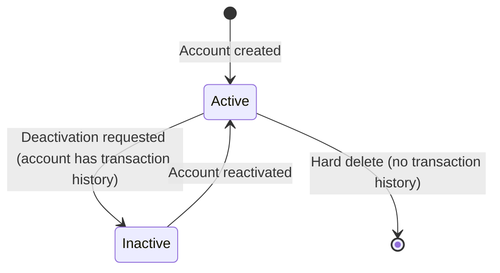

# Chart of Accounts Governance

## Business Context & Objective

The Chart of Accounts (COA) is the classification framework that determines how every financial transaction is categorized. It defines the account hierarchy — from broad categories such as Assets down to leaf accounts such as Cash or Accounts Receivable — and governs which accounts may receive postings.

The COA is resolved dynamically by all other domains (Commercial, SupplyChain, HumanCapital, Assets) through an account mapping service that translates business roles — such as "sales revenue" or "accounts payable" — into the specific account codes configured for the organization, enabling the ERP to operate independently of any particular numbering scheme.

Primary stakeholders are Controllers and Finance Directors who design the account structure, and Finance Managers who rely on account-level reporting.

## Domain Entities

| Entity | Business Definition | Role |
|--------|---------------------|------|
| ChartOfAccount | A node in the account hierarchy identified by a unique account code and typed as one of five account categories. | Provides the classification target for every GL posting. |

## State Machine / Lifecycle

An account that has received at least one GL posting is never physically deleted. Instead, it is deactivated to preserve the integrity of historical transaction records. An account with no posting history may be permanently removed.

## Business Rules & Constraints

1. Only leaf accounts — those with no child accounts — may receive GL postings.
2. An account with an existing transaction history cannot be physically deleted; it must be deactivated instead.
3. Every account must belong to one of five types: **asset**, **liability**, **equity**, **revenue**, or **expense**.
4. Account codes must be unique across the entire Chart of Accounts.
5. Inactive accounts are excluded from all posting operations but remain visible in historical reports.
6. Asset and Expense accounts carry debit-normal balances; Liability, Equity, and Revenue accounts carry credit-normal balances.

## Integration Events

| Event | Direction | Connected Domain | Trigger |
|-------|-----------|------------------|---------|
| Account Code Resolved | Consumed | Commercial, SupplyChain, HumanCapital, Assets | The mapping service is queried by other domains at transaction time to resolve business role names to account codes. |
| Account Deactivated | <!-- [ASSUMPTION] --> Emitted | All posting domains | Assumed to notify consuming domains that an account is no longer valid for posting. Not confirmed via event class inspection. |

## Key Operations

| Operation | Business Purpose |
|-----------|-----------------|
| Create Account | Registers a new account node in the hierarchy with a code, type, name, and optional parent. |
| Update Account | Modifies an account's name or description; the code and type are immutable once postings exist. |
| Delete / Deactivate Account | Permanently removes an account with no history; deactivates an account that has postings. |
| List Chart of Accounts | Returns the full account hierarchy, typically structured as a tree for financial reporting views. |
| Get Account Balances | Retrieves aggregated debit and credit totals per account for trial balance and period reporting. |
| Resolve Account by Role | The mapping service matches a business role (e.g., `accounts_receivable`) to its configured account code, supporting bilingual name matching. |

## Known Constraints

- Accounts support bilingual naming (Arabic and English); the mapping service searches Arabic first, then English.
- Parent accounts aggregate balances from children but cannot receive direct postings.
- <!-- [ASSUMPTION] --> Account code and type are assumed immutable once transaction history exists; not confirmed via update action constraints.

## Assumptions & Open Questions

| # | Location | Assumption | Verification Required |
|---|----------|------------|-----------------------|
| 1 | Integration Events | An event is emitted when an account is deactivated to notify posting domains. | Confirm via event class or domain event subscriber inspection. |
| 2 | Known Constraints | Account code and type are immutable after first posting. | Confirm via `UpdateChartOfAccountAction` validation logic. |
