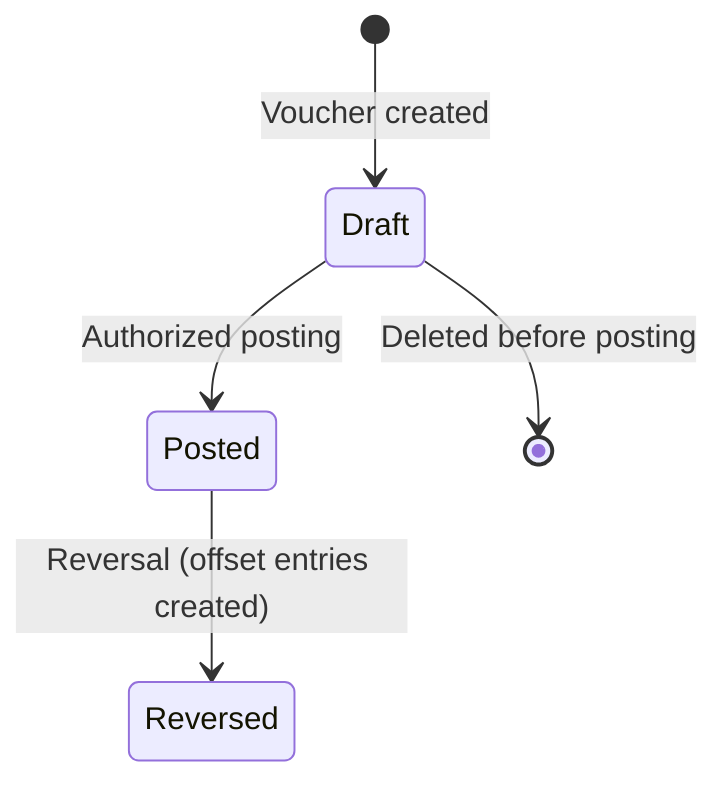

# Double-Entry Core Model

## Business Context & Objective

Double-entry bookkeeping requires that every financial event be recorded as at least two offsetting entries — one debit and one credit of equal value. This preserves the accounting equation (Assets = Liabilities + Equity) at all times and ensures no monetary value enters or exits the system without a traceable counterpart.

The General Ledger is the system of record for all such entries in ACCSYSTEM. It serves Controllers, Finance Directors, and external auditors who depend on its completeness and immutability to produce trial balances, financial statements, and compliance reports. Every domain that originates a financial event — Commercial, SupplyChain, HumanCapital, Assets — posts its financial effect here.

## Domain Entities

| Entity | Business Definition | Role |
|--------|---------------------|------|
| GeneralLedger | A single ledger line typed as DEBIT or CREDIT, always carrying a positive amount. | The atomic unit of financial recording; every event produces at least two. |
| UniversalJournal | A header record grouping all GL lines under a shared voucher number with a document type and summary. | Provides transaction context for a balanced set of GL entries. |
| FiscalPeriod | An accounting period that may be open, closed, or locked. | Controls which periods accept postings and enforces period-end closure. |

## State Machine / Lifecycle

The lifecycle governs journal vouchers (a UniversalJournal header paired with its GL lines).

<!-- [ASSUMPTION] --> The Draft and Posted states are inferred from `CreateJournalVoucherAction` and `PostJournalVoucherAction` in the Treasury subdomain. A formal status field on UniversalJournal was not confirmed in the model definition.

Once Posted, GL lines are immutable. Reversal creates new offset entries under a new voucher number — it does not alter the original record.

## Business Rules & Constraints

1. Every transaction must contain at least one DEBIT and one CREDIT entry with equal totals.
2. The `amount` on every GL line is always positive; the `entry_type` (DEBIT or CREDIT) determines accounting direction.
3. Asset and Expense balances equal debits minus credits; all other account types equal credits minus debits.
4. A GL entry must reference a valid, open FiscalPeriod at posting time.
5. Posted entries are immutable — no modification or deletion is permitted.

## Integration Events

| Event | Direction | Connected Domain | Trigger |
|-------|-----------|------------------|---------|
| Source Document Posted | Consumed | Commercial, SupplyChain, HumanCapital, Assets | Triggers automatic GL entry creation via the `AUTOMATIC` source path. |
| GL Entry Created | Emitted | <!-- [ASSUMPTION] --> Consuming domains | Assumed confirmation to the originating domain on successful GL write. |

## Key Operations

| Operation | Business Purpose |
|-----------|-----------------|
| Post Journal Voucher | Commits a balanced DEBIT/CREDIT set to the GL under one voucher number; validates equality before writing. |
| Reverse Journal Voucher | Creates offsetting entries to cancel a posted voucher without modifying the original record. |
| Get Trial Balance | Aggregates all GL entries by account and confirms total debits equal total credits across the ledger. |
| List GL Entries | Retrieves ledger entries filtered by account, period, or source for audit and reconciliation. |

## Known Constraints

- GL entries cannot be posted to a closed or locked FiscalPeriod.
- The trial balance is balanced when the absolute difference between total debits and credits is less than 0.01.
- Manual (`MANUAL`) and system-generated (`AUTOMATIC`) entries coexist in the ledger and may be filtered separately for audit.

## Assumptions & Open Questions

| # | Location | Assumption | Verification Required |
|---|----------|------------|-----------------------|
| 1 | State Machine | Draft and Posted states inferred from Treasury subdomain action names; a status field on UniversalJournal was not confirmed. | Inspect UniversalJournal migration or model definition. |
| 2 | Integration Events | `AUTOMATIC` entry creation is inferred from the entry_source field; event listener classes were not inspected. | Review domain event subscribers in each originating domain. |
