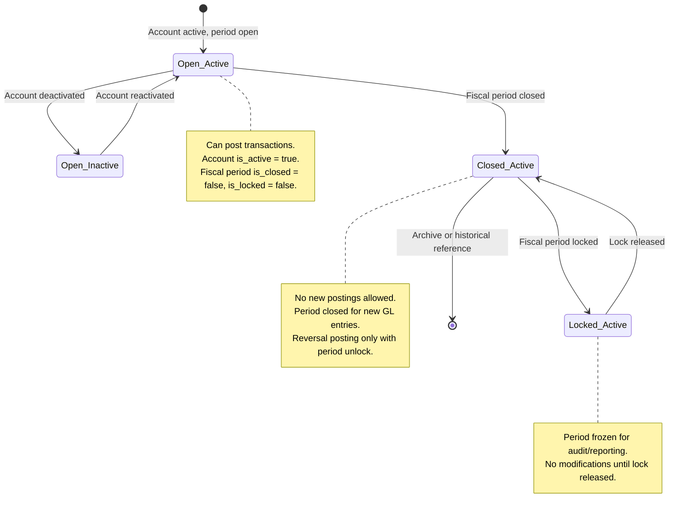

# GL Account Reconciliation & Financial Controls

## Business Context & Objective

The General Ledger Reconciliation module enforces the integrity of financial records through stringent posting controls, account balance verification, and fiscal period governance. This module ensures that every transaction posted to the GL conforms to double-entry accounting principles and respects authorization boundaries defined by fiscal periods and account hierarchies. Controllers, accountants, and internal auditors rely on this module to verify account balances, generate trial balances, and investigate variances between recorded amounts and physical counts.

## Domain Entities

| Entity | Business Definition | Role |
|--------|-------------------|------|
| **GeneralLedger** | Immutable record of a single debit or credit line of a transaction, grouped by voucher number. Each line captures the account, amount, entry type, and source. | Primary audit-trail entity; core source of truth for all financial amounts. |
| **ChartOfAccount** | Hierarchical classification scheme organizing accounts by type (asset, liability, equity, revenue, expense) and parent-child relationships. Only leaf accounts may receive postings. | Controls which accounts can be posted to; enforces proper classification of transactions. |
| **FiscalPeriod** | Accounting period with defined start/end dates, and flags indicating open, closed, or locked status. Locks prevent period-end modifications; closures prevent all new postings. | Period-based posting authorization; controls when GL entries can be created for a given date. |
| **UniversalJournal** | Central posting entry point that captures all journal vouchers, regardless of source (manual, automatic, or external). | Ensures single source of voucher numbering and provides a unified audit trail for all GL postings. |

## State Machine / Lifecycle

GL accounts progress through availability states based on fiscal period status and account hierarchy:

## Business Rules & Constraints

1. **Double-Entry Invariant:** Every transaction must have at least two entries (one debit, one credit), and the sum of debits must equal the sum of credits within ±0.01 tolerance. <!-- [ASSUMPTION] -->

2. **Parent Account Protection:** Transactions may only be posted to leaf accounts (accounts with no children). Summary/header accounts act as rollup nodes and cannot accept postings.

3. **Fiscal Period Authorization:** A transaction's voucher date must fall within an open and unlocked fiscal period. Posting to a closed or locked period is rejected.

4. **Account Activity Control:** An account marked `is_active = false` cannot receive new postings, even if its period is open.

5. **GL Immutability:** GL entries have no update timestamp and cannot be modified after creation. Changes to transaction amounts must be made via reversal and re-posting.

6. **Voucher Uniqueness:** Each GL transaction is identified by a unique voucher number, which groups all debit and credit entries belonging to a single posting event.

7. **Trial Balance Integrity:** The trial balance (sum of debit and credit balances across all accounts) must always balance (debits = credits). <!-- [ASSUMPTION] -->

8. **Account Type Balance Logic:** Asset and expense accounts naturally carry debit balances; liability, equity, and revenue accounts naturally carry credit balances. Balance calculations adjust for account type.

## Integration Events

| Event | Direction | Connected Domain | Trigger |
|-------|-----------|-----------------|---------|
| `GeneralLedgerPosted` | Outbound | Commercial, SupplyChain, HumanCapital | After successful GL posting from source domains |
| `FiscalPeriodClosed` | Inbound | (Internal Finance) | GL posting blocked when period is closed |
| `FiscalPeriodLocked` | Inbound | (Internal Finance) | GL posting blocked when period is locked for audit |
| `TransactionReversal` | Outbound | (Internal Finance) | Reversal posting creates compensating GL entries |

## Key Operations

**Post Transaction**  
Posts a multi-entry transaction to the GL after validating double-entry integrity, account hierarchy constraints, and fiscal period status. Returns a unique voucher number for reference.

**Get Account Balance**  
Retrieves the current balance for a specified account, optionally as of a historical date, applying account-type-specific debit/credit logic.

**Generate Trial Balance**  
Produces a complete trial balance report showing all active accounts with debit and credit balances, and verifies that debits equal credits within tolerance.

**Reverse Transaction**  
Creates a new compensating transaction (with reversed debit/credit entries) for a previously posted voucher. The reversal is posted as a new transaction and assigned a new voucher number.

**Lock/Unlock Fiscal Period**  
Prevents (or allows) new GL postings for a specific accounting period. Locked periods cannot accept new transactions but can be unlocked for correction posting.

## Known Constraints

- Transactions cannot be partially reversed; an entire voucher must be reversed as a single operation.
- GL entries cannot be edited in place; corrections require transaction reversal and re-posting.
- Posting to a closed period is not permitted without first unlocking the period.
- Summary accounts (parent accounts with children) are write-protected and exist only for roll-up reporting.
- Currency conversion uses a fixed exchange rate recorded at posting time; post-posting revaluation is handled separately by the ForeignExchange domain.
- GL postings are recorded in document currency; conversion to functional currency is handled at reporting time.

## Assumptions & Open Questions

- **[ASSUMPTION]** Double-entry validation uses a tolerance of ±0.01 to account for floating-point rounding. This threshold may require adjustment based on organizational precision requirements.
- **[ASSUMPTION]** Trial balance balancing logic assumes all accounts are classified correctly by type (asset, liability, equity, revenue, expense). Misclassified accounts may produce unbalanced trial balances.
- **Question:** Are there audit-specific GL posting requirements (e.g., mandatory narration for manual vs. automatic entries) that should be enforced at the GL layer rather than upstream?
- **Question:** Should GL entries include a "reconciliation status" flag to track which postings have been matched to supporting documents during reconciliation?
