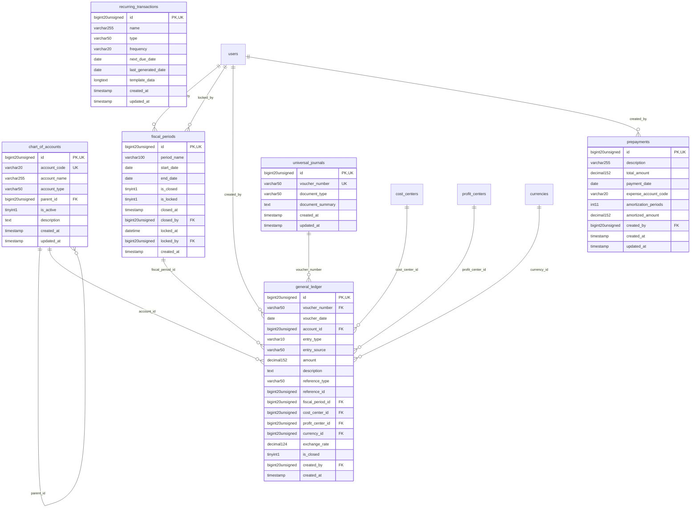

# Finance - GeneralLedger

> **Bounded Context Schema & ERD**
> 6 Tables | Generated dynamically by ACCSYSTEM engine

---

## Tables List

- `chart_of_accounts`
- `fiscal_periods`
- `general_ledger`
- `prepayments`
- `recurring_transactions`
- `universal_journals`

---

## Entity Relationship Diagram

---

## Data Dictionary

### Table: `chart_of_accounts`

| Column | Type | Nullable | Default | Indexes | Foreign Keys |
|---|---|---|---|---|---|
| `id` | `bigint(20) unsigned` | No |  | **PK** |  |
| `account_code` | `varchar(20)` | No |  | *UK* |  |
| `account_name` | `varchar(255)` | No |  |  |  |
| `account_type` | `varchar(50)` | No |  | IDX |  |
| `parent_id` | `bigint(20) unsigned` | Yes | `NULL` | IDX | -> `chart_of_accounts.id` |
| `is_active` | `tinyint(1)` | No | `1` |  |  |
| `description` | `text` | Yes | `NULL` |  |  |
| `created_at` | `timestamp` | Yes | `NULL` |  |  |
| `updated_at` | `timestamp` | Yes | `NULL` |  |  |

### Table: `fiscal_periods`

| Column | Type | Nullable | Default | Indexes | Foreign Keys |
|---|---|---|---|---|---|
| `id` | `bigint(20) unsigned` | No |  | **PK** |  |
| `period_name` | `varchar(100)` | No |  |  |  |
| `start_date` | `date` | No |  | IDX |  |
| `end_date` | `date` | No |  | IDX |  |
| `is_closed` | `tinyint(1)` | No | `0` | IDX |  |
| `is_locked` | `tinyint(1)` | No | `0` | IDX |  |
| `closed_at` | `timestamp` | Yes | `NULL` |  |  |
| `closed_by` | `bigint(20) unsigned` | Yes | `NULL` | IDX | -> `users.id` |
| `locked_at` | `datetime` | Yes | `NULL` |  |  |
| `locked_by` | `bigint(20) unsigned` | Yes | `NULL` | IDX | -> `users.id` |
| `created_at` | `timestamp` | No | `current_timestamp()` |  |  |

### Table: `general_ledger`

| Column | Type | Nullable | Default | Indexes | Foreign Keys |
|---|---|---|---|---|---|
| `id` | `bigint(20) unsigned` | No |  | **PK** |  |
| `voucher_number` | `varchar(50)` | No |  | IDX | -> `universal_journals.voucher_number` |
| `voucher_date` | `date` | No |  | IDX |  |
| `account_id` | `bigint(20) unsigned` | No |  | IDX | -> `chart_of_accounts.id` |
| `entry_type` | `varchar(10)` | No |  |  |  |
| `entry_source` | `varchar(50)` | No | `'AUTOMATIC'` |  |  |
| `amount` | `decimal(15,2)` | No |  |  |  |
| `description` | `text` | Yes | `NULL` |  |  |
| `reference_type` | `varchar(50)` | Yes | `NULL` | IDX |  |
| `reference_id` | `bigint(20) unsigned` | Yes | `NULL` | IDX |  |
| `fiscal_period_id` | `bigint(20) unsigned` | Yes | `NULL` | IDX | -> `fiscal_periods.id` |
| `cost_center_id` | `bigint(20) unsigned` | Yes | `NULL` | IDX | -> `cost_centers.id` |
| `profit_center_id` | `bigint(20) unsigned` | Yes | `NULL` | IDX | -> `profit_centers.id` |
| `currency_id` | `bigint(20) unsigned` | Yes | `NULL` | IDX | -> `currencies.id` |
| `exchange_rate` | `decimal(12,4)` | Yes | `NULL` |  |  |
| `is_closed` | `tinyint(1)` | No | `0` |  |  |
| `created_by` | `bigint(20) unsigned` | Yes | `NULL` | IDX | -> `users.id` |
| `created_at` | `timestamp` | No | `current_timestamp()` |  |  |

### Table: `prepayments`

| Column | Type | Nullable | Default | Indexes | Foreign Keys |
|---|---|---|---|---|---|
| `id` | `bigint(20) unsigned` | No |  | **PK** |  |
| `description` | `varchar(255)` | No |  |  |  |
| `total_amount` | `decimal(15,2)` | No |  |  |  |
| `payment_date` | `date` | No |  | IDX |  |
| `expense_account_code` | `varchar(20)` | No |  |  |  |
| `amortization_periods` | `int(11)` | No | `1` |  |  |
| `amortized_amount` | `decimal(15,2)` | No | `0.00` |  |  |
| `created_by` | `bigint(20) unsigned` | Yes | `NULL` | IDX | -> `users.id` |
| `created_at` | `timestamp` | Yes | `NULL` |  |  |
| `updated_at` | `timestamp` | Yes | `NULL` |  |  |

### Table: `recurring_transactions`

| Column | Type | Nullable | Default | Indexes | Foreign Keys |
|---|---|---|---|---|---|
| `id` | `bigint(20) unsigned` | No |  | **PK** |  |
| `name` | `varchar(255)` | No |  |  |  |
| `type` | `varchar(50)` | No |  |  |  |
| `frequency` | `varchar(20)` | No |  |  |  |
| `next_due_date` | `date` | No |  |  |  |
| `last_generated_date` | `date` | Yes | `NULL` |  |  |
| `template_data` | `longtext` | No |  |  |  |
| `created_at` | `timestamp` | Yes | `NULL` |  |  |
| `updated_at` | `timestamp` | Yes | `NULL` |  |  |

### Table: `universal_journals`

| Column | Type | Nullable | Default | Indexes | Foreign Keys |
|---|---|---|---|---|---|
| `id` | `bigint(20) unsigned` | No |  | **PK** |  |
| `voucher_number` | `varchar(50)` | No |  | *UK* |  |
| `document_type` | `varchar(50)` | Yes | `NULL` |  |  |
| `document_summary` | `text` | Yes | `NULL` |  |  |
| `created_at` | `timestamp` | Yes | `NULL` |  |  |
| `updated_at` | `timestamp` | Yes | `NULL` |  |  |

