# Cost Centers & Budget Management

## Business Context & Objective

The Management Accounting module provides cost allocation and internal profitability reporting structures through Cost Centers and Profit Centers. These entities enable organizations to track operational costs, monitor budgets, and analyze profitability by business unit, department, region, or product line. Finance managers and business unit leaders rely on this module to control costs, measure departmental performance, and identify variance between budgeted and actual amounts.

## Domain Entities

| Entity | Business Definition | Role |
|--------|-------------------|------|
| **CostCenter** | Hierarchical organizational node that accumulates and allocates operational costs. Budget is assigned at the cost center level, with types including operational, administrative, production, and support. | Primary vehicle for cost tracking, budget enforcement, and departmental cost accountability. |
| **ProfitCenter** | Hierarchical business unit that tracks both revenues and expenses for profitability analysis. Supports revenue targets and expense budgets. Types include business unit, product line, region, and branch. | Enables segment-level profitability analysis and performance measurement across the organization. |
| **Expense** | Operational sub-ledger record that links an expense event to a GL voucher number. Captures category, account code, supplier, and payment type; the actual amount is derived from the GL. | Provides non-financial context and auditability for expense transactions. |
| **Revenue** | Operational sub-ledger record that links a revenue event to a GL voucher number. Captures source and business description; the actual amount is derived from the GL. | Provides non-financial context and auditability for revenue transactions. |

## State Machine / Lifecycle

Cost centers and profit centers progress through their lifecycle independent of GL activity:

```mermaid
stateDiagram-v2
    [*] --> Active: Created with budget and manager
    Active --> Budget_Revised: Budget modified mid-period
    Budget_Revised --> Active: Variance monitoring continues
    Active --> Inactive: Deactivated (no new postings accepted)
    Inactive --> Active: Reactivated (if retroactive posting allowed)
    Inactive --> Archive: Period closed; historical reference only
    Archive --> [*]
    
    note right of Active
        Accepts GL postings.
        Budget vs. actual tracked.
        Expense and revenue events recorded.
    end note
    
    note right of Budget_Revised
        Budget re-forecasted.
        Prior variance history preserved.
    end note
    
    note right of Inactive
        GL postings rejected for this center.
        Historical data remains queryable.
    end note
```

## Business Rules & Constraints

1. **Hierarchical Structure:** Cost centers and profit centers support parent-child relationships, allowing nested organizational structures. A parent center's balance is the sum of all children. <!-- [ASSUMPTION] -->

2. **Budget Ownership:** Each cost center has a single allocated budget (stored as `budget` decimal). Profit centers have both a `revenue_target` and `expense_budget`. Budget is assigned at center creation or modified mid-period. <!-- [ASSUMPTION] -->

3. **Manager Assignment:** A cost center or profit center may be assigned to a manager (employee ID). The manager is responsible for variance monitoring and cost control. <!-- [ASSUMPTION] -->

4. **Account Linkage:** A cost center links to a single Chart of Account entry (for roll-up reporting). A profit center links separately to a revenue account and an expense account.

5. **Cost Center Types:** Operational, Administrative, Production, Support. Each type may have different authorization or reporting rules (to be defined by business process). <!-- [ASSUMPTION] -->

6. **Profit Center Types:** Business Unit, Product Line, Region, Branch. Each type represents a different profit segmentation strategy.

7. **GL Posting Control:** GL entries carry a `cost_center_id` or `profit_center_id` (or both) to associate amounts with management reporting nodes. Not all GL entries require a cost center (may be corporate/shared).

8. **Amount Authority:** Expense and Revenue sub-ledgers are operational metadata only. The authoritative amount comes from the GL entry linked via `voucher_number`. Balances are calculated from GL, not stored in sub-ledgers.

9. **Budget vs. Actual Reconciliation:** Monthly (or period-end) variance is calculated as `Actual (from GL) - Budget (from CostCenter.budget)`. Unfavorable variances trigger investigation.

## Integration Events

| Event | Direction | Connected Domain | Trigger |
|-------|-----------|-----------------|---------|
| `GLPostedToCostCenter` | Inbound | GeneralLedger | GL entry created with cost_center_id populated |
| `ExpenseRecorded` | Outbound | (Internal Finance) | Expense sub-ledger created; amount deferred to GL posting |
| `RevenueRecorded` | Outbound | (Internal Finance) | Revenue sub-ledger created; amount deferred to GL posting |
| `BudgetVarianceDetected` | Outbound | (Internal Finance, Reporting) | Period-end variance exceeds threshold |
| `CostCenterDeactivated` | Outbound | (Internal Finance) | Center marked inactive; new postings rejected |

## Key Operations

**Create Cost Center**  
Creates a hierarchical cost center with code, name (Arabic/English), budget amount, type, and manager assignment. Optionally assigns a parent for nesting.

**Allocate/Revise Budget**  
Assigns or updates the annual/periodic budget for a cost center. Preserves history of budget changes for variance analysis.

**Record Expense**  
Records an operational expense event (category, supplier, amount, payment type), generates a GL voucher number, and posts double-entry GL entries (debit expense account, credit payable/cash).

**Record Revenue**  
Records an operational revenue event (source, amount, description), generates a GL voucher number, and posts double-entry GL entries (debit cash/receivable, credit revenue account).

**Calculate Variance**  
For a cost center and fiscal period, calculates `(actual amount from GL) - (budget)` to identify over/under-spend.

**Generate Center Summary**  
Provides hierarchical view of all cost centers, their budgets, actuals, and variance, enabling management roll-up from child centers to parent.

## Known Constraints

- A cost center must have a non-zero budget; zero budgets are not persisted (deactivation is the mechanism to disable a center).
- GL entries cannot be retroactively reassigned to a different cost center; corrections require reversal and re-posting.
- Budget revisions are recorded separately; historical budget snapshots are preserved for audit.
- Profit centers cannot have GL postings without a linked revenue or expense account; the link must exist before posting.
- Cost center hierarchies cannot be cyclical (child cannot be an ancestor of its parent); enforcement is at the model/action level.
- Multi-currency GL postings carry a single cost center/profit center ID; costs cannot be split across multiple centers in a single entry.

## Assumptions & Open Questions

- **[ASSUMPTION]** Budget allocation and variance analysis are period-based (monthly, quarterly, annual), but period definition is deferred to business process configuration.
- **[ASSUMPTION]** Hierarchical balance roll-up for parent cost centers is calculated on-demand from GL, not pre-computed and cached.
- **[ASSUMPTION]** Cost center types (operational, administrative, production, support) have no built-in business rules; differentiation is organizational/process-level.
- **Question:** Should cost center budget be hard-enforced (preventing GL postings if budget is exhausted) or soft-enforced (warning only)?
- **Question:** Are there cost allocation matrices (e.g., allocating shared service center costs to operating centers) that should be documented in a follow-on task?
