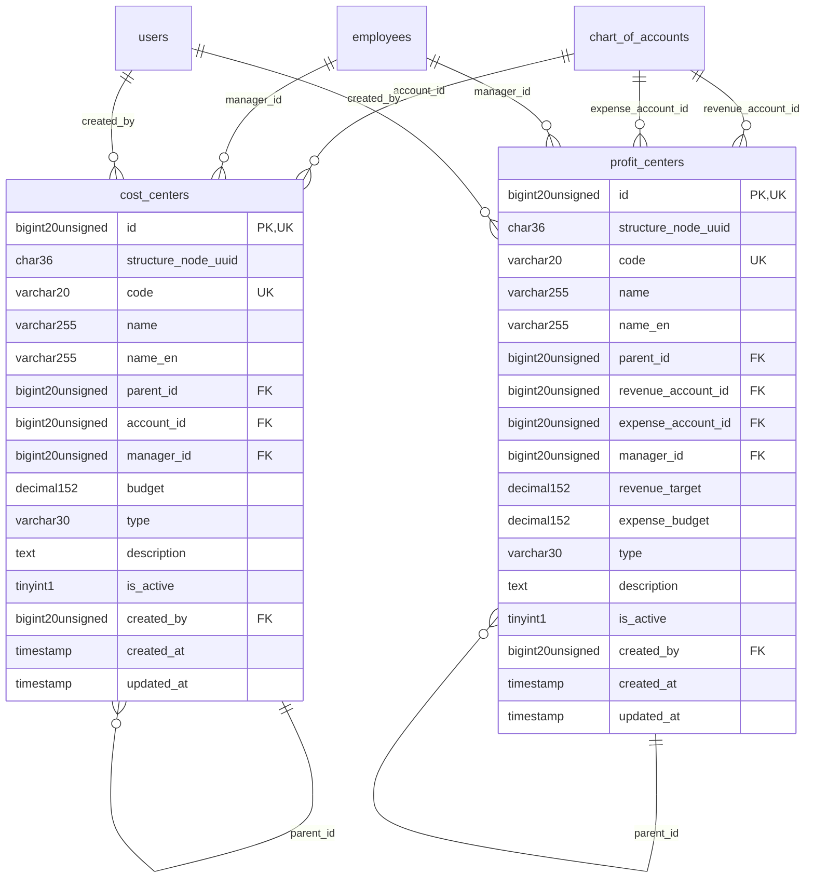

# Finance - ManagementAccounting

> **Bounded Context Schema & ERD**
> 2 Tables | Generated dynamically by ACCSYSTEM engine

---

## Tables List

- `cost_centers`
- `profit_centers`

---

## Entity Relationship Diagram

---

## Data Dictionary

### Table: `cost_centers`

| Column | Type | Nullable | Default | Indexes | Foreign Keys |
|---|---|---|---|---|---|
| `id` | `bigint(20) unsigned` | No |  | **PK** |  |
| `structure_node_uuid` | `char(36)` | Yes | `NULL` | IDX |  |
| `code` | `varchar(20)` | No |  | IDX, *UK* |  |
| `name` | `varchar(255)` | No |  |  |  |
| `name_en` | `varchar(255)` | Yes | `NULL` |  |  |
| `parent_id` | `bigint(20) unsigned` | Yes | `NULL` | IDX | -> `cost_centers.id` |
| `account_id` | `bigint(20) unsigned` | Yes | `NULL` | IDX | -> `chart_of_accounts.id` |
| `manager_id` | `bigint(20) unsigned` | Yes | `NULL` | IDX | -> `employees.id` |
| `budget` | `decimal(15,2)` | Yes | `NULL` |  |  |
| `type` | `varchar(30)` | No | `'operational'` |  |  |
| `description` | `text` | Yes | `NULL` |  |  |
| `is_active` | `tinyint(1)` | No | `1` | IDX |  |
| `created_by` | `bigint(20) unsigned` | Yes | `NULL` | IDX | -> `users.id` |
| `created_at` | `timestamp` | Yes | `NULL` |  |  |
| `updated_at` | `timestamp` | Yes | `NULL` |  |  |

### Table: `profit_centers`

| Column | Type | Nullable | Default | Indexes | Foreign Keys |
|---|---|---|---|---|---|
| `id` | `bigint(20) unsigned` | No |  | **PK** |  |
| `structure_node_uuid` | `char(36)` | Yes | `NULL` | IDX |  |
| `code` | `varchar(20)` | No |  | IDX, *UK* |  |
| `name` | `varchar(255)` | No |  |  |  |
| `name_en` | `varchar(255)` | Yes | `NULL` |  |  |
| `parent_id` | `bigint(20) unsigned` | Yes | `NULL` | IDX | -> `profit_centers.id` |
| `revenue_account_id` | `bigint(20) unsigned` | Yes | `NULL` | IDX | -> `chart_of_accounts.id` |
| `expense_account_id` | `bigint(20) unsigned` | Yes | `NULL` | IDX | -> `chart_of_accounts.id` |
| `manager_id` | `bigint(20) unsigned` | Yes | `NULL` | IDX | -> `employees.id` |
| `revenue_target` | `decimal(15,2)` | Yes | `NULL` |  |  |
| `expense_budget` | `decimal(15,2)` | Yes | `NULL` |  |  |
| `type` | `varchar(30)` | No | `'business_unit'` |  |  |
| `description` | `text` | Yes | `NULL` |  |  |
| `is_active` | `tinyint(1)` | No | `1` | IDX |  |
| `created_by` | `bigint(20) unsigned` | Yes | `NULL` | IDX | -> `users.id` |
| `created_at` | `timestamp` | Yes | `NULL` |  |  |
| `updated_at` | `timestamp` | Yes | `NULL` |  |  |

