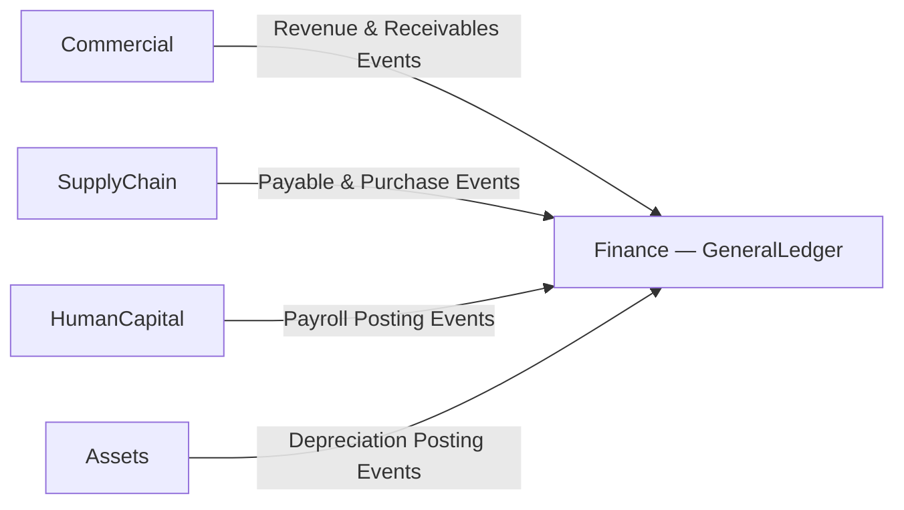

# Finance — Domain Overview

## Business Purpose

The Finance domain is the authoritative system of record for all monetary activity within the accore ERP. It governs general ledger accounting, fiscal period management, tax compliance, treasury operations, foreign exchange, and internal cost allocation. Every financial transaction originating in any bounded context must ultimately produce a General Ledger entry within this domain.

Primary stakeholders include Chief Financial Officers, Controllers, Tax Officers, Treasury Managers, and external auditors. The domain ensures that the organization maintains accurate, compliant, and immutable financial records across all fiscal periods and reporting jurisdictions.

## Bounded Context Boundaries

**Within scope:** Chart of Accounts and GL entry recording; fiscal period lifecycle; journal voucher authoring, posting, and reversal; multi-currency configuration and revaluation; cost center and profit center allocation; tax type configuration and regulatory submission; bank reconciliation and cash monitoring.

**Outside scope:** Trade receivables (Commercial); supplier payables (SupplyChain); asset depreciation (Assets); payroll computation (HumanCapital). Finance consumes financial events from these domains and posts authoritative ledger entries — it does not own the originating business transactions.

## Subdomains

| Subdomain | Description |
|-----------|-------------|
| GeneralLedger | Chart of Accounts, fiscal periods, double-entry journal entries, trial balance, and recurring transaction processing. |
| ForeignExchange | Currency definitions, exchange rate recording, currency policies, and period-end revaluation of foreign-currency balances. |
| ManagementAccounting | Internal cost centers, profit centers, and associated expense and revenue allocations for management reporting. |
| TaxCompliance | Tax type and rate configuration, tax obligation calculation, and ZATCA e-invoicing submission. |
| Treasury | Journal vouchers, bank reconciliations, and multi-currency cash position monitoring. |
| AuditCompliance | <!-- [ASSUMPTION] --> Financial audit trails and compliance reporting. No source directory found; inferred from the Finance Domain Roadmap. |

## Key Domain Entities

| Entity | Subdomain | Business Role |
|--------|-----------|---------------|
| ChartOfAccount | GeneralLedger | Account hierarchy used to classify all financial transactions. |
| FiscalPeriod | GeneralLedger | Accounting period that may be open, closed, or locked against new postings. |
| GeneralLedger | GeneralLedger | Immutable record of posted double-entry transactions. |
| UniversalJournal | GeneralLedger | Consolidated posting entry point for cross-subdomain financial events. |
| CurrencyPolicy | ForeignExchange | Governs the exchange rate method applied to a currency or transaction type. |
| CurrencyRevaluation | ForeignExchange | Period-end restatement of foreign-currency balances to functional currency. |
| CostCenter | ManagementAccounting | Organizational unit to which costs are allocated for internal reporting. |
| TaxType | TaxCompliance | Classification of tax obligation with associated rates and calculation rules. |
| ZatcaEinvoice | TaxCompliance | E-invoice record submitted to the ZATCA regulatory authority. |
| Reconciliation | Treasury | Record matching bank statement entries against internal ledger balances. |

## Integration Points

<!-- [ASSUMPTION] --> Event direction is inferred from roadmap dependency declarations; domain event contracts were not inspected.

## Governance Rules

1. General Ledger entries are immutable once posted; corrections must be executed via authorized offset journal entries.
2. A locked fiscal period prohibits new postings and requires an explicit, privileged unlock action.
3. All foreign-currency transactions must reference an active Currency record with a rate recorded for the transaction date.
4. ZATCA e-invoices are non-retractable once submitted within the system.
5. Recurring transactions execute against the open fiscal period at processing time; retroactive modifications to posted entries are prohibited.

## Documentation Scope

| Document | Task ID | Status |
|----------|---------|--------|
| Finance Domain Overview | FIN-001 | Draft |
| Double-Entry Core Model | FIN-002 | Planned |
| Chart of Accounts Governance | FIN-003 | Planned |
| Financial Auditing | FIN-004 | Planned |
| Currency Revaluation & Rates | FIN-005 | Planned |
| Cost Centers & Budgets | FIN-006 | Planned |
| Tax Jurisdictions & Calculations | FIN-007 | Planned |
| Cash Management & Reconciliation | FIN-008 | Planned |

---

## Assumptions & Open Questions

| # | Location | Assumption | Verification Required |
|---|----------|------------|-----------------------|
| 1 | Subdomains | AuditCompliance is declared in the Finance Roadmap but no directory exists under `backend/app/Domains/Finance/`. | Confirm whether this subdomain is planned, renamed, or absorbed into another subdomain. |
| 2 | Integration Points | Event direction from Commercial, SupplyChain, HumanCapital, and Assets into the GL is inferred from roadmap dependency declarations; event class files were not inspected. | Review domain event contracts at each integration boundary. |
