# Tax Jurisdictions & Calculations

## Business Context & Objective

The Tax Compliance module enforces jurisdiction-specific tax rules, manages time-bound tax rates, calculates tax liabilities on taxable transactions, and supports regulatory e-invoicing requirements (ZATCA, FTA, etc.). Finance officers, tax accountants, and regulatory officers rely on this module to ensure accurate tax calculation, maintain audit trails of all tax computations, and automate compliance submissions to tax authorities.

## Domain Entities

| Entity | Business Definition | Role |
|--------|-------------------|------|
| **TaxAuthority** | Jurisdiction-level tax regulator (e.g., ZATCA, FTA, Ministry of Finance) with region, authority code, and adapter configuration for rule implementation. | Central governance entity; one authority is marked primary for a country. Stores auth credentials and submission endpoints. |
| **TaxType** | Tax obligation within an authority (e.g., VAT, Excise, Zero Rate) with calculation method and geographic applicability. | Enables multi-tax scenarios; each type has its own rate schedule and GL posting account. |
| **TaxRate** | Time-bound tax rate (percentage or fixed amount) valid from effective_from to effective_to. Supports multiple rates per type (e.g., rate changes by date). | Ensures historical accuracy; allows retroactive tax recalculation and regulatory rate changes. |
| **TaxLine** | Immutable audit record of a single tax calculation: taxable amount, rate applied, tax amount computed. Polymorphic (links to invoices, purchases, or any taxable entity). | Permanent tax audit trail; prevents unauthorized modification of tax history. |
| **ZatcaEinvoice** | ZATCA e-invoice wrapper containing signed XML, QR code, ZATCA UUID, and submission status (signed, submitted, rejected). | Integration bridge to ZATCA; tracks compliance submission lifecycle. |

## State Machine / Lifecycle

A tax rate progresses through its validity window; tax lines are immutable once created:

```mermaid
stateDiagram-v2
    [*] --> Not_Effective: Rate defined; effective_from is future
    Not_Effective --> Effective: effective_from date reached
    Effective --> Superseded: effective_to date reached OR new rate becomes primary
    Superseded --> Archive: Historical record locked
    Archive --> [*]
    
    note right of Not_Effective
        Configured but not yet applicable.
        Calculations use default rate (is_default=true) if available.
    end note
    
    note right of Effective
        Active tax rate for calculations.
        Jurisdiction regulatory period.
    end note
    
    note right of Superseded
        Rate no longer current.
        Used for historical revaluation/restatement.
    end note
    
    note right of Archive
        Locked for regulatory hold.
        Immutable for audit.
    end note
```

## Business Rules & Constraints

1. **Primary Authority Per Country:** For each country code, exactly one TaxAuthority is marked `is_primary = true`. This is the default authority for tax calculations unless explicitly overridden. <!-- [ASSUMPTION] -->

2. **Effective Rate Lookup:** When calculating tax, the system retrieves the most recent effective_from date on or before the transaction date, and validates that effective_to (if set) has not been reached.

3. **Tax Type Applicability:** TaxType has `applicable_areas` (array) that may filter applicability by region, sector, or other dimension. If the array is empty, the tax applies universally. <!-- [ASSUMPTION] -->

4. **Calculation Method:** Each TaxType specifies `calculation_type` (percentage or fixed_amount). Percentage rates apply a basis point calculation; fixed_amount imposes a flat levy regardless of taxable amount.

5. **Default Rate Fallback:** Each TaxType may have a rate marked `is_default = true`. If no effective rate exists for a date, the default rate is applied. <!-- [ASSUMPTION] -->

6. **TaxLine Immutability:** TaxLine records cannot be edited after creation. Corrections require reversal (new line with negative amount) and recalculation.

7. **Polymorphic Taxability:** TaxLine uses a polymorphic relationship (taxable_type/taxable_id) to link to any entity (invoices, purchases, GL entries, etc.). This allows unified tax audit trails across domains.

8. **GL Account Mapping:** Each TaxType links to a GL account code (gl_account_code). Tax liabilities post to this account for financial reporting.

9. **ZATCA Submission Gateway:** ZatcaEinvoice status transitions (signed → submitted → approved/rejected) represent ZATCA compliance checkpoints. Only signed invoices may be submitted.

10. **Rate Change Retroactivity:** If a tax rate is updated with a backdated effective_from date, prior tax lines remain immutable; only new transactions use the adjusted rate.

## Integration Events

| Event | Direction | Connected Domain | Trigger |
|-------|-----------|-----------------|---------|
| `TaxCalculated` | Outbound | Commercial, SupplyChain | Tax amount computed on transaction; TaxLine created |
| `TaxAuthorityUpdated` | Outbound | (Internal Finance) | Authority credentials/config changed; future submissions affected |
| `TaxRateChanged` | Outbound | (Internal Finance) | New effective tax rate configured; future calculations affected |
| `ZatcaEinvoiceSubmitted` | Outbound | Reporting/Compliance | Invoice XML signed and submitted to ZATCA |
| `ZatcaApprovalReceived` | Inbound | Reporting/Compliance | ZATCA responds with approval or rejection |

## Key Operations

**Get Primary Authority**  
Retrieves the primary (active) tax authority for a specified country code.

**Calculate Tax**  
Given a taxable amount, country, transaction date, and applicable area, evaluates all active tax types, retrieves effective rates, and computes tax amount. Returns TaxCalculationResult (total tax, breakdown by type).

**Get Effective Rate**  
Returns the applicable tax rate for a tax type as of a specific date, consulting the effective_from/effective_to range and falling back to is_default if needed.

**Record Tax Line**  
Creates an immutable TaxLine audit record capturing the exact rate, taxable amount, and tax amount computed for a transaction.

**Submit Einvoice to ZATCA**  
Generates UBL XML from invoice data, signs with PKI certificate, computes QR code, posts to ZATCA endpoint, and records ZatcaEinvoice with UUID and status.

**Query Tax Liability**  
Summarizes tax lines by type/authority for a period, enabling tax return preparation and compliance reporting.

## Known Constraints

- Tax rates cannot be deleted; they must be expired via effective_to date. Historical rates are preserved for audit.
- A transaction's tax is calculated at posting time using the effective rate on that date; retroactive rate changes do not affect posted amounts.
- Multiple tax authorities can be configured, but tax calculation uses the primary authority unless explicitly overridden; ambiguity must be resolved at the application level.
- ZATCA submission requires a valid PKI certificate and network connectivity; submission retries are not automated (manual resubmission is the recovery path).
- Tax areas (geographic applicability) are free-form strings; no validation is enforced for typos or inconsistencies.
- TaxLine metadata (array) may store calculation details (e.g., discount amount before tax), but this is implementation-specific and not enforced by the model.

## Assumptions & Open Questions

- **[ASSUMPTION]** TaxAuthority adapter_class enables pluggable authority-specific logic (e.g., ZATCA vs. FTA vs. custom). Implementation and invocation of adapters is not documented in this module.
- **[ASSUMPTION]** Tax authority status transitions (signed → submitted → approved) are tracked in ZatcaEinvoice but not enforced at the GL posting layer; rejected invoices may remain recorded in GL.
- **[ASSUMPTION]** TaxCalculationResult is ephemeral (in-memory object) and not persisted; only TaxLine records are persisted for audit.
- **Question:** Should tax recalculation be supported if a rate is backdated? Current immutability prevents correction of posted amounts.
- **Question:** Are there tax exemption/deferred payment scenarios that should be documented as TaxType subtypes?
