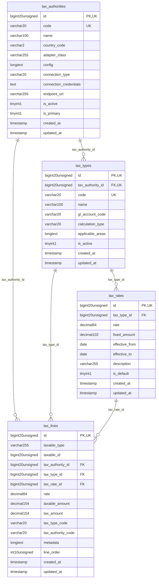

# Finance - TaxCompliance

> **Bounded Context Schema & ERD**
> 4 Tables | Generated dynamically by accoregine

---

## Tables List

- `tax_authorities`
- `tax_lines`
- `tax_rates`
- `tax_types`

---

## Entity Relationship Diagram

---

## Data Dictionary

### Table: `tax_authorities`

| Column | Type | Nullable | Default | Indexes | Foreign Keys |
|---|---|---|---|---|---|
| `id` | `bigint(20) unsigned` | No |  | **PK** |  |
| `code` | `varchar(20)` | No |  | *UK* |  |
| `name` | `varchar(100)` | No |  |  |  |
| `country_code` | `varchar(2)` | No | `'SA'` |  |  |
| `adapter_class` | `varchar(255)` | Yes | `NULL` |  |  |
| `config` | `longtext` | Yes | `NULL` |  |  |
| `connection_type` | `varchar(20)` | No | `'push_api'` |  |  |
| `connection_credentials` | `text` | Yes | `NULL` |  |  |
| `endpoint_url` | `varchar(255)` | Yes | `NULL` |  |  |
| `is_active` | `tinyint(1)` | No | `1` |  |  |
| `is_primary` | `tinyint(1)` | No | `0` |  |  |
| `created_at` | `timestamp` | Yes | `NULL` |  |  |
| `updated_at` | `timestamp` | Yes | `NULL` |  |  |

### Table: `tax_lines`

| Column | Type | Nullable | Default | Indexes | Foreign Keys |
|---|---|---|---|---|---|
| `id` | `bigint(20) unsigned` | No |  | **PK** |  |
| `taxable_type` | `varchar(255)` | No |  | IDX |  |
| `taxable_id` | `bigint(20) unsigned` | No |  | IDX |  |
| `tax_authority_id` | `bigint(20) unsigned` | No |  | IDX | -> `tax_authorities.id` |
| `tax_type_id` | `bigint(20) unsigned` | No |  | IDX | -> `tax_types.id` |
| `tax_rate_id` | `bigint(20) unsigned` | Yes | `NULL` | IDX | -> `tax_rates.id` |
| `rate` | `decimal(8,4)` | No | `0.0000` |  |  |
| `taxable_amount` | `decimal(15,4)` | No | `0.0000` |  |  |
| `tax_amount` | `decimal(15,4)` | No |  |  |  |
| `tax_type_code` | `varchar(20)` | No |  |  |  |
| `tax_authority_code` | `varchar(20)` | No |  |  |  |
| `metadata` | `longtext` | Yes | `NULL` |  |  |
| `line_order` | `int(10) unsigned` | No | `0` |  |  |
| `created_at` | `timestamp` | Yes | `NULL` |  |  |
| `updated_at` | `timestamp` | Yes | `NULL` |  |  |

### Table: `tax_rates`

| Column | Type | Nullable | Default | Indexes | Foreign Keys |
|---|---|---|---|---|---|
| `id` | `bigint(20) unsigned` | No |  | **PK** |  |
| `tax_type_id` | `bigint(20) unsigned` | No |  | IDX | -> `tax_types.id` |
| `rate` | `decimal(8,4)` | No | `0.0000` |  |  |
| `fixed_amount` | `decimal(10,2)` | No | `0.00` |  |  |
| `effective_from` | `date` | No |  | IDX |  |
| `effective_to` | `date` | Yes | `NULL` | IDX |  |
| `description` | `varchar(255)` | Yes | `NULL` |  |  |
| `is_default` | `tinyint(1)` | No | `0` |  |  |
| `created_at` | `timestamp` | Yes | `NULL` |  |  |
| `updated_at` | `timestamp` | Yes | `NULL` |  |  |

### Table: `tax_types`

| Column | Type | Nullable | Default | Indexes | Foreign Keys |
|---|---|---|---|---|---|
| `id` | `bigint(20) unsigned` | No |  | **PK** |  |
| `tax_authority_id` | `bigint(20) unsigned` | No |  | *UK* | -> `tax_authorities.id` |
| `code` | `varchar(20)` | No |  | *UK* |  |
| `name` | `varchar(100)` | No |  |  |  |
| `gl_account_code` | `varchar(20)` | Yes | `NULL` |  |  |
| `calculation_type` | `varchar(20)` | No | `'percentage'` |  |  |
| `applicable_areas` | `longtext` | Yes | `NULL` |  |  |
| `is_active` | `tinyint(1)` | No | `1` |  |  |
| `created_at` | `timestamp` | Yes | `NULL` |  |  |
| `updated_at` | `timestamp` | Yes | `NULL` |  |  |

