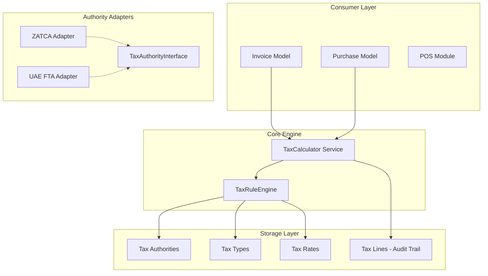

# Tax Engine: Architecture & Overview

## 1. Introduction
The Tax Engine is a core infrastructure module in the accoreesigned to handle multi-jurisdiction tax requirements, regulatory compliance (like ZATCA), and complex tax scenarios (mixed rates, excise taxes) through a flexible, service-oriented architecture.

Earlier versions of the system used static VAT fields (`vat_rate`, `vat_amount`) directly on transaction records. This "Legacy Mode" is now being phased out in favor of a dynamic Engine that treats tax as a first-class domain entity.

## 2. Core Architectural Principles

### A. Authority Abstraction
Regulatory bodies (like ZATCA in Saudi Arabia or FTA in the UAE) are implemented as **Adapters** that satisfy a common interface. The system doesn't "know" about ZATCA specifically; it knows how to interact with a `TaxAuthorityInterface`.

### B. Calculation as a Domain Service
Tax logic is decoupled from Eloquent Models. The `TaxCalculator` service is the single source of truth for all calculations, ensuring consistency across Invoices, Purchases, and Journal Entries.

### C. Immutable Tax Lines
Every tax calculation generates `TaxLine` records. These are immutable audit trails that store the exact rate, authority, and amount at the time of the transaction, protecting against future configuration changes.

### D. Configuration Over Code
Adding a new tax rate or even a new tax type (e.g., Excise Tax) can be done via database configuration without requiring a new code deployment.

## 3. High-Level Architecture Diagram

## 4. Key Benefits
- **Multi-Tax Support**: Handle VAT + Excise + Municipal taxes on a single line item.
- **Audit Readiness**: Precise mapping of every penny to a specific tax authority and GL account.
- **Market Expansion**: Rapidly deploy to new countries by simple implementing a compliance adapter.
- **Backward Compatibility**: Seamless fallback to legacy VAT settings for historical data.
