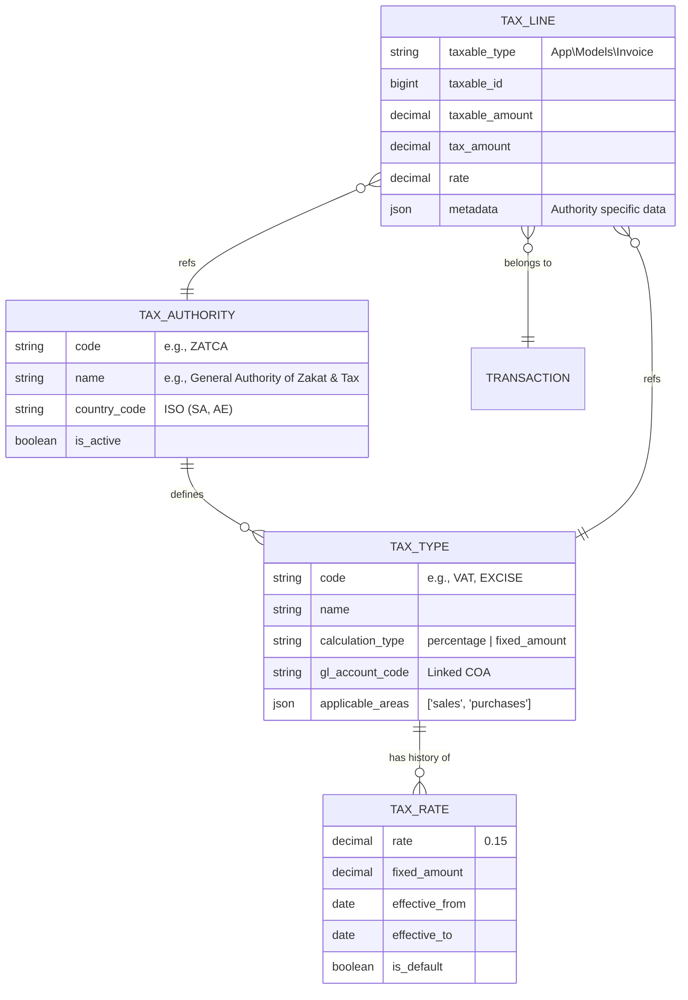

# Tax Engine: Domain Model & Schema

The Tax Engine relies on a normalized schema to manage jurisdictions, types, and historical rates.

## 1. Entity Relationship Overview



## 2. Model Definitions

### `TaxAuthority`
Represents the jurisdiction. Each country typically has one primary authority (e.g., ZATCA for SA).
- **Scope**: Used to group tax types and identify compliance requirements.

### `TaxType`
Defines the nature of the tax. 
- **Calculation Type**: Can be `percentage` (standard VAT) or `fixed_amount` (e.g., environmental fees).
- **GL Integration**: Directly specifies which Chart of Accounts code receives the tax credit/debit.

### `TaxRate`
The historical record of values. Since tax laws change (e.g., SA VAT moving from 5% to 15%), rates are versioned by `effective_from` dates.
- The Engine always picks the rate where `effective_from <= transaction_date <= effective_to`.

### `TaxLine`
The transaction record. Unlike the other models which are "Config", `TaxLine` is "Data".
- It stores a snapshot of the rate and authority at the time of posting.
- It links back to the parent transaction (Polymorphic relationship).

## 3. Database Seeders
To initialize the engine for Saudi Arabia (ZATCA), use:
```bash
php artisan db:seed --class=TaxSeeder
```
This will populate the default 15% VAT for ZATCA and link it to the appropriate GL accounts specified in the system settings.
