# Cash Management & Reconciliation

## Business Context & Objective

The Treasury module manages cash positions, reconciles recorded GL balances with physical bank statements, and enables manual journal voucher posting for treasury operations. Treasury managers and financial controllers rely on this module to maintain accurate cash accounts, identify reconciliation variances, and process treasury transactions (inter-account transfers, loan draws, investment placements) outside routine operational posting.

## Domain Entities

| Entity | Business Definition | Role |
|--------|-------------------|------|
| **Reconciliation** | Comparison record between a GL cash account's ledger balance (from GL) and physical balance (from bank statement) on a specific date. Captures variance for investigation and sign-off. | Primary tool for identifying cash discrepancies; supports month-end and period-end controls. |
| **RecurringTransaction** | Template for regularly repeating cash transactions (e.g., monthly loan payments, weekly payroll funding) with frequency, next due date, and entry template. | Automates routine treasury postings; reduces manual entry and timing errors. |
| **JournalVoucher** | Treasury-specific manual GL posting mechanism for transactions not fitting standard operational modules. Enforces double-entry integrity and requires explicit approval. | Bridge for treasury-only cash movements (inter-account transfers, debt service, liquidity adjustments). |
| **CurrencyPosition** | Multi-currency summary of cash balances across all cash accounts by currency, supporting exposure analysis and hedging decisions. | Enables global liquidity visibility and FX risk management. |

## State Machine / Lifecycle

A reconciliation progresses from draft to reconciled (or unresolved if variance persists):

```mermaid
stateDiagram-v2
    [*] --> Draft: Reconciliation created with ledger and physical balances
    Draft --> Variance_Identified: Difference > 0 (cleared or unresolved)
    Variance_Identified --> Investigating: Root cause analysis in progress
    Investigating --> Adjustment_Pending: Adjustment GL entry required
    Adjustment_Pending --> Reconciled: GL entry posted; difference resolved to 0
    Variance_Identified --> Reconciled: Variance explanation documented and accepted
    Reconciled --> Signed_Off: Authorized user approves reconciliation
    Signed_Off --> Archive: Period closed; historical reference
    Archive --> [*]
    
    note right of Draft
        Ledger balance computed from GL.
        Physical balance input from bank statement.
        Difference calculated automatically.
    end note
    
    note right of Variance_Identified
        Variance present.
        May be timing (in-transit) or error.
    end note
    
    note right of Adjustment_Pending
        GL entry must post before reconciliation completion.
        Entry may be reversal or correction.
    end note
```

## Business Rules & Constraints

1. **Ledger Balance Authority:** Ledger balance is computed from GL at reconciliation time, not imported. This ensures GL remains the single source of truth for cash.

2. **Variance Calculation:** Difference = Physical Balance (bank statement) − Ledger Balance (GL). Positive variance indicates overage; negative indicates shortage.

3. **Multi-Currency Tracking:** Cash accounts may be held in multiple currencies. Reconciliation is performed per account per currency; multi-currency positions are aggregated in CurrencyPosition. <!-- [ASSUMPTION] -->

4. **Journal Voucher Scope:** JournalVoucher is strictly for treasury operations (inter-bank transfers, external financing, central treasury decisions). Operational transactions must use domain-specific posting mechanisms. <!-- [ASSUMPTION] -->

5. **Double-Entry Integrity:** JournalVoucher entries are validated for debit/credit balance before posting, identical to standard GL constraints.

6. **Manual Sourcing:** JournalVoucher entries are marked `entry_source = 'MANUAL'` in GL, enabling audit distinction from automatic postings.

7. **Recurring Transaction Scheduling:** Frequency values (daily, weekly, monthly, quarterly, annual) are processed by a background job. `next_due_date` is advanced automatically after posting. <!-- [ASSUMPTION] -->

8. **Reconciliation Sign-Off:** Treasury manager must explicitly approve reconciliation (mark status = 'reconciled') after variance resolution, creating an audit checkpoint.

9. **Variance Investigation Trail:** Notes and adjustment_notes fields preserve the reconciliation narrative for regulatory audit. Changes are immutable after sign-off.

10. **Bank Account Mapping:** Reconciliation references an account code (typically a cash/bank GL account). Multiple reconciliation records per account indicate monthly or periodic tracking.

## Integration Events

| Event | Direction | Connected Domain | Trigger |
|-------|-----------|-----------------|---------|
| `CashAccountReconciled` | Outbound | (Internal Finance) | Reconciliation signed off; cash position confirmed |
| `ReconciliationVarianceDetected` | Outbound | Reporting/Compliance | Variance exceeds threshold; escalation required |
| `JournalVoucherPosted` | Outbound | GeneralLedger | Treasury GL entry created; GL balance updated |
| `RecurringTransactionDue` | Inbound | (Internal Finance, Automation) | Scheduled job triggers recurring transaction posting |
| `CurrencyPositionUpdated` | Outbound | ForeignExchange | Multi-currency cash holdings change; FX exposure revised |

## Key Operations

**Create Reconciliation**  
Given an account code and bank statement date, retrieves GL balance, compares to physical balance input, computes difference, and creates Reconciliation record in draft status.

**Post Manual Journal Voucher**  
Treasury user submits validated GL entries (debits/credits) with descriptions and cost/profit center allocations. System validates double-entry, generates voucher number (JV prefix), and posts to GL.

**Investigate Variance**  
For an unreconciled variance, treasury support updates notes, identifies root cause (e.g., in-transit check, bank fee), and either creates adjustment GL entry or documents reason for acceptance.

**Sign Off Reconciliation**  
Treasury manager reviews and approves completed reconciliation, locking the record and creating audit proof of control.

**Query Currency Position**  
Returns aggregated cash balance by currency across all cash accounts, supporting FX exposure analysis and hedging decisions.

**Process Recurring Transactions**  
Background job evaluates all active RecurringTransaction records, identifies those with `next_due_date <= today`, posts entries to GL, and advances next_due_date by frequency.

## Known Constraints

- Reconciliation records cannot be deleted; they are archived for historical reference.
- If a GL entry must be reversed after reconciliation sign-off, a new reconciliation must be created and re-signed.
- JournalVoucher does not support partial approval; entire entry set is posted or rejected atomically.
- Recurring transactions cannot be scheduled more than once per frequency period (no sub-daily frequency). <!-- [ASSUMPTION] -->
- Multi-currency cash positions are calculated at reporting time; no pre-computed cache exists (performance may be a concern for organizations with >100 active accounts/currencies).

## Assumptions & Open Questions

- **[ASSUMPTION]** Reconciliation variance investigation is manual; the system does not auto-match outstanding checks or in-transit deposits.
- **[ASSUMPTION]** Background job for recurring transactions runs once daily (at a configured time); intraday-recurring transactions are not supported.
- **[ASSUMPTION]** JournalVoucher authorization/approval workflow is defined at the action level, not in this domain model.
- **[ASSUMPTION]** Bank statement data is manually input; no automated bank feed integration is documented.
- **Question:** Should reconciliation variance thresholds be configurable (e.g., auto-approve variances < 100 SAR)?
- **Question:** Are there escalation procedures for variances that persist across multiple period-end reconciliations?
