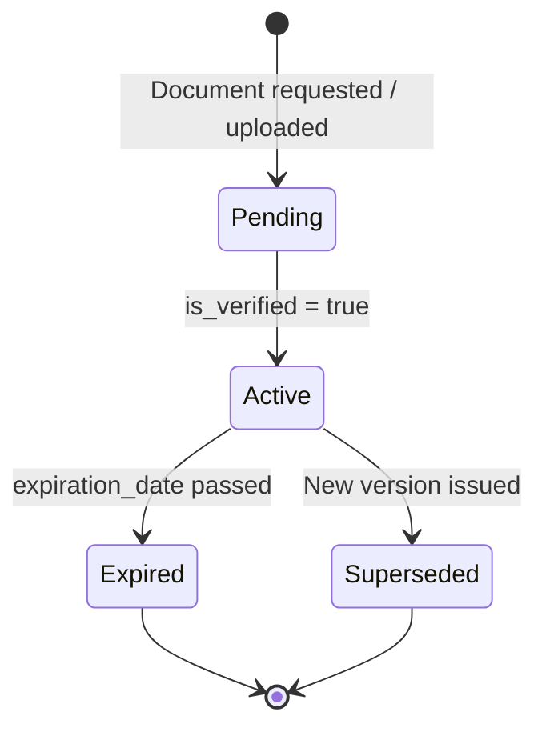

# Advanced Reporting

## Business Context & Objective

The HRAdvanced subdomain manages the structured production and governance of HR-specific documents and reports. Rather than providing ad-hoc data exports, it enforces the use of a centrally administered template registry to generate compliant employee-facing documents such as employment confirmation letters, salary certificates, contract summaries, and expat authorization letters. HR administrators and legal officers are the primary users. The subdomain ensures that all formally issued documents conform to approved layouts, contain only sanctioned data fields, and are versioned for audit traceability.

## Domain Entities

| Entity | Business Definition | Role |
|--------|-------------------|------|
| EmployeeDocument | A formal document issued to or on behalf of an employee, tracking type, issuance date, expiry, verification status, and file storage path. | Official document of record within the employee file. |
| ExpatDocument | A document specifically associated with an expatriate employee's immigration or work authorization record. | Compliance record linked to ExpatManagement. |
| OnboardingDocument | A document generated and required as part of an employee's onboarding workflow. | Checklist item within the OnboardingWorkflow process. |
| DocumentTemplate | An approved, versioned template registered in the system for producing standardized HR documents (owned by EnterpriseCore/OrganizationGovernance but consumed here). | Immutable layout definition enforced by the TemplateRegistry. |

## State Machine / Lifecycle

## Business Rules & Constraints

1. All HR-generated documents must be produced using a template registered in the TemplateRegistry; direct generation outside the approved template set is rejected by the TemplateService.
2. A DocumentTemplate type must appear in the TemplateRegistry's approved types list before it can be used; the TemplateService raises an exception for unapproved types.
3. An EmployeeDocument is not considered verified until is_verified is set to true by an authorized HR officer; unverified documents are flagged as pending in the employee file.
4. ExpatDocuments inherit expiry date tracking from the ExpatManagement record and are linked directly to the expatriate's immigration profile.
5. The TemplateRenderer populates document templates with employee-specific context data assembled by the EmployeeContextBuilder; no manual data insertion is permitted.
6. Document template versioning is enforced through the DocumentTemplateHistory table; changes to an approved template create a new version, preserving the prior state.

## Integration Events

| Event | Direction | Connected Domain | Trigger |
|-------|-----------|-----------------|---------|
| Onboarding Document Required | Inbound | HumanCapital / TalentRecruitment | OnboardingWorkflow task completion requires OnboardingDocument generation |
| Expat Document Expiry Alert | Outbound | HumanCapital / HRCompliance | ExpatDocument expiry date proximity triggers compliance review |
| Template Change Audit | Outbound | EnterpriseCore / MonitoringCompliance | DocumentTemplate update creates a DocumentTemplateHistory record |

## Key Operations

**RenderHrDocumentTemplateAction** selects an approved template by type and key, assembles the employee's contextual data through the EmployeeContextBuilder, and renders the final document output for issuance.

**CreateHrDocumentTemplateAction** registers a new document template in the approved set, specifying the template type, key, and layout definition. The action enforces that the type is recognized by the TemplateRegistry.

**ShowHrDocumentTemplateAction** retrieves a specific template definition for review or preview purposes without executing a render operation.

**GetHrDocumentTemplateApprovedKeysAction** returns the list of all currently approved template keys, enabling callers to validate available templates before initiating a render request.

## Known Constraints

- Document templates cannot be deleted; they may be deactivated (is_active = false), but the record and its history are permanently retained.
- The TemplateRenderer does not support free-form data injection; all available template variables are pre-defined and controlled by the EmployeeContextBuilder.
- OnboardingDocument and ExpatDocument types share the document archival infrastructure but are distinct entity types with separate business rules.

## Assumptions & Open Questions

<!-- [ASSUMPTION] -->
The specific list of approved template types maintained by the TemplateRegistry is not fully enumerable from the source code without runtime inspection of the approved types configuration. Business confirmation of the complete approved template type list is required.
