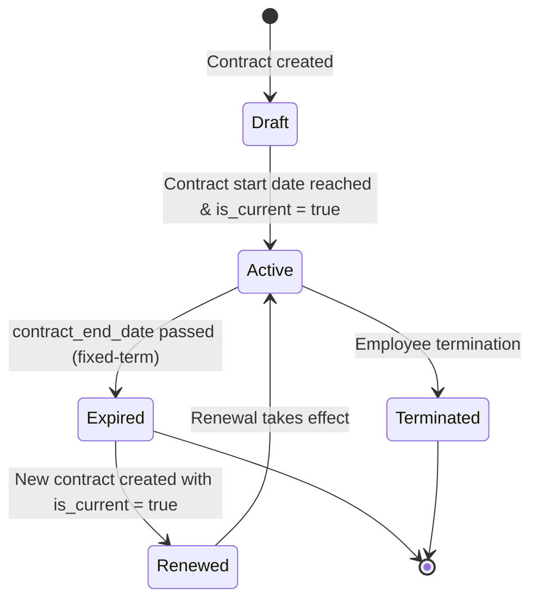

# Labor Laws and Contracts

## Business Context & Objective

Labor law compliance and structured employment contracts are prerequisites for operating a legally sound workforce in any jurisdiction. The HRCompliance subdomain maintains the legal and procedural framework surrounding employment relationships, covering contract governance, disciplinary procedures, expatriate documentation management, and formal compliance audit trails. The primary stakeholders are HR legal officers, compliance managers, and senior HR administrators. The subdomain ensures that contractual obligations are documented, visa and permit expiration dates are tracked, and corrective action processes are recorded against a defensible audit trail.

## Domain Entities

| Entity | Business Definition | Role |
|--------|-------------------|------|
| EmployeeContract | The formal legal agreement between employer and employee, defining terms, salary, probation period, and non-disclosure obligations. | Authoritative source for contractual terms consumed by payroll and compliance. |
| DisciplinaryAction | A formal record of a corrective measure applied to an employee for a defined violation. | Evidence record within an EmployeeRelationsCase; linked to warning issuance. |
| ExpatManagement | A record maintaining all immigration and work authorization documents for a non-national employee. | Compliance record for visa, work permit, and residency expiry monitoring. |
| ComplianceProfile | An employee-level compliance checklist tracking required certifications and policy acknowledgments. | Governance record ensuring all mandatory compliance requirements are met. |
| EmployeeRelationsCase | A formal case file opened to investigate and resolve a reported HR relations issue (disciplinary, grievance, or welfare). | Parent container for DisciplinaryAction records. |

## State Machine / Lifecycle

## Business Rules & Constraints

1. Only one EmployeeContract per employee may carry the is_current flag at any given time; creating a new contract automatically supersedes the previous current contract.
2. An EmployeeContract records NDA and non-compete agreement status as immutable boolean flags; once signed, these cannot be reversed through the system.
3. Expatriate document expiry dates (passport, visa, work permit, residency) are tracked individually; the system must surface approaching expirations to HR administrators.
4. A DisciplinaryAction carries an expiry_date after which the record's active effect lapses, but the record itself is retained for historical audit purposes and is never deleted.
5. CAPA (Corrective and Preventive Action) records under QA compliance must reference an identified root cause and a defined preventive measure before the case is considered closed.
6. An EmployeeRelationsCase must exist before a DisciplinaryAction can be created; the action is always subordinate to the formal case record.

## Integration Events

| Event | Direction | Connected Domain | Trigger |
|-------|-----------|-----------------|---------|
| Contract Salary Reference | Outbound | HumanCapital / PayrollBenefits | SalaryCalculatorService reads base_salary from current EmployeeContract |
| Expatriate Status Flag | Outbound | HumanCapital / WorkforceAdmin | ExpatManagement record links to Employee for payroll allowance calculation |
| Compliance Status | Inbound | EnterpriseCore / MonitoringCompliance | Audit logging captures all compliance record create and update events |

## Key Operations

**CreateContractAction** creates an EmployeeContract record, marks it as is_current, and deactivates any previously current contract for that employee. The operation is transactional.

**CreateExpatRecordAction** registers an ExpatManagement record for a non-national employee, capturing all document expiry dates and financial provisions such as housing allowance and cost-of-living adjustment.

**CreateDisciplinaryActionAction** attaches a formal disciplinary measure to an existing EmployeeRelationsCase, specifying the action type, violation description, action date, and expiry date for the punitive effect.

**CreateCapaAction** records a corrective and preventive action against a compliance incident, requiring both root cause identification and a preventive measure description.

## Known Constraints

- EmployeeContract records are never deleted; superseded contracts remain as historical records with is_current set to false.
- Work permit and residency expiry tracking for expatriates does not trigger automated renewal workflows; notification and action are the responsibility of the HR team.
- Disciplinary records may not be expunged from the system through any available action; they are permanently retained for audit purposes.

## Assumptions & Open Questions

<!-- [ASSUMPTION] -->
The mechanism for automated expiry notifications for expatriate documents is inferred as absent from the current implementation; the system stores expiry dates but notification scheduling is not confirmed in the source code. Business confirmation of the notification process is required.
