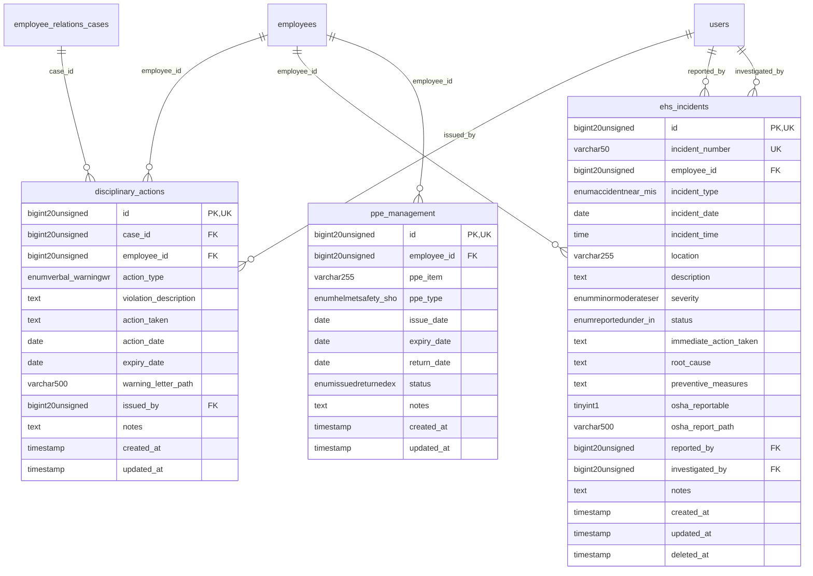

# HumanCapital - HRCompliance

> **Bounded Context Schema & ERD**
> 3 Tables | Generated dynamically by ACCSYSTEM engine

---

## Tables List

- `disciplinary_actions`
- `ehs_incidents`
- `ppe_management`

---

## Entity Relationship Diagram

---

## Data Dictionary

### Table: `disciplinary_actions`

| Column | Type | Nullable | Default | Indexes | Foreign Keys |
|---|---|---|---|---|---|
| `id` | `bigint(20) unsigned` | No |  | **PK** |  |
| `case_id` | `bigint(20) unsigned` | Yes | `NULL` | IDX | -> `employee_relations_cases.id` |
| `employee_id` | `bigint(20) unsigned` | No |  | IDX | -> `employees.id` |
| `action_type` | `enum('verbal_warning','written_warning','final_warning','suspension','termination','other')` | No | `'written_warning'` |  |  |
| `violation_description` | `text` | No |  |  |  |
| `action_taken` | `text` | No |  |  |  |
| `action_date` | `date` | No |  |  |  |
| `expiry_date` | `date` | Yes | `NULL` |  |  |
| `warning_letter_path` | `varchar(500)` | Yes | `NULL` |  |  |
| `issued_by` | `bigint(20) unsigned` | Yes | `NULL` | IDX | -> `users.id` |
| `notes` | `text` | Yes | `NULL` |  |  |
| `created_at` | `timestamp` | Yes | `NULL` |  |  |
| `updated_at` | `timestamp` | Yes | `NULL` |  |  |

### Table: `ehs_incidents`

| Column | Type | Nullable | Default | Indexes | Foreign Keys |
|---|---|---|---|---|---|
| `id` | `bigint(20) unsigned` | No |  | **PK** |  |
| `incident_number` | `varchar(50)` | No |  | *UK* |  |
| `employee_id` | `bigint(20) unsigned` | Yes | `NULL` | IDX | -> `employees.id` |
| `incident_type` | `enum('accident','near_miss','injury','illness','property_damage','environmental','other')` | No | `'accident'` |  |  |
| `incident_date` | `date` | No |  |  |  |
| `incident_time` | `time` | Yes | `NULL` |  |  |
| `location` | `varchar(255)` | Yes | `NULL` |  |  |
| `description` | `text` | No |  |  |  |
| `severity` | `enum('minor','moderate','serious','critical','fatal')` | No | `'minor'` |  |  |
| `status` | `enum('reported','under_investigation','resolved','closed')` | No | `'reported'` |  |  |
| `immediate_action_taken` | `text` | Yes | `NULL` |  |  |
| `root_cause` | `text` | Yes | `NULL` |  |  |
| `preventive_measures` | `text` | Yes | `NULL` |  |  |
| `osha_reportable` | `tinyint(1)` | No | `0` |  |  |
| `osha_report_path` | `varchar(500)` | Yes | `NULL` |  |  |
| `reported_by` | `bigint(20) unsigned` | Yes | `NULL` | IDX | -> `users.id` |
| `investigated_by` | `bigint(20) unsigned` | Yes | `NULL` | IDX | -> `users.id` |
| `notes` | `text` | Yes | `NULL` |  |  |
| `created_at` | `timestamp` | Yes | `NULL` |  |  |
| `updated_at` | `timestamp` | Yes | `NULL` |  |  |
| `deleted_at` | `timestamp` | Yes | `NULL` |  |  |

### Table: `ppe_management`

| Column | Type | Nullable | Default | Indexes | Foreign Keys |
|---|---|---|---|---|---|
| `id` | `bigint(20) unsigned` | No |  | **PK** |  |
| `employee_id` | `bigint(20) unsigned` | No |  | IDX | -> `employees.id` |
| `ppe_item` | `varchar(255)` | No |  |  |  |
| `ppe_type` | `enum('helmet','safety_shoes','gloves','goggles','vest','mask','other')` | No | `'other'` |  |  |
| `issue_date` | `date` | No |  |  |  |
| `expiry_date` | `date` | Yes | `NULL` |  |  |
| `return_date` | `date` | Yes | `NULL` |  |  |
| `status` | `enum('issued','returned','expired','damaged','lost')` | No | `'issued'` |  |  |
| `notes` | `text` | Yes | `NULL` |  |  |
| `created_at` | `timestamp` | Yes | `NULL` |  |  |
| `updated_at` | `timestamp` | Yes | `NULL` |  |  |

