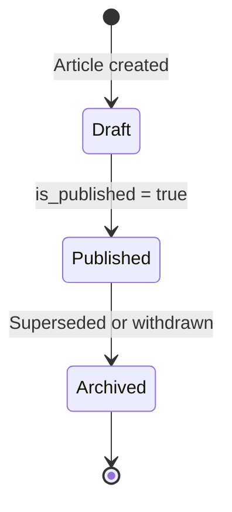

# Internal Documentation

<!-- [ASSUMPTION] -->
> **Note:** The source directory `backend/app/Domains/HumanCapital/KnowledgePortal/` does not exist in the codebase. Knowledge portal functionality is implemented within `backend/app/Domains/HumanCapital/HRCompliance/`, which contains the KnowledgeBase, ExpertiseDirectory, PulseSurvey, and CorporateAnnouncement models. This document is generated from that source with an assumption marker. See Assumptions & Open Questions.

## Business Context & Objective

Organizational knowledge management and internal communications are critical to operational continuity and employee engagement. The KnowledgePortal capability within HumanCapital provides a structured repository for internal documentation, an expertise directory enabling skill discovery across the organization, pulse survey instruments for measuring employee sentiment, and a corporate announcement broadcast channel. HR managers, knowledge officers, and all employees are the primary users. The capability reduces knowledge loss from employee turnover, surfaces internal expertise, and provides a formal channel for organizational communications.

## Domain Entities

| Entity | Business Definition | Role |
|--------|-------------------|------|
| KnowledgeBase | A structured article or document published within the internal knowledge repository, categorized by topic and tagged for discoverability. | Core content unit of the knowledge management system. |
| ExpertiseDirectory | An employee-declared skill profile recording proficiency level, years of experience, certifications, and project associations. | Enables skill-based talent matching and internal resource allocation. |
| PulseSurvey | A time-bounded, targeted questionnaire distributed to a defined employee audience to capture sentiment or operational feedback. | Organizational health measurement instrument. |
| SurveyResponse | An individual employee's completed response to a PulseSurvey. | Data record for survey analysis and reporting. |
| CorporateAnnouncement | An official communication broadcast to all employees or to a defined group within the organization. | Formal internal communication record. |

## State Machine / Lifecycle

## Business Rules & Constraints

1. A KnowledgeBase article must be in published status (is_published = true) to be visible to employees; draft articles are accessible only to the author and HR administrators.
2. The helpful_count on a KnowledgeBase article is incremented through the MarkKnowledgeBaseHelpfulAction and represents employee feedback on article utility; this count is read-only from the employee perspective.
3. PulseSurveys may be configured as anonymous (is_anonymous = true); in this case, SurveyResponse records are stored without an employee identifier.
4. A PulseSurvey is scoped by target_departments and target_roles arrays; employees outside the defined scope do not receive the survey.
5. ExpertiseDirectory entries are employee-declared and are not validated against external certification authorities by the system.

## Integration Events

| Event | Direction | Connected Domain | Trigger |
|-------|-----------|-----------------|---------|
| Expertise Profile Update | Internal | HumanCapital / PerformanceDevelopment | Skill data informs development planning and succession candidate assessment |
| Survey Results | Internal | HumanCapital / HRAdvanced | Survey response data feeds HR reporting and analytics |

## Key Operations

**CreateKnowledgeBaseEntryAction** creates a new knowledge article with title, content, category, and tags. The article is created in unpublished state and requires an explicit publish action.

**CreatePulseSurveyAction** defines a new survey with a structured questions array, a target audience, and an active date window. Responses are collected during the active period.

**CreateExpertiseEntryAction** allows an employee or HR administrator to register a skill profile entry in the expertise directory with proficiency level and availability for project assignment.

## Known Constraints

- KnowledgeBase articles support soft deletion; deleted articles are retained in the database but are inaccessible through standard queries.
- PulseSurvey results are not editable after submission by the respondent.

## Assumptions & Open Questions

<!-- [ASSUMPTION] -->
The KnowledgePortal subdomain directory referenced in the task file does not exist. Functionality has been documented from the HRCompliance subdomain where KnowledgeBase, ExpertiseDirectory, PulseSurvey, and CorporateAnnouncement models reside. Business confirmation of the intended subdomain boundary and directory structure is required. The view_count increment mechanism on KnowledgeBase articles is also inferred; no explicit tracking action was identified.
