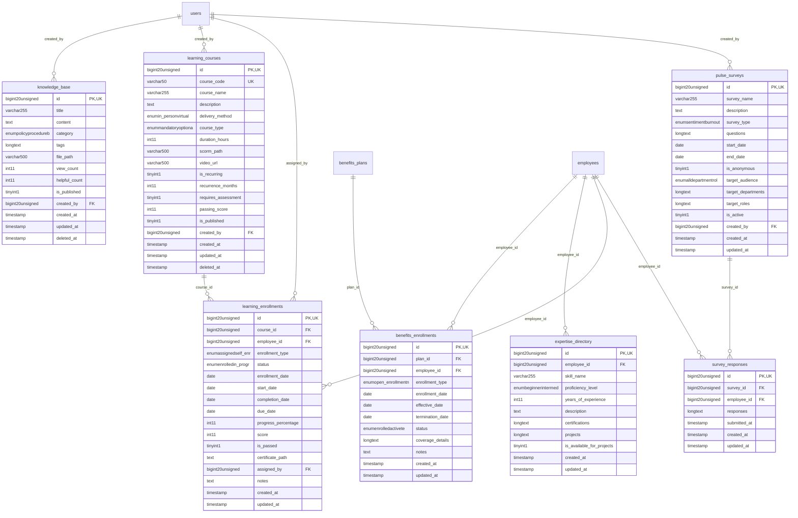

# HumanCapital - KnowledgePortal

> **Bounded Context Schema & ERD**
> 7 Tables | Generated dynamically by ACCSYSTEM engine

---

## Tables List

- `benefits_enrollments`
- `expertise_directory`
- `knowledge_base`
- `learning_courses`
- `learning_enrollments`
- `pulse_surveys`
- `survey_responses`

---

## Entity Relationship Diagram

---

## Data Dictionary

### Table: `benefits_enrollments`

| Column | Type | Nullable | Default | Indexes | Foreign Keys |
|---|---|---|---|---|---|
| `id` | `bigint(20) unsigned` | No |  | **PK** |  |
| `plan_id` | `bigint(20) unsigned` | No |  | IDX | -> `benefits_plans.id` |
| `employee_id` | `bigint(20) unsigned` | No |  | IDX | -> `employees.id` |
| `enrollment_type` | `enum('open_enrollment','new_hire','life_event','qualifying_event')` | No | `'open_enrollment'` |  |  |
| `enrollment_date` | `date` | No |  |  |  |
| `effective_date` | `date` | No |  |  |  |
| `termination_date` | `date` | Yes | `NULL` |  |  |
| `status` | `enum('enrolled','active','terminated','cancelled')` | No | `'enrolled'` |  |  |
| `coverage_details` | `longtext` | Yes | `NULL` |  |  |
| `notes` | `text` | Yes | `NULL` |  |  |
| `created_at` | `timestamp` | Yes | `NULL` |  |  |
| `updated_at` | `timestamp` | Yes | `NULL` |  |  |

### Table: `expertise_directory`

| Column | Type | Nullable | Default | Indexes | Foreign Keys |
|---|---|---|---|---|---|
| `id` | `bigint(20) unsigned` | No |  | **PK** |  |
| `employee_id` | `bigint(20) unsigned` | No |  | IDX | -> `employees.id` |
| `skill_name` | `varchar(255)` | No |  |  |  |
| `proficiency_level` | `enum('beginner','intermediate','advanced','expert')` | No | `'intermediate'` |  |  |
| `years_of_experience` | `int(11)` | No | `0` |  |  |
| `description` | `text` | Yes | `NULL` |  |  |
| `certifications` | `longtext` | Yes | `NULL` |  |  |
| `projects` | `longtext` | Yes | `NULL` |  |  |
| `is_available_for_projects` | `tinyint(1)` | No | `1` |  |  |
| `created_at` | `timestamp` | Yes | `NULL` |  |  |
| `updated_at` | `timestamp` | Yes | `NULL` |  |  |

### Table: `knowledge_base`

| Column | Type | Nullable | Default | Indexes | Foreign Keys |
|---|---|---|---|---|---|
| `id` | `bigint(20) unsigned` | No |  | **PK** |  |
| `title` | `varchar(255)` | No |  |  |  |
| `content` | `text` | No |  |  |  |
| `category` | `enum('policy','procedure','best_practice','faq','training','other')` | No | `'other'` |  |  |
| `tags` | `longtext` | Yes | `NULL` |  |  |
| `file_path` | `varchar(500)` | Yes | `NULL` |  |  |
| `view_count` | `int(11)` | No | `0` |  |  |
| `helpful_count` | `int(11)` | No | `0` |  |  |
| `is_published` | `tinyint(1)` | No | `0` |  |  |
| `created_by` | `bigint(20) unsigned` | Yes | `NULL` | IDX | -> `users.id` |
| `created_at` | `timestamp` | Yes | `NULL` |  |  |
| `updated_at` | `timestamp` | Yes | `NULL` |  |  |
| `deleted_at` | `timestamp` | Yes | `NULL` |  |  |

### Table: `learning_courses`

| Column | Type | Nullable | Default | Indexes | Foreign Keys |
|---|---|---|---|---|---|
| `id` | `bigint(20) unsigned` | No |  | **PK** |  |
| `course_code` | `varchar(50)` | No |  | *UK* |  |
| `course_name` | `varchar(255)` | No |  |  |  |
| `description` | `text` | Yes | `NULL` |  |  |
| `delivery_method` | `enum('in_person','virtual','elearning','blended')` | No | `'elearning'` |  |  |
| `course_type` | `enum('mandatory','optional','compliance','development')` | No | `'optional'` |  |  |
| `duration_hours` | `int(11)` | No | `0` |  |  |
| `scorm_path` | `varchar(500)` | Yes | `NULL` |  |  |
| `video_url` | `varchar(500)` | Yes | `NULL` |  |  |
| `is_recurring` | `tinyint(1)` | No | `0` |  |  |
| `recurrence_months` | `int(11)` | Yes | `NULL` |  |  |
| `requires_assessment` | `tinyint(1)` | No | `0` |  |  |
| `passing_score` | `int(11)` | Yes | `NULL` |  |  |
| `is_published` | `tinyint(1)` | No | `0` |  |  |
| `created_by` | `bigint(20) unsigned` | Yes | `NULL` | IDX | -> `users.id` |
| `created_at` | `timestamp` | Yes | `NULL` |  |  |
| `updated_at` | `timestamp` | Yes | `NULL` |  |  |
| `deleted_at` | `timestamp` | Yes | `NULL` |  |  |

### Table: `learning_enrollments`

| Column | Type | Nullable | Default | Indexes | Foreign Keys |
|---|---|---|---|---|---|
| `id` | `bigint(20) unsigned` | No |  | **PK** |  |
| `course_id` | `bigint(20) unsigned` | No |  | IDX | -> `learning_courses.id` |
| `employee_id` | `bigint(20) unsigned` | No |  | IDX | -> `employees.id` |
| `enrollment_type` | `enum('assigned','self_enrolled','mandatory')` | No | `'self_enrolled'` |  |  |
| `status` | `enum('enrolled','in_progress','completed','failed','dropped')` | No | `'enrolled'` |  |  |
| `enrollment_date` | `date` | No |  |  |  |
| `start_date` | `date` | Yes | `NULL` |  |  |
| `completion_date` | `date` | Yes | `NULL` |  |  |
| `due_date` | `date` | Yes | `NULL` |  |  |
| `progress_percentage` | `int(11)` | No | `0` |  |  |
| `score` | `int(11)` | Yes | `NULL` |  |  |
| `is_passed` | `tinyint(1)` | No | `0` |  |  |
| `certificate_path` | `text` | Yes | `NULL` |  |  |
| `assigned_by` | `bigint(20) unsigned` | Yes | `NULL` | IDX | -> `users.id` |
| `notes` | `text` | Yes | `NULL` |  |  |
| `created_at` | `timestamp` | Yes | `NULL` |  |  |
| `updated_at` | `timestamp` | Yes | `NULL` |  |  |

### Table: `pulse_surveys`

| Column | Type | Nullable | Default | Indexes | Foreign Keys |
|---|---|---|---|---|---|
| `id` | `bigint(20) unsigned` | No |  | **PK** |  |
| `survey_name` | `varchar(255)` | No |  |  |  |
| `description` | `text` | Yes | `NULL` |  |  |
| `survey_type` | `enum('sentiment','burnout','engagement','custom')` | No | `'engagement'` |  |  |
| `questions` | `longtext` | No |  |  |  |
| `start_date` | `date` | No |  |  |  |
| `end_date` | `date` | No |  |  |  |
| `is_anonymous` | `tinyint(1)` | No | `1` |  |  |
| `target_audience` | `enum('all','department','role','location')` | No | `'all'` |  |  |
| `target_departments` | `longtext` | Yes | `NULL` |  |  |
| `target_roles` | `longtext` | Yes | `NULL` |  |  |
| `is_active` | `tinyint(1)` | No | `1` |  |  |
| `created_by` | `bigint(20) unsigned` | Yes | `NULL` | IDX | -> `users.id` |
| `created_at` | `timestamp` | Yes | `NULL` |  |  |
| `updated_at` | `timestamp` | Yes | `NULL` |  |  |

### Table: `survey_responses`

| Column | Type | Nullable | Default | Indexes | Foreign Keys |
|---|---|---|---|---|---|
| `id` | `bigint(20) unsigned` | No |  | **PK** |  |
| `survey_id` | `bigint(20) unsigned` | No |  | IDX | -> `pulse_surveys.id` |
| `employee_id` | `bigint(20) unsigned` | Yes | `NULL` | IDX | -> `employees.id` |
| `responses` | `longtext` | No |  |  |  |
| `submitted_at` | `timestamp` | No | `current_timestamp()` |  |  |
| `created_at` | `timestamp` | Yes | `NULL` |  |  |
| `updated_at` | `timestamp` | Yes | `NULL` |  |  |

