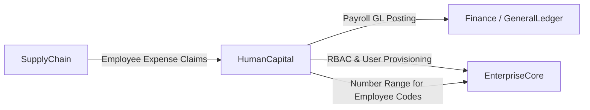

# HumanCapital — Domain Overview

## Business Purpose

The HumanCapital domain governs the full scope of human resource management within accore. It exists to provide enterprises with a unified, compliant, and data-driven platform for managing the complete employee relationship — from initial hiring through to end-of-service settlement. The domain automates workforce administration, payroll disbursement, attendance tracking, talent acquisition, and employee development, eliminating manual HR processes and reducing the risk of regulatory non-compliance.

Primary stakeholders include HR managers, payroll officers, department heads, compliance teams, and employees themselves through a self-service interface. The domain is architecturally positioned as a cost center of record, interfacing with the Finance domain for payroll journal entries and the EnterpriseCore domain for role-based access governance.

## Bounded Context Boundaries

The HumanCapital domain owns all data and processes pertaining to employees, employment relationships, compensation structures, and workforce compliance. This includes Employee Records, Employment Contracts, Payroll Cycles, Leave Requests, Attendance Records, Recruitment Requisitions, Performance Appraisals, and End-of-Service Benefits (EOSB) calculations.

Excluded from this domain are General Ledger accounts and posting rules, which belong to the Finance domain. User authentication credentials are owned by EnterpriseCore. Organizational chart definitions and position hierarchies are co-owned with EnterpriseCore's OrganizationGovernance subdomain; however, HumanCapital holds the employment assignment records that populate those positions.

## Subdomains

| Subdomain | Description |
|-----------|-------------|
| WorkforceAdmin | Manages the full employee master record, employment contracts, organizational assignments, disciplinary actions, contingent workers, and expatriate documentation. |
| PayrollBenefits | Executes the payroll lifecycle including salary calculation, allowances, deductions, EOSB computation, benefits enrollment, and General Ledger posting. |
| TimeProductivity | Tracks employee attendance via manual entry or biometric device integration, manages leave requests and accrual balances, and enforces shift and scheduling rules. |
| HRCompliance | Maintains labor law adherence through contract governance, disciplinary procedures, CAPA (Corrective and Preventive Action) records, and QA compliance frameworks. |
| TalentRecruitment | Manages the full recruitment pipeline from Requisition creation through applicant screening, interview scheduling, offer management, and onboarding workflow completion. |
| PerformanceDevelopment | Governs employee goal-setting, KPI tracking, periodic appraisal cycles, continuous feedback, learning course enrollment, and succession planning. |
| KnowledgePortal | Provides a structured internal knowledge base, expertise directory, pulse surveys, and corporate announcement management for organizational communication. |
| ServicesWellness | Covers employee self-service functions including travel requests and expense claims, loan management with automatic payroll deduction, and Environment, Health, and Safety (EHS) incident reporting. |
| HRAdvanced | Manages HR document templates with an enforced template registry, renders employee-specific documents (contracts, letters), and maintains the document archive for employees and expatriates. |

## Key Domain Entities

The **Employee** entity is the central anchor of the domain, holding employment status, compensation data, organizational assignment, and GOSI registration details. It extends the system's authentication model to enable self-service access.

The **PayrollCycle** represents a discrete pay run covering a defined period, tracking gross, deductions, and net totals, and progressing through a multi-level approval trail before payment disbursement.

The **LeaveRequest** governs employee absence requests against accrued balances, with configurable approval routing and payroll integration for unpaid leave deductions.

The **RecruitmentRequisition** initiates and governs open headcount requests, linking approved positions to the applicant pipeline and ultimately to new Employee Record creation.

The **PerformanceAppraisal** captures structured evaluation data across multi-source inputs (self, manager, peer) and produces a rated outcome used in compensation and succession decisions.

## Integration Points

The domain emits payroll posting events consumed by Finance's LedgerService to create salary expense journal entries. EnterpriseCore provides the NumberRangeService for auto-generating employee codes and manages the linked User record upon employee creation.

## Governance Rules

1. An Employee Record and its linked User account are created atomically within a single database transaction; partial creation is not permitted.
2. A Payroll Cycle may not advance to payment without completing the full hierarchical approval trail.
3. End-of-Service Benefit calculations adhere to Saudi Labor Law entitlement tiers and are computed by a dedicated, auditable service.
4. Leave accrual balances are deducted at the point of leave request approval; retroactive adjustments require a compensating entry.
5. Attendance records sourced from biometric devices carry an immutable source flag and may not be manually overridden without an audit note.

## Documentation Scope

| Document | Task ID | Status |
|----------|---------|--------|
| HumanCapital Domain Overview | HC-001 | draft |
| Employee Lifecycle | HC-002 | draft |
| Payroll Execution and Taxation | HC-003 | draft |
| Timesheets and Leave Accrual | HC-004 | draft |
| Labor Laws and Contracts | HC-005 | draft |
| Hiring Workflows | HC-006 | draft |
| KPIs and Reviews | HC-007 | draft |
| Internal Documentation (Knowledge Portal) | HC-008 | draft |
| Employee Self-Service | HC-009 | draft |
| Advanced Reporting | HC-010 | draft |
