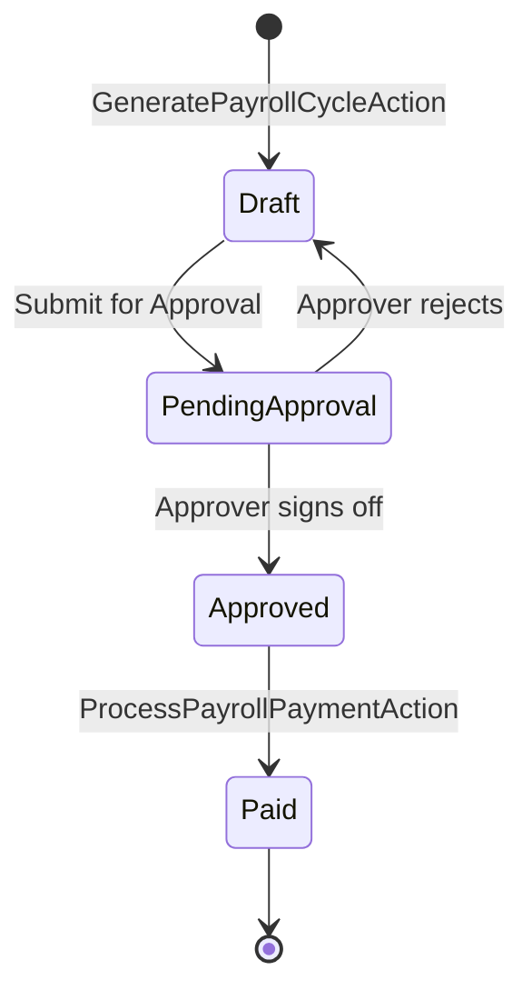

# Payroll Execution and Taxation

## Business Context & Objective

Payroll execution is one of the most financially consequential processes within any enterprise. The PayrollBenefits subdomain automates the calculation, approval, and disbursement of employee compensation, ensuring legal compliance with Saudi Labor Law and accuracy in General Ledger cost allocation. Payroll officers, finance controllers, and department approvers are the primary users. The subdomain eliminates manual salary spreadsheets, enforces multi-level authorization, and produces auditable journal entries that feed directly into the Finance domain's General Ledger.

## Domain Entities

| Entity | Business Definition | Role |
|--------|-------------------|------|
| PayrollCycle | A discrete pay run covering a defined calendar period (monthly, bonus, or incentive). | Root aggregate governing the payroll lifecycle. |
| PayrollItem | An individual salary computation record for one employee within a cycle. | Line-item carrier of gross, deductions, and net figures. |
| PayrollComponent | A named, configurable salary element (allowance or deduction type). | Building block for dynamic salary structure composition. |
| PayrollTransaction | An immutable financial transaction recording the actual disbursement event. | Audit trail for payments made. |
| BenefitsPlan | An employer-sponsored benefit offering (e.g., medical insurance) with enrollment rules. | Governs voluntary and mandatory benefit deductions. |
| CompensationPlan | A structured salary band or variable pay scheme applied to employee groups. | Drives targeted bonus and incentive cycle generation. |
| PostPayrollIntegration | A post-close reconciliation record linking payroll output to third-party systems (e.g., GOSI, bank files). | Ensures external compliance obligations are met after payment. |

## State Machine / Lifecycle

## Business Rules & Constraints

1. A Payroll Cycle must cover a non-overlapping period; two cycles of the same type may not share overlapping period_start and period_end dates for the same employee group.
2. Salary calculation applies a pro-rata reduction for each day of unpaid leave falling within the payroll period, computed by dividing the monthly gross by the number of working days in the period.
3. The multi-level approval trail is resolved by traversing the manager_id hierarchy; a Payroll Cycle advances only when the current_approver_id accepts.
4. Once a Payroll Cycle reaches Paid status, its PayrollItems and PayrollTransactions are immutable; corrections require a subsequent adjusting cycle.
5. End-of-Service Benefits are calculated according to Saudi Labor Law: employees resigning with fewer than two years of service receive no EOSB; those with two to five years receive one-third of the last gross monthly salary per year of service; those with five or more years receive one-half per year.
6. Allowances and deductions are resolved from active PayrollComponent records at the time of cycle generation; retroactive component changes do not affect closed cycles.

## Integration Events

| Event | Direction | Connected Domain | Trigger |
|-------|-----------|-----------------|---------|
| Payroll GL Posting | Outbound | Finance / GeneralLedger | PayrollCycle transitions to Paid |
| Attendance Data Pull | Inbound | HumanCapital / TimeProductivity | GeneratePayrollCycleAction invokes SalaryCalculatorService |
| GOSI Reconciliation | Outbound | PostPayrollIntegration (external) | ProcessPostPayrollIntegrationAction executes |

## Key Operations

**GeneratePayrollCycleAction** creates the PayrollCycle record and iterates over the target employee set, invoking SalaryCalculatorService for each employee to produce a PayrollItem with computed gross, allowances, deductions, and net figures.

**ProcessPayrollPaymentAction** finalizes a fully approved cycle, records PayrollTransaction entries, triggers GL journal posting via the Finance domain's LedgerService, and marks the cycle as Paid.

**PreviewEOSBAction** allows HR to calculate an employee's EOSB entitlement in advance of termination without committing any financial records, supporting voluntary separation discussions.

**ReconcilePostPayrollIntegrationAction** matches the disbursement output against external system confirmations and marks each PostPayrollIntegration record as reconciled.

## Known Constraints

- A Payroll Cycle cannot be paid without a complete approval trail; partial approvals do not advance the cycle to Paid.
- Individual PayrollItems may be toggled inactive (TogglePayrollItemStatusAction) before a cycle is submitted, but not after approval.
- EOSB calculations assume a 30-day month for daily rate computation; this is a fixed system constant derived from Saudi Labor Law convention.

## Assumptions & Open Questions

<!-- [ASSUMPTION] -->
The specific tax withholding mechanism (income tax or social insurance deduction) beyond GOSI is inferred as absent from the current implementation, consistent with Saudi Arabia's zero personal income tax regime. Business confirmation is required if withholding tax rules apply for non-Saudi employees.
