# HumanCapital - PayrollBenefits

> **Bounded Context Schema & ERD**
> 13 Tables | Generated dynamically by accore engine

---

## Tables List

- `benefits_plans`
- `compensation_entries`
- `compensation_plans`
- `employee_allowances`
- `employee_deductions`
- `employee_loans`
- `loan_repayments`
- `payroll_components`
- `payroll_cycles`
- `payroll_entries`
- `payroll_items`
- `payroll_transactions`
- `post_payroll_integrations`

---

## Entity Relationship Diagram

```mermaid
erDiagram
    benefits_plans {
        bigint20unsigned id "PK,UK"
        varchar50 plan_code "UK"
        varchar255 plan_name 
        enumhealthdentalvisi plan_type 
        text description 
        enumallfull_timetenu eligibility_rule 
        longtext eligibility_criteria 
        decimal102 employee_contribution 
        decimal102 employer_contribution 
        date effective_date 
        date expiry_date 
        tinyint1 is_active 
        bigint20unsigned created_by "FK"
        timestamp created_at 
        timestamp updated_at 
    }
    compensation_entries {
        bigint20unsigned id "PK,UK"
        bigint20unsigned compensation_plan_id "FK"
        bigint20unsigned employee_id "FK"
        decimal102 current_salary 
        decimal102 proposed_salary 
        decimal102 increase_amount 
        decimal52 increase_percentage 
        decimal52 comp_ratio 
        enumpendingapprovedr status 
        text justification 
        bigint20unsigned approved_by "FK"
        timestamp created_at 
        timestamp updated_at 
    }
    compensation_plans {
        bigint20unsigned id "PK,UK"
        varchar255 plan_name 
        enummeritpromotionad plan_type 
        varchar10 fiscal_year 
        date effective_date 
        enumdraftpending_app status 
        decimal152 budget_pool 
        decimal152 allocated_amount 
        text notes 
        bigint20unsigned created_by "FK"
        bigint20unsigned approved_by "FK"
        timestamp created_at 
        timestamp updated_at 
    }
    employee_allowances {
        bigint20unsigned id "PK,UK"
        bigint20unsigned employee_id "FK"
        varchar100 allowance_name 
        decimal152 amount 
        enummonthlyquarterly frequency 
        date start_date 
        date end_date 
        tinyint1 is_active 
        timestamp created_at 
        timestamp updated_at 
    }
    employee_deductions {
        bigint20unsigned id "PK,UK"
        bigint20unsigned employee_id "FK"
        varchar100 deduction_name 
        decimal152 amount 
        enummonthlyquarterly frequency 
        date start_date 
        date end_date 
        tinyint1 is_active 
        timestamp created_at 
        timestamp updated_at 
    }
    employee_loans {
        bigint20unsigned id "PK,UK"
        varchar50 loan_number "UK"
        bigint20unsigned employee_id "FK"
        enumsalary_advanceho loan_type 
        decimal102 loan_amount 
        decimal52 interest_rate 
        int11 installment_count 
        decimal102 monthly_installment 
        date start_date 
        date end_date 
        enumpendingapproveda status 
        decimal102 remaining_balance 
        tinyint1 auto_deduction 
        bigint20unsigned deduction_component_id "FK"
        bigint20unsigned approved_by "FK"
        text notes 
        timestamp created_at 
        timestamp updated_at 
        timestamp deleted_at 
    }
    loan_repayments {
        bigint20unsigned id "PK,UK"
        bigint20unsigned loan_id "FK"
        int11 installment_number 
        date due_date 
        date paid_date 
        decimal102 amount 
        decimal102 principal 
        decimal102 interest 
        enumpendingpaidoverd status 
        bigint20unsigned payroll_cycle_id "FK"
        text notes 
        timestamp created_at 
        timestamp updated_at 
    }
    payroll_components {
        bigint20unsigned id "PK,UK"
        varchar50 component_code "UK"
        varchar100 component_name 
        enumallowancededucti component_type 
        enumfixedpercentagef calculation_type 
        decimal152 base_amount 
        decimal52 percentage 
        text formula 
        tinyint1 is_taxable 
        tinyint1 is_active 
        int11 display_order 
        text description 
        timestamp created_at 
        timestamp updated_at 
    }
    payroll_cycles {
        bigint20unsigned id "PK,UK"
        varchar100 cycle_name 
        varchar30 cycle_type 
        text description 
        date period_start 
        date period_end 
        date payment_date 
        enumdraftpending_app status 
        bigint20unsigned current_approver_id "FK"
        longtext approval_trail 
        decimal152 total_gross 
        decimal152 total_deductions 
        decimal152 total_net 
        bigint20unsigned approved_by "FK"
        datetime approved_at 
        bigint20unsigned created_by "FK"
        timestamp created_at 
        timestamp updated_at 
    }
    payroll_entries {
        bigint20unsigned id "PK,UK"
        varchar255 employee_name 
        decimal152 salary_amount 
        date payroll_date 
        text description 
        varchar20 status 
        date payment_date 
        datetime paid_at 
        timestamp created_at 
        timestamp updated_at 
        bigint20unsigned created_by "FK"
    }
    payroll_items {
        bigint20unsigned id "PK,UK"
        bigint20unsigned payroll_cycle_id "FK"
        bigint20unsigned employee_id "FK"
        decimal152 base_salary 
        decimal152 total_allowances 
        decimal152 total_deductions 
        decimal152 gross_salary 
        decimal152 net_salary 
        enumactiveon_hold status 
        text notes 
        timestamp created_at 
        timestamp updated_at 
    }
    payroll_transactions {
        bigint20unsigned id "PK,UK"
        bigint20unsigned payroll_item_id "FK"
        bigint20unsigned employee_id "FK"
        decimal152 amount 
        enumpaymentadvancebo transaction_type 
        date transaction_date 
        text notes 
        bigint20unsigned created_by "FK"
        timestamp created_at 
        timestamp updated_at 
    }
    post_payroll_integrations {
        bigint20unsigned id "PK,UK"
        bigint20unsigned payroll_cycle_id "FK"
        enumbank_filegl_entr integration_type 
        enumpendingprocessin status 
        varchar500 file_path 
        varchar50 file_format 
        decimal152 total_amount 
        int11 transaction_count 
        text error_message 
        timestamp processed_at 
        timestamp reconciled_at 
        bigint20unsigned processed_by "FK"
        text notes 
        timestamp created_at 
        timestamp updated_at 
    }
    users ||--o{ benefits_plans : "created_by"
    compensation_plans ||--o{ compensation_entries : "compensation_plan_id"
    employees ||--o{ compensation_entries : "employee_id"
    users ||--o{ compensation_entries : "approved_by"
    users ||--o{ compensation_plans : "created_by"
    users ||--o{ compensation_plans : "approved_by"
    employees ||--o{ employee_allowances : "employee_id"
    employees ||--o{ employee_deductions : "employee_id"
    employees ||--o{ employee_loans : "employee_id"
    payroll_components ||--o{ employee_loans : "deduction_component_id"
    users ||--o{ employee_loans : "approved_by"
    employee_loans ||--o{ loan_repayments : "loan_id"
    payroll_cycles ||--o{ loan_repayments : "payroll_cycle_id"
    users ||--o{ payroll_cycles : "current_approver_id"
    users ||--o{ payroll_cycles : "approved_by"
    users ||--o{ payroll_cycles : "created_by"
    users ||--o{ payroll_entries : "created_by"
    payroll_cycles ||--o{ payroll_items : "payroll_cycle_id"
    employees ||--o{ payroll_items : "employee_id"
    payroll_items ||--o{ payroll_transactions : "payroll_item_id"
    employees ||--o{ payroll_transactions : "employee_id"
    users ||--o{ payroll_transactions : "created_by"
    payroll_cycles ||--o{ post_payroll_integrations : "payroll_cycle_id"
    users ||--o{ post_payroll_integrations : "processed_by"
```

---

## Data Dictionary

### Table: `benefits_plans`

| Column | Type | Nullable | Default | Indexes | Foreign Keys |
|---|---|---|---|---|---|
| `id` | `bigint(20) unsigned` | No |  | **PK** |  |
| `plan_code` | `varchar(50)` | No |  | *UK* |  |
| `plan_name` | `varchar(255)` | No |  |  |  |
| `plan_type` | `enum('health','dental','vision','life_insurance','disability','retirement','fsa','hsa','other')` | No | `'health'` |  |  |
| `description` | `text` | Yes | `NULL` |  |  |
| `eligibility_rule` | `enum('all','full_time','tenure','role','custom')` | No | `'all'` |  |  |
| `eligibility_criteria` | `longtext` | Yes | `NULL` |  |  |
| `employee_contribution` | `decimal(10,2)` | No | `0.00` |  |  |
| `employer_contribution` | `decimal(10,2)` | No | `0.00` |  |  |
| `effective_date` | `date` | No |  |  |  |
| `expiry_date` | `date` | Yes | `NULL` |  |  |
| `is_active` | `tinyint(1)` | No | `1` |  |  |
| `created_by` | `bigint(20) unsigned` | Yes | `NULL` | IDX | -> `users.id` |
| `created_at` | `timestamp` | Yes | `NULL` |  |  |
| `updated_at` | `timestamp` | Yes | `NULL` |  |  |

### Table: `compensation_entries`

| Column | Type | Nullable | Default | Indexes | Foreign Keys |
|---|---|---|---|---|---|
| `id` | `bigint(20) unsigned` | No |  | **PK** |  |
| `compensation_plan_id` | `bigint(20) unsigned` | No |  | IDX | -> `compensation_plans.id` |
| `employee_id` | `bigint(20) unsigned` | No |  | IDX | -> `employees.id` |
| `current_salary` | `decimal(10,2)` | No |  |  |  |
| `proposed_salary` | `decimal(10,2)` | No |  |  |  |
| `increase_amount` | `decimal(10,2)` | No |  |  |  |
| `increase_percentage` | `decimal(5,2)` | No |  |  |  |
| `comp_ratio` | `decimal(5,2)` | Yes | `NULL` |  |  |
| `status` | `enum('pending','approved','rejected','processed')` | No | `'pending'` |  |  |
| `justification` | `text` | Yes | `NULL` |  |  |
| `approved_by` | `bigint(20) unsigned` | Yes | `NULL` | IDX | -> `users.id` |
| `created_at` | `timestamp` | Yes | `NULL` |  |  |
| `updated_at` | `timestamp` | Yes | `NULL` |  |  |

### Table: `compensation_plans`

| Column | Type | Nullable | Default | Indexes | Foreign Keys |
|---|---|---|---|---|---|
| `id` | `bigint(20) unsigned` | No |  | **PK** |  |
| `plan_name` | `varchar(255)` | No |  |  |  |
| `plan_type` | `enum('merit','promotion','adjustment','bonus','commission')` | No | `'merit'` |  |  |
| `fiscal_year` | `varchar(10)` | No |  |  |  |
| `effective_date` | `date` | No |  |  |  |
| `status` | `enum('draft','pending_approval','approved','active','closed')` | No | `'draft'` |  |  |
| `budget_pool` | `decimal(15,2)` | No | `0.00` |  |  |
| `allocated_amount` | `decimal(15,2)` | No | `0.00` |  |  |
| `notes` | `text` | Yes | `NULL` |  |  |
| `created_by` | `bigint(20) unsigned` | Yes | `NULL` | IDX | -> `users.id` |
| `approved_by` | `bigint(20) unsigned` | Yes | `NULL` | IDX | -> `users.id` |
| `created_at` | `timestamp` | Yes | `NULL` |  |  |
| `updated_at` | `timestamp` | Yes | `NULL` |  |  |

### Table: `employee_allowances`

| Column | Type | Nullable | Default | Indexes | Foreign Keys |
|---|---|---|---|---|---|
| `id` | `bigint(20) unsigned` | No |  | **PK** |  |
| `employee_id` | `bigint(20) unsigned` | No |  | IDX | -> `employees.id` |
| `allowance_name` | `varchar(100)` | No |  |  |  |
| `amount` | `decimal(15,2)` | No |  |  |  |
| `frequency` | `enum('monthly','quarterly','annual','one_time')` | No |  |  |  |
| `start_date` | `date` | No |  |  |  |
| `end_date` | `date` | Yes | `NULL` |  |  |
| `is_active` | `tinyint(1)` | No | `1` |  |  |
| `created_at` | `timestamp` | Yes | `NULL` |  |  |
| `updated_at` | `timestamp` | Yes | `NULL` |  |  |

### Table: `employee_deductions`

| Column | Type | Nullable | Default | Indexes | Foreign Keys |
|---|---|---|---|---|---|
| `id` | `bigint(20) unsigned` | No |  | **PK** |  |
| `employee_id` | `bigint(20) unsigned` | No |  | IDX | -> `employees.id` |
| `deduction_name` | `varchar(100)` | No |  |  |  |
| `amount` | `decimal(15,2)` | No |  |  |  |
| `frequency` | `enum('monthly','quarterly','annual','one_time')` | No |  |  |  |
| `start_date` | `date` | No |  |  |  |
| `end_date` | `date` | Yes | `NULL` |  |  |
| `is_active` | `tinyint(1)` | No | `1` |  |  |
| `created_at` | `timestamp` | Yes | `NULL` |  |  |
| `updated_at` | `timestamp` | Yes | `NULL` |  |  |

### Table: `employee_loans`

| Column | Type | Nullable | Default | Indexes | Foreign Keys |
|---|---|---|---|---|---|
| `id` | `bigint(20) unsigned` | No |  | **PK** |  |
| `loan_number` | `varchar(50)` | No |  | *UK* |  |
| `employee_id` | `bigint(20) unsigned` | No |  | IDX | -> `employees.id` |
| `loan_type` | `enum('salary_advance','housing','car','personal','other')` | No | `'personal'` |  |  |
| `loan_amount` | `decimal(10,2)` | No |  |  |  |
| `interest_rate` | `decimal(5,2)` | No | `0.00` |  |  |
| `installment_count` | `int(11)` | No |  |  |  |
| `monthly_installment` | `decimal(10,2)` | No |  |  |  |
| `start_date` | `date` | No |  |  |  |
| `end_date` | `date` | Yes | `NULL` |  |  |
| `status` | `enum('pending','approved','active','completed','cancelled','defaulted')` | No | `'pending'` |  |  |
| `remaining_balance` | `decimal(10,2)` | No |  |  |  |
| `auto_deduction` | `tinyint(1)` | No | `1` |  |  |
| `deduction_component_id` | `bigint(20) unsigned` | Yes | `NULL` | IDX | -> `payroll_components.id` |
| `approved_by` | `bigint(20) unsigned` | Yes | `NULL` | IDX | -> `users.id` |
| `notes` | `text` | Yes | `NULL` |  |  |
| `created_at` | `timestamp` | Yes | `NULL` |  |  |
| `updated_at` | `timestamp` | Yes | `NULL` |  |  |
| `deleted_at` | `timestamp` | Yes | `NULL` |  |  |

### Table: `loan_repayments`

| Column | Type | Nullable | Default | Indexes | Foreign Keys |
|---|---|---|---|---|---|
| `id` | `bigint(20) unsigned` | No |  | **PK** |  |
| `loan_id` | `bigint(20) unsigned` | No |  | IDX | -> `employee_loans.id` |
| `installment_number` | `int(11)` | No |  |  |  |
| `due_date` | `date` | No |  |  |  |
| `paid_date` | `date` | Yes | `NULL` |  |  |
| `amount` | `decimal(10,2)` | No |  |  |  |
| `principal` | `decimal(10,2)` | No |  |  |  |
| `interest` | `decimal(10,2)` | No | `0.00` |  |  |
| `status` | `enum('pending','paid','overdue','skipped')` | No | `'pending'` |  |  |
| `payroll_cycle_id` | `bigint(20) unsigned` | Yes | `NULL` | IDX | -> `payroll_cycles.id` |
| `notes` | `text` | Yes | `NULL` |  |  |
| `created_at` | `timestamp` | Yes | `NULL` |  |  |
| `updated_at` | `timestamp` | Yes | `NULL` |  |  |

### Table: `payroll_components`

| Column | Type | Nullable | Default | Indexes | Foreign Keys |
|---|---|---|---|---|---|
| `id` | `bigint(20) unsigned` | No |  | **PK** |  |
| `component_code` | `varchar(50)` | No |  | *UK* |  |
| `component_name` | `varchar(100)` | No |  |  |  |
| `component_type` | `enum('allowance','deduction','overtime','bonus','other')` | No | `'allowance'` | IDX |  |
| `calculation_type` | `enum('fixed','percentage','formula','attendance_based')` | No | `'fixed'` |  |  |
| `base_amount` | `decimal(15,2)` | Yes | `NULL` |  |  |
| `percentage` | `decimal(5,2)` | Yes | `NULL` |  |  |
| `formula` | `text` | Yes | `NULL` |  |  |
| `is_taxable` | `tinyint(1)` | No | `1` |  |  |
| `is_active` | `tinyint(1)` | No | `1` | IDX |  |
| `display_order` | `int(11)` | No | `0` |  |  |
| `description` | `text` | Yes | `NULL` |  |  |
| `created_at` | `timestamp` | Yes | `NULL` |  |  |
| `updated_at` | `timestamp` | Yes | `NULL` |  |  |

### Table: `payroll_cycles`

| Column | Type | Nullable | Default | Indexes | Foreign Keys |
|---|---|---|---|---|---|
| `id` | `bigint(20) unsigned` | No |  | **PK** |  |
| `cycle_name` | `varchar(100)` | No |  |  |  |
| `cycle_type` | `varchar(30)` | No | `'salary'` |  |  |
| `description` | `text` | Yes | `NULL` |  |  |
| `period_start` | `date` | No |  |  |  |
| `period_end` | `date` | No |  |  |  |
| `payment_date` | `date` | No |  |  |  |
| `status` | `enum('draft','pending_approval','processing','approved','paid')` | No | `'draft'` |  |  |
| `current_approver_id` | `bigint(20) unsigned` | Yes | `NULL` | IDX | -> `users.id` |
| `approval_trail` | `longtext` | Yes | `NULL` |  |  |
| `total_gross` | `decimal(15,2)` | No | `0.00` |  |  |
| `total_deductions` | `decimal(15,2)` | No | `0.00` |  |  |
| `total_net` | `decimal(15,2)` | No | `0.00` |  |  |
| `approved_by` | `bigint(20) unsigned` | Yes | `NULL` | IDX | -> `users.id` |
| `approved_at` | `datetime` | Yes | `NULL` |  |  |
| `created_by` | `bigint(20) unsigned` | Yes | `NULL` | IDX | -> `users.id` |
| `created_at` | `timestamp` | Yes | `NULL` |  |  |
| `updated_at` | `timestamp` | Yes | `NULL` |  |  |

### Table: `payroll_entries`

| Column | Type | Nullable | Default | Indexes | Foreign Keys |
|---|---|---|---|---|---|
| `id` | `bigint(20) unsigned` | No |  | **PK** |  |
| `employee_name` | `varchar(255)` | No |  |  |  |
| `salary_amount` | `decimal(15,2)` | No |  |  |  |
| `payroll_date` | `date` | No |  | IDX |  |
| `description` | `text` | Yes | `NULL` |  |  |
| `status` | `varchar(20)` | No | `'accrued'` | IDX |  |
| `payment_date` | `date` | Yes | `NULL` |  |  |
| `paid_at` | `datetime` | Yes | `NULL` |  |  |
| `created_at` | `timestamp` | Yes | `NULL` |  |  |
| `updated_at` | `timestamp` | Yes | `NULL` |  |  |
| `created_by` | `bigint(20) unsigned` | Yes | `NULL` | IDX | -> `users.id` |

### Table: `payroll_items`

| Column | Type | Nullable | Default | Indexes | Foreign Keys |
|---|---|---|---|---|---|
| `id` | `bigint(20) unsigned` | No |  | **PK** |  |
| `payroll_cycle_id` | `bigint(20) unsigned` | No |  | IDX | -> `payroll_cycles.id` |
| `employee_id` | `bigint(20) unsigned` | No |  | IDX | -> `employees.id` |
| `base_salary` | `decimal(15,2)` | No |  |  |  |
| `total_allowances` | `decimal(15,2)` | No | `0.00` |  |  |
| `total_deductions` | `decimal(15,2)` | No | `0.00` |  |  |
| `gross_salary` | `decimal(15,2)` | No |  |  |  |
| `net_salary` | `decimal(15,2)` | No |  |  |  |
| `status` | `enum('active','on_hold')` | No | `'active'` |  |  |
| `notes` | `text` | Yes | `NULL` |  |  |
| `created_at` | `timestamp` | Yes | `NULL` |  |  |
| `updated_at` | `timestamp` | Yes | `NULL` |  |  |

### Table: `payroll_transactions`

| Column | Type | Nullable | Default | Indexes | Foreign Keys |
|---|---|---|---|---|---|
| `id` | `bigint(20) unsigned` | No |  | **PK** |  |
| `payroll_item_id` | `bigint(20) unsigned` | Yes | `NULL` | IDX | -> `payroll_items.id` |
| `employee_id` | `bigint(20) unsigned` | No |  | IDX | -> `employees.id` |
| `amount` | `decimal(15,2)` | No |  |  |  |
| `transaction_type` | `enum('payment','advance','bonus','other')` | No | `'payment'` |  |  |
| `transaction_date` | `date` | No |  |  |  |
| `notes` | `text` | Yes | `NULL` |  |  |
| `created_by` | `bigint(20) unsigned` | Yes | `NULL` | IDX | -> `users.id` |
| `created_at` | `timestamp` | Yes | `NULL` |  |  |
| `updated_at` | `timestamp` | Yes | `NULL` |  |  |

### Table: `post_payroll_integrations`

| Column | Type | Nullable | Default | Indexes | Foreign Keys |
|---|---|---|---|---|---|
| `id` | `bigint(20) unsigned` | No |  | **PK** |  |
| `payroll_cycle_id` | `bigint(20) unsigned` | No |  | IDX | -> `payroll_cycles.id` |
| `integration_type` | `enum('bank_file','gl_entry','third_party_pay','garnishment')` | No | `'bank_file'` |  |  |
| `status` | `enum('pending','processing','completed','failed','reconciled')` | No | `'pending'` |  |  |
| `file_path` | `varchar(500)` | Yes | `NULL` |  |  |
| `file_format` | `varchar(50)` | Yes | `NULL` |  |  |
| `total_amount` | `decimal(15,2)` | No | `0.00` |  |  |
| `transaction_count` | `int(11)` | No | `0` |  |  |
| `error_message` | `text` | Yes | `NULL` |  |  |
| `processed_at` | `timestamp` | Yes | `NULL` |  |  |
| `reconciled_at` | `timestamp` | Yes | `NULL` |  |  |
| `processed_by` | `bigint(20) unsigned` | Yes | `NULL` | IDX | -> `users.id` |
| `notes` | `text` | Yes | `NULL` |  |  |
| `created_at` | `timestamp` | Yes | `NULL` |  |  |
| `updated_at` | `timestamp` | Yes | `NULL` |  |  |

